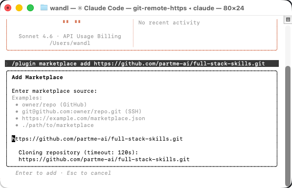
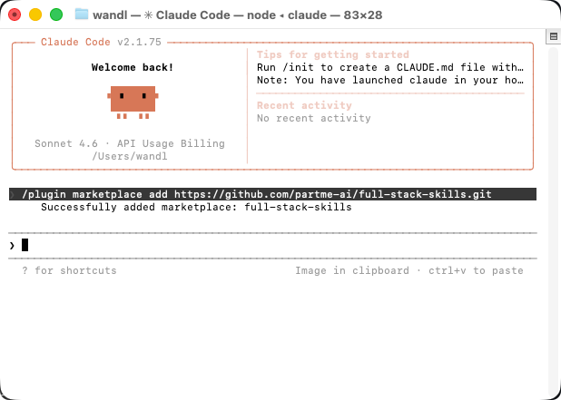

<div align="center">

# Full Stack Skills（Alpha）

**基于 Agent Skills 规范的分组式全栈技能仓库**


</div>

## 📖 简介

**Full-Stack-Skills（Alpha）** 是一个开源的 Agent Skills 仓库，面向 Claude Code、Claude.ai 与兼容 Agent Skills 生态的平台。当前仓库采用 `skills/<group>/<skill>/SKILL.md` 的分组式结构，覆盖产品、设计、前端、后端、测试、运维、文档、Spec 驱动开发等全链路场景。

> **⚠️ 注意：** 当前文档口径以仓库内 `skills/` 实际目录和 `.claude-plugin/marketplace.json` 为准。

> **说明：** 当前仓库内共有 **42 个技能组目录**、**421 个 `SKILL.md` 文件**；其中 Marketplace 当前发布 **40 个插件**、共 **410 条技能路径**。未进入 Marketplace 的仓库内技能组为 `threejs-skills` 与 `vscode-skills`。

## 什么是 Skills？

Skills 是由说明、脚本和资源组成的文件夹，Claude 会按需动态加载它们，以提升在特定任务上的表现。Skills 用于以可复用的方式教会 Claude 完成具体工作，例如：按团队规范创建文档、执行特定技术流程、沉淀设计系统知识，或自动化重复性工程任务。

### 更多信息

- [什么是技能？](https://support.claude.com/en/articles/12512176-what-are-skills)
- [在 Claude 中使用技能](https://support.claude.com/en/articles/12512180-using-skills-in-claude)
- [如何创建自定义技能](https://support.claude.com/en/articles/12512198-creating-custom-skills)
- [用 Agent Skills 为现实世界装备智能体](https://anthropic.com/engineering/equipping-agents-for-the-real-world-with-agent-skills)
- [Agent Skills 规范](https://agentskills.io/)

### 各平台 Agent Skills 文档

- Antigravity Agent Skills: https://antigravity.google/docs/skills
- Claude Agent Skills: https://code.claude.com/docs/en/skills
- Cursor Agent Skills: https://cursor.com/cn/docs/context/skills
- Codex Agent Skills: https://developers.openai.com/codex/skills
- Codex Agent Skills (Create Skill): https://developers.openai.com/codex/skills/create-skill
- Codebuddy Agent Skills: https://www.codebuddy.ai/docs/zh/ide/Features/Skills
- Qoder Agent Skills: https://docs.qoder.com/extensions/skills
- Trae Agent Skills: https://docs.trae.ai/ide/skills?_lang=en

## 关于本仓库

**full-stack-skills** 是一个面向团队与独立开发者的开源技能仓库与 Marketplace 发布源。它不再采用早期的少量大类聚合方式，而是按技能组进行目录拆分与发布管理。

### 📊 仓库快照

| 指标 | 当前值 |
|---|---:|
| `skills/` 下技能组目录 | 42 |
| 仓库内 `SKILL.md` 文件 | 421 |
| Marketplace 插件数 | 40 |
| Marketplace 技能路径数 | 410 |
| 仓库内未发布技能组 | 2 |

### ✨ 核心特性

#### 1. 分组式组织
- **42 个技能组目录**：按领域、框架和工作流拆分，便于维护与扩展
- **40 个 Marketplace 插件**：按技能组发布，便于按需安装与组合使用
- **421 个 `SKILL.md` 文件**：沉淀可复用的 Agent Skills 资产

#### 2. 全链路覆盖
- **前端与 UI**：Vue、React、Angular、Svelte、各类 UI 组件库与构建工具
- **后端与跨端**：Spring、Node.js、Python、Go、Electron、Tauri、UniApp、Flutter
- **工程化与交付**：测试、DevOps、Docker、数据库、nvm、Spec 驱动开发
- **设计与文档**：Figma、流程图、OCR、Mermaid、PlantUML、Pencil、Stitch、T2UI

#### 3. 工程友好
- **统一规范**：严格遵循 Agent Skills 规范
- **结构清晰**：统一使用 `SKILL.md`、`examples/`、`references/`、`scripts/`、`assets/` 等结构
- **跨平台适配**：提供 TypeScript 标准转换器，覆盖 43 个平台并统一输出标准 skills 目录

### 技能组织方式

当前仓库按**技能组**组织，核心分布如下：

- **前端与 UI**：`vue-skills`、`react-skills`、`angular-skills`、`svelte-skills`、`build-skills`、`vue-ui-skills`、`antd-skills`、`uview-skills`、`avue-skills`
- **后端与跨端开发**：`spring-skills`、`nodejs-skills`、`python-skills`、`go-skills`、`electron-skills`、`tauri-skills`、`uniapp-skills`、`flutter-skills`、`mobile-native-skills`、`cocos-skills`、`chart-skills`
- **工程化与架构**：`dev-utils-skills`、`ddd-skills`、`testing-skills`、`devops-skills`、`docker-skills`、`database-skills`、`nvm-skills`
- **设计、文档与流程**：`design-skills`、`document-skills`、`ocrmypdf-skills`、`drawio-skills`、`ascii-skills`
- **Spec 与设计生态**：`speckit-skills`、`openspec-skills`、`t2ui-skills`、`stitch-skills`、`pencil-skills`
- **通用支持**：`social-skills`、`teaching-skills`、`utility-skills`

### 能力覆盖矩阵

| 领域 | 代表技能组 | 覆盖重点 |
|---|---|---|
| 前端与 UI | `vue-skills`、`react-skills`、`angular-skills`、`svelte-skills`、`antd-skills`、`vue-ui-skills`、`build-skills` | 框架开发、组件库、构建体系、界面实现 |
| 服务端与跨端 | `spring-skills`、`nodejs-skills`、`python-skills`、`go-skills`、`electron-skills`、`tauri-skills`、`uniapp-skills`、`flutter-skills` | 服务开发、桌面应用、移动与混合交付 |
| 工程化与交付 | `dev-utils-skills`、`ddd-skills`、`testing-skills`、`devops-skills`、`docker-skills`、`database-skills`、`nvm-skills` | 脚手架、架构模式、测试体系、交付与运维 |
| 设计与文档 | `design-skills`、`document-skills`、`ocrmypdf-skills`、`drawio-skills`、`ascii-skills` | 设计执行、文档处理、OCR、图表与文本可视化 |
| Spec 与设计协同 | `speckit-skills`、`openspec-skills`、`t2ui-skills`、`stitch-skills`、`pencil-skills` | Spec 驱动交付、界面生成、设计系统协作 |
| 通用支持 | `social-skills`、`teaching-skills`、`utility-skills` | 沟通协作、教学资源、通用工具能力 |

### 当前发布面说明

- `threejs-skills` 当前在仓库中包含 18 个技能，但未进入 Marketplace 发布面。
- `vscode-skills` 当前在仓库中包含 4 个技能，但未进入 Marketplace 发布面。
- `document-skills` 当前目录中有 5 个技能，而 Marketplace 仍引用 9 个条目，其中 `docx`、`pptx`、`pdf`、`xlsx` 为缺失目录引用。
- `tauri-skills` 当前目录中有 52 个技能，而 Marketplace 当前发布 51 个条目；`tauri-app-updater` 目前仅存在于仓库目录中。

### 阅读路径建议

- **先理解仓库全貌**：先阅读本 README 与 `docs/repository-map.md`，快速掌握目录结构、发布面和当前差异。
- **按技能组导航**：如果你关心某一技术域，直接从 `docs/skill-group-mapping.md` 与对应 `skills/<group>-skills/` 目录进入。
- **按研发流程导航**：如果你关心需求、设计、开发、测试、交付的串联关系，优先阅读 `docs/pipeline-stage-to-skills.md`。
- **按设计生态导航**：如果你关注界面生成、设计系统与 Spec 驱动协作，优先阅读 `stitch-skills`、`pencil-skills`、`t2ui-skills`、`speckit-skills`、`openspec-skills`。

### 技能生态与主文档入口

本仓库提供全链路**阶段→技能**映射，以及面向 Spec 驱动开发、界面设计、全栈开发、测试与交付的基础技能集合。请优先参考以下文档：

- [docs/repository-map.md](docs/repository-map.md)
- [docs/skill-group-mapping.md](docs/skill-group-mapping.md)
- [docs/pipeline-stage-to-skills.md](docs/pipeline-stage-to-skills.md)
- [docs/skills-ecosystem.md](docs/skills-ecosystem.md)

### 🎯 核心设计理念

#### **技能标准化**
- **Agent Skills 规范**：严格遵循 [Agent Skills 规范](https://agentskills.io/)
- **统一格式**：统一采用 `SKILL.md` 与结构化子目录
- **渐进式披露**：通过 `examples/`、`references/`、`scripts/`、`assets/` 承载增量内容

#### **按组发布**
- **目录与发布面解耦**：目录结构以 `skills/` 为准，发布面以 Marketplace 为准
- **灵活组合**：按技能组安装，不绑定单一岗位模型
- **可扩展**：支持在仓库内继续引入未发布技能组

#### **面向交付**
- **覆盖需求到部署**：支持从需求、设计到研发、测试、交付的全过程
- **支持多生态协作**：兼容 T2UI、Stitch、Pencil、Tauri、OpenSpec、SpecKit 等流程
- **适合团队沉淀**：可作为技能资产库与内部标准库使用

### 📦 项目定位

**Full-Stack-Skills** 是一个以实际技能目录为核心、以 Marketplace 为发布面的技能基础设施仓库，适用于：

- 团队内部技能资产沉淀
- Claude Code Marketplace 发布
- Agent Skills 设计参考与模板复用
- Spec 驱动研发与设计协作流程落地

### 🏗️ 项目架构

**当前仓库结构**：

```text
full-stack-skills/
├── .claude-plugin/
│   └── marketplace.json          # Marketplace 配置
├── adapters/                     # TypeScript 标准转换器与平台路径注册表
├── agents/                       # 代理角色与编排入口
├── bundles/                      # 打包与聚合产物
├── dist/                         # 分发产物
├── docs/                         # 目录映射、阶段映射、生态说明
├── media/                        # 截图与展示素材
├── skills/                       # 技能主目录（按组拆分）
│   ├── vue-skills/
│   │   └── vue3/
│   │       └── SKILL.md
│   ├── react-skills/
│   ├── spring-skills/
│   ├── tauri-skills/
│   └── ...
├── spec/                         # 规范与规格说明
├── template/                     # 技能模板
├── tools/                        # 辅助工具
├── AGENTS.md                     # 仓库级 Agent 约束
└── README.md                     # 项目说明
```

**目录模型说明**：

- 本仓库统一采用 `skills/<group>-skills/<skill>/SKILL.md` 作为技能存储模型。
- `references/` 用于承载较长的技术说明与官方资料，避免 `SKILL.md` 过长。
- `scripts/` 用于固化可复用的自动化流程，优先替代大段内联命令。
- `docs/` 用于描述仓库级结构、阶段映射、技能生态与发布状态。

**当前状态**：

| 项目 | 当前值 |
|---|---:|
| 技能组目录 | 42 |
| `SKILL.md` 文件 | 421 |
| Marketplace 插件 | 40 |
| Marketplace 技能路径 | 410 |
| 仓库内未发布技能组 | 2 |

### 免责声明

**这些技能仅用于演示与教育用途。** 虽然其中部分能力可能在 Claude 中可用，但你从 Claude 获得的实现与行为可能与这些技能所展示的不同。这些技能旨在展示模式与可能性。在依赖它们处理关键任务之前，请务必在你自己的环境中充分测试。

## 📖 快速开始

### 前置要求

- **Claude Code** 或 **Claude.ai**（付费套餐）或 **Claude API**
- **Git**（用于克隆仓库，可选）
- **Node.js LTS 与 npm**（用于 TypeScript 跨平台转换器，可选）

### 在 Claude Code 中使用

#### 1. 注册 Marketplace

在 Claude Code 中运行以下命令，将本仓库注册为 Claude Code 的插件市场：

```
/plugin marketplace add https://github.com/partme-ai/full-stack-skills.git
```



安装成功！



或者使用简写形式：

```
/plugin marketplace add partme-ai/full-stack-skills
# 删除插件
/plugin marketplace remove full-stack-skills
```

#### 2. 安装插件

安装插件有两种方式：

**方式一：通过界面安装**

1. 选择 `Browse and install plugins`
2. 选择 `full-stack-skills`
3. 选择要安装的插件（见下方可用插件列表）
4. 选择 `Install now`

**方式二：通过命令安装**

直接使用命令安装插件：

```
# 按当前技能组安装示例
/plugin install vue-skills@full-stack-skills
/plugin install react-skills@full-stack-skills
/plugin install spring-skills@full-stack-skills
/plugin install dev-utils-skills@full-stack-skills
/plugin install testing-skills@full-stack-skills
/plugin install tauri-skills@full-stack-skills
/plugin install t2ui-skills@full-stack-skills
/plugin install stitch-skills@full-stack-skills
```


#### 3. 使用技能

安装插件后，您只需提到该技能即可使用。Claude 会根据技能描述自动判断何时使用该技能。

### 在 Claude.ai 中使用

这些示例技能在 Claude.ai 的付费套餐中已默认可用。

如需使用本仓库中的任意技能或上传自定义技能，请参考 [在 Claude 中使用技能](https://support.claude.com/en/articles/12512180-using-skills-in-claude#h_a4222fa77b) 的说明。

### 在 Claude API 中使用

你可以通过 Claude API 使用 Anthropic 预置的技能并上传自定义技能。详情参见 [Skills API Quickstart](https://docs.claude.com/en/api/skills-guide#creating-a-skill)。

### 在其他平台使用

本仓库提供一个 **TypeScript 标准转换器**，将 `skills/<group>/<skill>/` 导出为标准 skills 目录，并按目标平台写入其项目级或全局级路径。转换器不再生成 Cursor rule、Trae plugin、Qoder agent、CodeBuddy workflow 这类平台专有包装物，统一以标准技能目录作为输出。

#### 适配器说明

- **命令行名称**：`fskill`
- **仓库位置**：`adapters/`
- **输入结构**：仓库内的 `skills/<group>/<skill>/`
- **输出结构**：标准技能目录 `SKILL.md` + 资源目录
- **核心命令**：`platforms`、`audit`、`convert`、`install`
- **默认安装目标**：当前项目 `.agents/skills/`
- **平台安装方式**：通过 `--platform` 切换目标平台，通过 `--scope project|global` 切换项目级或全局级路径
- **适配原则**：保留原始技能目录内容，只变更安装路径，不生成平台专有包装文件

#### 适配器工作流

1. 用 `fskill audit` 检查仓库技能是否完整、数量是否正确
2. 用 `fskill platforms` 查看支持的平台 ID、项目路径和全局路径
3. 用 `fskill convert --platform <id|all>` 生成可分发的标准输出目录
4. 用 `fskill install` 或 `fskill install --platform <id>` 直接安装到目标平台目录

#### 常用适配命令

```bash
# 查看支持的平台与路径
fskill platforms

# 审计仓库技能
fskill audit

# 导出到 Cursor 结构
fskill convert --platform cursor --output ./adapters-output

# 安装到当前项目的 Cursor 路径
fskill install --platform cursor --scope project

# 安装到 Cursor 全局路径 ~/.cursor/skills/
fskill install --platform cursor --scope global

# 默认安装到当前项目 .agents/skills/
fskill install
```

#### Cursor 与其他平台的关系

- **Cursor**：项目级使用 `.agents/skills/`，全局级使用 `~/.cursor/skills/`
- **Claude Code**：项目级使用 `.claude/skills/`
- **OpenClaw**：项目级使用 `skills/`
- **Antigravity**：项目级使用 `.agents/skills/`，全局级使用 `~/.gemini/antigravity/skills/`
- **其它平台**：全部由 `fskill platforms` 输出的平台注册表统一管理

**安装与执行命令：**
```bash
git clone https://github.com/partme-ai/full-stack-skills.git
cd full-stack-skills
npm install -g ./adapters
fskill --version
fskill platforms
fskill audit
fskill convert --platform all --output ./adapters-output
fskill install
```

默认情况下，`fskill install` 会把技能安装到当前项目的 `.agents/skills/` 目录；这是标准 Agent Skills 兼容路径。如需其他平台目录，再显式传入 `--platform` 与 `--scope`。
如果只想在仓库开发态使用，也可以进入 `adapters/` 执行 `npm install && npm link`，随后直接运行 `fskill ...`。

**平台覆盖：**
- **共享 `.agents/skills/` 路径族**：`amp`、`kimi-cli`、`replit`、`universal`、`antigravity`、`cline`、`warp`、`codex`、`cursor`、`deepagents`、`gemini-cli`、`github-copilot`、`opencode`
- **专属目录路径族**：`augment`、`claude-code`、`openclaw`、`codebuddy`、`command-code`、`continue`、`cortex`、`crush`、`droid`、`goose`、`junie`、`iflow-cli`、`kilo`、`kiro-cli`、`kode`、`mcpjam`、`mistral-vibe`、`mux`、`openhands`、`pi`、`qoder`、`qwen-code`、`roo`、`trae`、`trae-cn`、`windsurf`、`zencoder`、`neovate`、`pochi`、`adal`
- **Antigravity 基线**：项目级使用 `.agents/skills/`，全局级使用 `~/.gemini/antigravity/skills/`

**详细文档：**
- [跨平台使用指南](PLATFORM_GUIDE.md) - 完整平台矩阵、安装路径与执行示例
- [平台适配器工具](adapters/README.md) - CLI 命令、审计规则、导出与安装说明

## 📝 核心功能

### 1. 技能管理
- **技能分类**：按技能组组织，并通过 Marketplace 插件发布
- **技能搜索**：通过技能名称快速查找所需技能
- **技能安装**：支持按插件类别批量安装或单独安装技能

### 2. 跨平台支持
- **Claude Code**：原生支持，通过插件市场安装
- **Claude.ai**：支持上传自定义技能
- **Claude API**：通过 API 使用技能
- **标准目录兼容**：统一导出标准 skills 目录，并按平台路径矩阵安装
- **43 平台覆盖**：覆盖 `.agents/skills/` 共享路径平台与各类专属目录平台
- **可审计与可安装**：内置 `platforms`、`audit`、`convert`、`install` 命令

### 3. 技能创建
- **规范指导**：提供技能创建规范和最佳实践
- **模板支持**：提供技能模板，快速创建新技能
- **文档生成**：自动生成技能文档结构

### 4. 文档处理
- **办公文档**：支持 Word、PowerPoint、Excel、PDF 等文档处理
- **OCR 识别**：支持 OCRmyPDF 扫描件 OCR（100+ 语言、图像处理、优化压缩、批量处理、Python API、多引擎插件）
- **图表绘制**：支持 Mermaid、PlantUML、Draw.io 等图表绘制
- **文档协作**：支持多人协作编辑

### 5. 开发工具
- **代码生成**：支持代码生成和模板化
- **项目构建**：支持 DDD 项目构建（单体单模块、单体多模块、微服务）
- **文档生成**：支持全栈文档生成（14种文档模板）

### 6. 仓库治理
- **目录即事实**：`skills/` 目录代表仓库中的真实技能资产
- **Marketplace 即发布面**：`.claude-plugin/marketplace.json` 代表对外可安装范围
- **差异需显式记录**：目录与发布面不一致时，README 与 `docs/repository-map.md` 需要同步说明
- **结构优先稳定**：新增技能优先归入已有技能组，只有在职责明显独立时才引入新技能组

## 可用插件和技能

以下表格以当前 `skills/` 实际目录与 `.claude-plugin/marketplace.json` 为准，展示仓库中的技能组、目录技能数与当前发布状态。

| 技能组 | 目录内技能数 | 已发布 | Marketplace 引用数 | 说明 |
|---|---:|---|---:|---|
| `angular-skills` | 1 | 是 | 1 | 已与当前发布面对应 |
| `antd-skills` | 4 | 是 | 4 | 已与当前发布面对应 |
| `ascii-skills` | 13 | 是 | 13 | 已与当前发布面对应 |
| `avue-skills` | 3 | 是 | 3 | 已与当前发布面对应 |
| `build-skills` | 6 | 是 | 6 | 已与当前发布面对应 |
| `chart-skills` | 2 | 是 | 2 | 已与当前发布面对应 |
| `cocos-skills` | 1 | 是 | 1 | 已与当前发布面对应 |
| `database-skills` | 5 | 是 | 5 | 已与当前发布面对应 |
| `ddd-skills` | 6 | 是 | 6 | 已与当前发布面对应 |
| `design-skills` | 12 | 是 | 12 | 已与当前发布面对应 |
| `dev-utils-skills` | 13 | 是 | 13 | 已与当前发布面对应 |
| `devops-skills` | 6 | 是 | 6 | 已与当前发布面对应 |
| `docker-skills` | 2 | 是 | 2 | 已与当前发布面对应 |
| `document-skills` | 5 | 是 | 9 | 目录技能数与 Marketplace 引用数不一致，详见 repository-map |
| `drawio-skills` | 2 | 是 | 2 | 已与当前发布面对应 |
| `electron-skills` | 3 | 是 | 3 | 已与当前发布面对应 |
| `flutter-skills` | 2 | 是 | 2 | 已与当前发布面对应 |
| `go-skills` | 2 | 是 | 2 | 已与当前发布面对应 |
| `mobile-native-skills` | 2 | 是 | 2 | 已与当前发布面对应 |
| `nodejs-skills` | 4 | 是 | 4 | 已与当前发布面对应 |
| `nvm-skills` | 15 | 是 | 15 | 已与当前发布面对应 |
| `ocrmypdf-skills` | 5 | 是 | 5 | 已与当前发布面对应 |
| `openspec-skills` | 15 | 是 | 15 | 已与当前发布面对应 |
| `pencil-skills` | 28 | 是 | 28 | 已与当前发布面对应 |
| `python-skills` | 3 | 是 | 3 | 已与当前发布面对应 |
| `react-skills` | 6 | 是 | 6 | 已与当前发布面对应 |
| `social-skills` | 2 | 是 | 2 | 已与当前发布面对应 |
| `speckit-skills` | 13 | 是 | 13 | 已与当前发布面对应 |
| `spring-skills` | 7 | 是 | 7 | 已与当前发布面对应 |
| `stitch-skills` | 28 | 是 | 28 | 已与当前发布面对应 |
| `svelte-skills` | 1 | 是 | 1 | 已与当前发布面对应 |
| `t2ui-skills` | 97 | 是 | 97 | 已与当前发布面对应 |
| `tauri-skills` | 52 | 是 | 51 | 目录技能数与 Marketplace 引用数不一致，详见 repository-map |
| `teaching-skills` | 3 | 是 | 3 | 已与当前发布面对应 |
| `testing-skills` | 9 | 是 | 9 | 已与当前发布面对应 |
| `threejs-skills` | 18 | 否 | 0 | 仓库内存在，当前未写入 Marketplace |
| `uniapp-skills` | 13 | 是 | 13 | 已与当前发布面对应 |
| `utility-skills` | 3 | 是 | 3 | 已与当前发布面对应 |
| `uview-skills` | 2 | 是 | 2 | 已与当前发布面对应 |
| `vscode-skills` | 4 | 否 | 0 | 仓库内存在，当前未写入 Marketplace |
| `vue-skills` | 7 | 是 | 7 | 已与当前发布面对应 |
| `vue-ui-skills` | 4 | 是 | 4 | 已与当前发布面对应 |

### 当前一致性说明

- 对仓库内容的理解，应以 `skills/` 目录为准。
- 对外发布面的理解，应以 `.claude-plugin/marketplace.json` 为准。
- 当前真实存在的差异仅有三类：仓库内未发布技能组、Marketplace 缺失目录引用、仓库内新增但未发布的单个技能。
- 上表已经明确标识这些差异，因此 README 现在对应的是“当前仓库状态”，而不是历史分类口径。

### 安装建议

- 需要前端能力：优先安装 `vue-skills`、`react-skills`、`build-skills`、`antd-skills`、`vue-ui-skills`
- 需要后端与跨端能力：优先安装 `spring-skills`、`nodejs-skills`、`python-skills`、`go-skills`、`tauri-skills`、`uniapp-skills`
- 需要设计与文档能力：优先安装 `design-skills`、`document-skills`、`ocrmypdf-skills`、`drawio-skills`
- 需要交付与工程化能力：优先安装 `dev-utils-skills`、`testing-skills`、`devops-skills`、`docker-skills`、`database-skills`、`nvm-skills`
- 需要 Spec / 设计工作流：优先安装 `speckit-skills`、`openspec-skills`、`t2ui-skills`、`stitch-skills`、`pencil-skills`

### 场景化安装路径

- **前端应用开发**：先安装 `vue-skills` 或 `react-skills`，再按需要补充 `build-skills`、`antd-skills`、`vue-ui-skills`。
- **后端服务开发**：将 `spring-skills`、`nodejs-skills`、`python-skills`、`go-skills` 与 `testing-skills`、`database-skills` 组合使用。
- **桌面与跨端产品**：按目标平台选择 `tauri-skills`、`electron-skills`、`uniapp-skills`、`flutter-skills`。
- **Spec 驱动协作**：建议成套安装 `speckit-skills`、`openspec-skills`、`t2ui-skills`、`stitch-skills`、`pencil-skills`。
- **文档与图形表达**：建议组合 `document-skills`、`ocrmypdf-skills`、`drawio-skills`、`ascii-skills`。

### 业务域导航

| 目标 | 建议优先阅读 | 建议安装组合 |
|---|---|---|
| Web 前端交付 | `vue-skills`、`react-skills`、`build-skills` | `vue-skills` / `react-skills` + `build-skills` + `testing-skills` |
| 企业后台与服务 | `spring-skills`、`nodejs-skills`、`database-skills` | `spring-skills` / `nodejs-skills` + `database-skills` + `devops-skills` |
| 桌面与跨端应用 | `tauri-skills`、`electron-skills`、`uniapp-skills`、`flutter-skills` | 按目标平台选 1–2 个运行时组，再补 `testing-skills` |
| Spec 驱动产品研发 | `speckit-skills`、`openspec-skills`、`t2ui-skills` | `speckit-skills` + `openspec-skills` + `t2ui-skills` |
| 设计系统与界面生产 | `stitch-skills`、`pencil-skills`、`design-skills` | `stitch-skills` + `pencil-skills` + `design-skills` |
| 文档、OCR 与图表 | `document-skills`、`ocrmypdf-skills`、`drawio-skills`、`ascii-skills` | `document-skills` + `ocrmypdf-skills` + `drawio-skills` |


## 🛠️ 技术栈

### 核心规范
- **Agent Skills 规范**：严格遵循 [Agent Skills 规范](https://agentskills.io/)，确保技能质量和兼容性
- **Markdown 格式**：所有技能文档采用 Markdown 格式，便于阅读和维护
- **YAML Frontmatter**：使用 YAML Frontmatter 定义技能元数据

### 技能结构
- **SKILL.md**：技能主文档，包含描述、使用说明、示例等
- **examples/**：示例文件目录，包含各种使用场景的示例
- **references/**：参考资料目录，用于承载较长说明与官方链接
- **scripts/**：脚本文件目录，包含自动化脚本
- **assets/**：资源文件目录，用于存放图片、素材或辅助文件

### 编写原则
- **描述准确**：`description` 必须明确说明技能的触发场景与适用任务
- **正文精简**：`SKILL.md` 保持精炼，复杂材料优先放入 `references/`
- **路径一致**：目录名、frontmatter 中的 `name` 与 Marketplace 路径保持一致
- **任务导向**：优先描述工作流、输入输出、边界条件，而不是泛化概念说明
- **脚本优先**：可复用流程优先沉淀到 `scripts/`，减少内联命令噪音

### 文档维护规则
- **计数更新同步**：当技能组数量、`SKILL.md` 数量或 Marketplace 路径变化时，需同步更新 README 中的快照数据
- **状态说明同步**：当出现 repo-only 技能组或 Marketplace 漂移时，README 与 `docs/repository-map.md` 必须同时更新
- **示例命令同步**：安装命令示例只能使用当前 Marketplace 中实际存在的插件名
- **路径说明同步**：路径示例必须遵循 `skills/<group>-skills/<skill>/` 结构，避免回退到历史写法

### 跨平台支持
- **Claude Code**：原生支持，通过插件市场安装
- **Claude.ai**：支持上传自定义技能
- **Claude API**：通过 API 使用技能
- **标准转换器**：以 TypeScript CLI 统一导出标准 skills 目录
- **路径矩阵**：覆盖 43 个平台的项目级与全局级安装路径

## 📦 版本信息

| 项目 | 当前版本          |
|---|---------------|
| full-stack-skills | 0.0.1 (Alpha) |
| 技能组目录 | 42            |
| `SKILL.md` 文件 | 421           |
| Marketplace 插件 | 40            |
| Marketplace 技能路径 | 410           |
| Agent Skills 规范 | 最新版本          |

## 🔗 相关链接

### 官方资源
- **Agent Skills 规范**：[https://agentskills.io/](https://agentskills.io/)
- **Claude Skills 文档**：[https://support.claude.com/en/articles/12512176-what-are-skills](https://support.claude.com/en/articles/12512176-what-are-skills)
- **使用技能指南**：[https://support.claude.com/en/articles/12512180-using-skills-in-claude](https://support.claude.com/en/articles/12512180-using-skills-in-claude)
- **创建自定义技能**：[https://support.claude.com/en/articles/12512198-creating-custom-skills](https://support.claude.com/en/articles/12512198-creating-custom-skills)
- **Skills API 快速开始**：[https://docs.claude.com/en/api/skills-guide#creating-a-skill](https://docs.claude.com/en/api/skills-guide#creating-a-skill)

### 项目资源
- **跨平台使用指南**：[PLATFORM_GUIDE.md](PLATFORM_GUIDE.md)
- **平台适配器工具**：[adapters/README.md](adapters/README.md)
- **角色定义**：[ROLE_DEFINITIONS.md](ROLE_DEFINITIONS.md)
- **智能体提示词**：[AGENTS_PROMPT.md](AGENTS_PROMPT.md)

### 联系我们
- **GitHub Issues**：提交问题或建议
- **问题反馈**：通过 GitHub Issues 反馈

## 🤝 贡献指南

欢迎您为 Full-Stack-Skills 做出贡献！请遵循以下步骤：

1. **Fork 本仓库**
2. **创建特性分支** (`git checkout -b feature/AmazingFeature`)
3. **提交更改** (`git commit -m 'Add some AmazingFeature'`)
4. **推送到分支** (`git push origin feature/AmazingFeature`)
5. **提交 Pull Request**

### 贡献类型
- **新增技能**：添加新的技能到相应类别
- **改进现有技能**：完善技能文档、示例或模板
- **修复问题**：修复技能中的错误或问题
- **文档改进**：改进项目文档或使用指南

### 技能创建规范
- 严格遵循 [Agent Skills 规范](https://agentskills.io/)
- 路径遵循 `skills/<group>-skills/<skill>/SKILL.md`
- 参考现有技能的结构和格式
- 包含完整的官方文档链接
- 提供清晰的使用示例
- 需要发布时同步更新 `.claude-plugin/marketplace.json`

### 提交前检查清单
- 确认技能目录名、frontmatter `name` 与实际用途一致
- 确认 `SKILL.md` 足够精炼，长说明已移动至 `references/`
- 确认脚本、示例、资源文件路径可被仓库内直接解析
- 确认 README、映射文档、Marketplace 配置之间没有新的口径差异

## 📄 许可证

本项目采用 [Apache License 2.0](LICENSE) 许可证。

**注意**：本仓库中的许多技能是开源的（Apache 2.0）。我们还在 [`skills/document-skills/docx`](skills/document-skills/docx)、[`skills/document-skills/pdf`](skills/document-skills/pdf)、[`skills/document-skills/pptx`](skills/document-skills/pptx) 和 [`skills/document-skills/xlsx`](skills/document-skills/xlsx) 子目录中包含了用于支撑 [Claude 文档能力](https://www.anthropic.com/news/create-files) 的文档创建与编辑技能。这些技能是“可查看源码”的（source-available），但并非开源；它们同时也是构建复杂文档类技能的参考实现。

## 🙏 致谢

感谢以下开源项目和社区：

- [Anthropic](https://www.anthropic.com/) - Claude AI 和 Agent Skills 规范
- [Agent Skills](https://agentskills.io/) - Agent Skills 规范制定
- [Spring Boot](https://spring.io/projects/spring-boot) - Java 应用开发框架
- [Vue.js](https://vuejs.org/) - 渐进式 JavaScript 框架
- [React](https://react.dev/) - 用于构建用户界面的 JavaScript 库
- 以及所有贡献者和技能维护者

---

<div align="center">

**如果这个项目对你有帮助，请给我们一个 ⭐️**

Made with ❤️ by partme-ai Team

</div>
