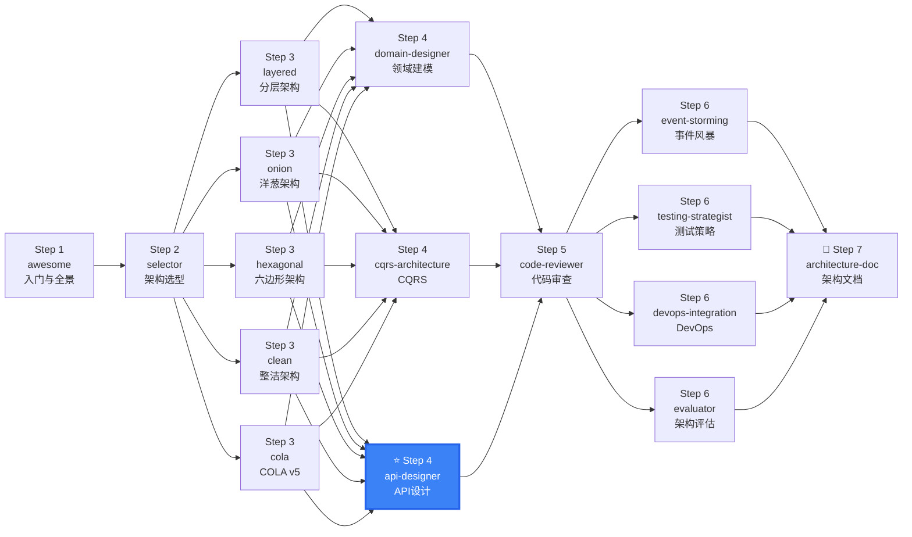

# DDD API Designer

API design from domain models — expose DDD aggregates through well-designed REST APIs with proper CQRS separation, four-layer data object transformation, unified response format, BFF adaptation, versioning, and security.

## Workflow

```
Input: Domain Model (aggregates, entities, value objects)
  │
  ├── 1. Identify Command vs Query operations
  │      └── Commands (POST/PUT/DELETE) → Write Model
  │      └── Queries (GET)              → Read Model (MV/ReadModel)
  │
  ├── 2. Design data object conversion chain
  │      └── PO(Infra) ↔ DO(Domain) ↔ DTO(Interface) ↔ VO(Frontend)
  │      └── Define Assembler/Converter per layer boundary
  │
  ├── 3. Design REST endpoints per CQRS convention
  │      └── Command: verb-based suffixes (confirm, cancel, approve)
  │      └── Query: resource-based naming with parameters
  │
  ├── 4. Define unified response format
  │      └── Success wrapper (code, message, data)
  │      └── Error response (code, message, detail)
  │
  ├── 5. Apply BFF layer if multi-platform
  │      └── Web BFF / iOS BFF / MiniApp BFF per platform
  │
  ├── 6. Choose versioning strategy
  │      └── URL path recommended: /api/v1/orders
  │
  └── 7. Apply security controls
         └── AuthN + AuthZ + Input validation + Rate limiting
```

## When to Use This Skill

**ALWAYS use this skill when the user mentions:**
- "API 设计"、"REST API"、"接口设计"、"endpoint design"
- "DTO 设计"、"VO 设计"、"data object conversion"
- "BFF"、"Backend for Frontend"
- "OpenAPI"、"Swagger"、"API 文档"
- "数据对象转换"、"PO DO DTO VO"
- "统一响应格式"、"unified response"
- "API 版本管理"、"API versioning"
- "接口安全"、"API security"
- Need to expose DDD domain models as REST APIs

| ❌ Skip | ✅ Use Instead |
|---------|---------------|
| Internal tool, no external API consumers | Skip API design formalities |
| GraphQL/gRPC project | Use protocol-specific design patterns |
| No domain model yet | `ddd-domain-designer` (model first) |
| Simple CRUD, no DDD | Standard Spring Boot Controller |
| gRPC microservices | gRPC IDL (protobuf), skip REST |

## CQRS: Command vs Query API Differentiation

### Endpoint Separation

```
Command APIs (Write) — Verb-driven:
  POST   /api/v1/orders                 → CreateOrderCommand
  PUT    /api/v1/orders/{id}/confirm    → ConfirmOrderCommand
  DELETE /api/v1/orders/{id}            → CancelOrderCommand
  PUT    /api/v1/orders/{id}/ship       → ShipOrderCommand

Query APIs (Read) — Resource-driven:
  GET    /api/v1/orders/{id}            → OrderDetailDTO (from Materialized View)
  GET    /api/v1/orders?status=PAID     → OrderSummaryDTO[] (from Read Model)
  GET    /api/v1/orders/{id}/items      → OrderItemDTO[]
```

### Key Design Rules

| Rule | Command (Write) | Query (Read) |
|------|----------------|--------------|
| HTTP Method | POST / PUT / DELETE | GET |
| Verb in URL | Yes (confirm, cancel) | No (resource only) |
| Request Body | Always (command object) | Query parameters only |
| Response | Created resource / success | Data DTO / list |
| DTO Separation | Separate Command DTO | Separate Query DTO |
| Idempotency | Must implement | Naturally idempotent |
| Cache | Never cached | Cacheable (ETag, max-age) |

**Never share DTO between command and query operations.** Even if fields look similar, they serve different purposes.

### Sub-resource Naming

```
GET    /orders/{id}/items              → List sub-resources
POST   /orders/{id}/items              → Create sub-resource
PUT    /orders/{id}/items/{itemId}     → Update sub-resource
DELETE /orders/{id}/items/{itemId}     → Remove sub-resource
```

**Max depth: 2 levels** (`/orders/{id}/items` → OK, `/orders/{id}/items/{itemId}/details` → avoid)

## Data Object Transformation Chain (PO → DO → DTO → VO)

### Four-Layer Object Model

```
Frontend VO ←→ Interface DTO ←→ Domain DO ←→ Infrastructure PO
    │               │               │              │
Display/Client   API Layer       Domain Layer   Data Layer
```

| Object | Layer | Responsibility | Visibility |
|--------|-------|---------------|------------|
| **PO** (Persistent Object) | Infrastructure | DB schema mapping, ORM entities | Internal |
| **DO** (Domain Object) | Domain | Rich domain model with business behavior | Internal |
| **DTO** (Transfer Object) | Interface/App | Cross-layer/cross-service data transport | Semi-internal |
| **VO** (View Object) | Interface/Frontend | Page-specific display data | External |

### Transformation Rules

```
Read direction (domain → frontend):
  PO → DO: Repository loads from DB, converts to domain object
  DO → DTO: Assembler/Converter. One DO → multiple DTOs (different scenarios)
  DTO → VO: BFF combines multiple DTOs into page-specific VO

Write direction (frontend → domain):
  VO → DTO: Frontend sends form/request data
  DTO → DO: Application layer converts to domain command object
  DO → PO: Repository persists domain changes
```

### One DO → Multiple DTOs

```java
public class OrderAssembler {
    // Detail page — full fields
    public static OrderDetailDTO toDetailDTO(Order order) {
        return OrderDetailDTO.builder()
            .orderId(order.getId().getValue())
            .status(order.getStatus().name())
            .totalAmount(order.getTotalAmount().toString())
            .customerInfo(toCustomerDTO(order.getCustomer()))
            .paymentInfo(toPaymentDTO(order.getPayment()))
            .timeline(order.getTimeline())
            .build();
    }

    // List page — summary fields only
    public static OrderSummaryDTO toSummaryDTO(Order order) {
        return OrderSummaryDTO.builder()
            .orderId(order.getId().getValue())
            .status(order.getStatus().name())
            .totalAmount(order.getTotalAmount().toString())
            .itemCount(order.getItemCount())
            .build();
    }
}
```

## API Design Conventions

### Naming Rules

```
✓ Plural nouns:        /orders (not /order)
✓ Kebab-case paths:    /order-history (not /orderHistory)
✓ Max 2-level nesting: /orders/{id}/items
✓ Write verb suffix:   /orders/{id}/confirm, /orders/{id}/cancel
✓ Query parameters:    ?status=PAID&page=1&size=20
✗ No verbs in query:   GET /getOrders (→ GET /orders)
```

### HTTP Status Code Mapping

| Scenario | HTTP Status | API Code |
|----------|-------------|----------|
| Create success | 201 Created | 0 |
| Read success | 200 OK | 0 |
| Update success | 200 OK | 0 |
| Delete success | 204 No Content | 0 |
| Validation error | 400 Bad Request | 40002 |
| Business rule violation | 400 Bad Request | 40001 |
| Not found | 404 Not Found | 40401 |
| Conflict (optimistic lock) | 409 Conflict | 40901 |
| Rate limited | 429 Too Many Requests | 42901 |
| Internal error | 500 Internal Server Error | 50000 |

## Unified Response Format

### Success Responses

```json
// Command — Created
{
  "code": 0,
  "message": "success",
  "data": { "orderId": "ORD-2024-001", "status": "PAID", "createdAt": "2024-01-15T10:30:00Z" }
}

// Query — Single Object
{
  "code": 0,
  "message": "success",
  "data": { "id": "ORD-2024-001", "totalAmount": "99.00", "status": "PAID", "items": [/* ... */] }
}

// Query — Paginated
{
  "code": 0,
  "message": "success",
  "data": {
    "records": [/* ... */],
    "total": 100,
    "page": 1,
    "pageSize": 20
  }
}

// Delete — No Content (204)
// (empty body)
```

### Error Responses

```json
// Business Error
{
  "code": 40001,
  "message": "订单状态不允许支付",
  "detail": "当前状态：CANCELLED，可支付状态：DRAFT",
  "requestId": "req-abc123",
  "timestamp": "2024-01-15T10:30:00Z"
}

// Validation Error
{
  "code": 40002,
  "message": "参数校验失败",
  "detail": [
    { "field": "amount", "message": "金额不能为负数" },
    { "field": "customerId", "message": "客户ID不能为空" }
  ],
  "requestId": "req-abc123"
}

// System Error
{
  "code": 50000,
  "message": "系统内部错误",
  "requestId": "req-abc123"
}
```

### Response Wrapper Implementation

```java
public class Result<T> {
    private int code;
    private String message;
    private T data;
    private String requestId;

    public static <T> Result<T> success(T data) {
        return new Result<>(0, "success", data, null);
    }

    public static <T> Result<T> error(int code, String message) {
        return new Result<>(code, message, null, null);
    }

    public static <T> Result<T> error(int code, String message, String requestId) {
        return new Result<>(code, message, null, requestId);
    }
}
```

## BFF (Backend for Frontend) Design

### Architecture

```
      ┌──────────┐  ┌──────────┐  ┌──────────┐
      │  Web BFF │  │ iOS BFF  │  │ MiniApp  │
      │          │  │          │  │ BFF      │
      └────┬─────┘  └────┬─────┘  └────┬─────┘
           │              │              │
    ┌──────┼──────────────┼──────────────┼──────────┐
    │      ▼              ▼              ▼          │
    │  ┌──────────────────────────────────────┐    │
    │  │         API Gateway / Load Balancer   │    │
    │  └────┬──────────────┬─────────────┬────┘    │
    │       ▼              ▼             ▼         │
    │  ┌─────────┐  ┌──────────┐  ┌─────────┐     │
    │  │ Order   │  │ Payment  │  │ Product │     │
    │  │ Service │  │ Service  │  │ Service │     │
    │  └─────────┘  └──────────┘  └─────────┘     │
    └───────────────── Microservice Cluster ──────┘
```

### BFF Responsibilities

| Responsibility | Description | Example |
|---------------|-------------|---------|
| **Data Aggregation** | Combine data from multiple microservices into page-specific VO | Order detail page needs order + payment + shipping data |
| **Format Adaptation** | Tailor data per platform requirements | Web: full fields; Mobile: minimal fields |
| **Protocol Translation** | Convert internal protocols to external | Internal gRPC → External REST/JSON |
| **Response Shaping** | Remove internal fields, add UI metadata | Add page title, action buttons, navigation |

### BFF vs API Gateway

| Aspect | BFF | API Gateway |
|--------|-----|-------------|
| Scope | Per-frontend (one BFF per platform) | Unified entry for all services |
| Logic | Contains view-specific aggregation | Minimal routing, auth, throttling |
| Granularity | Coarse-grained (page-level) | Fine-grained (service-level) |
| Example | Web BFF returns `orderPageVO` | Gateway routes `/orders` to Order Service |

## API Versioning

### Strategy Comparison

| Strategy | How | Pros | Cons | Best For |
|----------|-----|------|------|----------|
| **URL Path** | `/api/v1/orders` → `/api/v2/orders` | Most intuitive, CDN-friendly | URL pollution | **Recommended** |
| Header | `Accept: app.vnd.company.v2+json` | Clean URLs | Hard to test in browser | Advanced clients |
| Query Param | `/api/orders?version=2` | Simple implementation | Caching chaos | Temporary debug |
| Content Negotiation | `Accept: app/json;version=2` | RESTful standard | Poor tooling support | REST purists |

**Recommendation**: URL path versioning — most intuitive for API consumers, best Swagger/OpenAPI compatibility.

### Version Lifecycle

```
v1 (active)  →  v1 + v2 (dual-run)  →  v2 only  →  v1 sunset (deprecated header)
  [launch]       [migration]            [stable]     [retirement notice]
```

## API Security Design

### Security Layers

```
Layer 1: Authentication — Who are you?
  ├── JWT Bearer Token (standard for REST APIs)
  ├── OAuth2 / OpenID Connect (third-party auth)
  └── API Key (service-to-service, internal)

Layer 2: Authorization — What can you do?
  ├── Per bounded context: Order BC permissions ≠ Payment BC
  ├── Resource-based ownership: user only operates own orders
  └── Role-based access: admin vs regular user vs readonly

Layer 3: Input Validation — What data is allowed?
  ├── Controller: Format validation (@Valid + JSR-303)
  ├── Application: Business validation (idempotency, state machine)
  └── Domain: Invariant validation (inside aggregate root)

Layer 4: Rate Limiting — How much can you do?
  ├── Command APIs: Lower QPS (prevent write abuse)
  ├── Query APIs: Higher QPS (can add cache)
  └── Per-user throttling in BFF/gateway
```

### OpenAPI Security Schemes

```yaml
components:
  securitySchemes:
    BearerAuth:
      type: http
      scheme: bearer
      bearerFormat: JWT
    ApiKeyAuth:
      type: apiKey
      in: header
      name: X-API-Key
```

## Gotchas — Common Pitfalls

- **DTO 直接暴露领域对象字段**: 不要把 `OrderStatus` 枚举直接暴露给 DTO。DTO 应当将领域类型转为 String code，调用方不需要知道内部实现。
- **Command/Query DTO 混用**: CQRS 下即使 URL 相同（`POST /orders` vs `GET /orders`），请求和响应结构完全不同。Command DTO 和 Query DTO 必须分开定义。
- **忘记空值安全**: PO → DO 转换时 PO 字段可能为 null（数据库默认 NULL）。必须处理 null 安全（Optional / Objects.requireNonNull），否则构建 DO 时 NPE。
- **VO 透传数据库字段**: VO 是为前端视图定制的，不要把 `created_at`、`updated_by`、`deleted` 等内部字段透传给前端。只返回前端需要的数据。
- **版本号只用 Header**: 推荐 URL 路径版本 `/api/v1/orders`。Header 版本对 API 消费者不直观，且无法通过 CDN 缓存区分。

## FAQ

| Question | Answer |
|----------|--------|
| **DO 和 DTO 字段一样，能复用吗？** | 不能。DO 是充血模型含业务行为，DTO 是纯数据传输对象。即使现在字段相同，未来演化方向也不同。 |
| **BFF 和服务端渲染有什么区别？** | BFF 是 API 层聚合，返回 JSON 给前端渲染；SSR 是服务端渲染 HTML。BFF 更灵活，SSR 更利于 SEO。 |
| **OpenAPI 文档需要手动维护吗？** | 推荐代码生成（SpringDoc / swagger-annotations）。手动维护 YAML 容易与实现不同步。 |
| **所有 API 都要统一响应格式吗？** | 对，Command 和 Query 都统一用 `Result<T>` 包装。只有文件下载、204 No Content 可例外。 |
| **API 版本多久升级一次？** | 尽量减少破坏性变更。积累多次非兼容变更后统一升级大版本（v1 → v2）。推荐 6-12 个月一次。 |
| **子资源最多嵌套几层？** | 最多 2 层：`/orders/{id}/items`。超过 2 层说明聚合边界可能有问题，或者需要重新建模。 |

## Keywords

`CQRS API` `REST endpoint design` `PO DO DTO VO` `data object transformation` `unified response format` `BFF` `Backend for Frontend` `OpenAPI` `Swagger` `API versioning` `API security` `command query separation` `read model` `materialized view` `Result<T>` `response wrapper` `input validation` `rate limiting`

## References

- [references/cqrs-api-design.md](references/cqrs-api-design.md) — CQRS API 设计模式：命令/查询端点分离、DTO 分拆、幂等设计
- [references/data-object-transformation.md](references/data-object-transformation.md) — 数据对象转换链详解：PO↔DO↔DTO↔VO 四层边界与转换器模式
- [references/BFF-design-pattern.md](references/BFF-design-pattern.md) — BFF 设计模式：多平台适配、数据聚合、VO 组装
- [references/api-security-design.md](references/api-security-design.md) — API 安全设计：JWT/OAuth2、BC 级授权、三层校验、限流
- [references/api-versioning-strategies.md](references/api-versioning-strategies.md) — API 版本管理：4 种策略对比、迁移流程、OpenAPI 集成
- [references/api-naming-conventions.md](references/api-naming-conventions.md) — API 命名规范与错误码设计
- [references/unified-response-format.md](references/unified-response-format.md) — 统一响应格式规范：Result<T> 包装器、错误码体系
- [references/openapi-specification.md](references/openapi-specification.md) — OpenAPI 3.0 规范：完整 YAML 模板、安全方案、生成策略
- [references/partme-16-service-data-view.md](references/partme-16-service-data-view.md) — DDD 分层架构下服务和数据的协作关系
- [references/clean-ddd-hexagonal-hexagonal.md](references/clean-ddd-hexagonal-hexagonal.md) — 六边形架构 Port/Adapter 参考

## Examples

- [examples/order-api-design.md](examples/order-api-design.md) — 订单服务完整 API 设计案例（CQRS+数据转换+OpenAPI）
- [examples/user-api-design.md](examples/user-api-design.md) — 用户服务 API 设计案例（注册/登录/资料）
- [examples/BFF-aggregation-example.md](examples/BFF-aggregation-example.md) — BFF 聚合案例：订单详情页多服务数据聚合
- [examples/api-version-migration.md](examples/api-version-migration.md) — API 版本迁移案例：v1 → v2 完整流程

---

## 🧭 DDD Skills Journey

> 📍 **You are here: `ddd-api-designer` — Step 4: API 设计与数据转换**



**← Previous**: [domain-designer](../ddd-domain-designer/) — 先有领域模型，再来设计 API
**→ Next**: [code-reviewer](../ddd-code-reviewer/) — 审查 API 设计是否符合 DDD 规范
**🔗 Related**: [cqrs-architecture](../ddd-cqrs-architecture/) — CQRS 端点设计 | [architecture-doc](../ddd-architecture-doc/) — 输出 OpenAPI 文档
**🏠 Home**: [awesome](../ddd-architecture-awesome/) — DDD 概念全景

💡 Command API（写）和 Query API（读）要分开设计。牢记 PO→DO→DTO→VO 四层转换链。DTO 必须与领域对象解耦，VO 必须与数据库结构解耦。

> 📋 See [DESIGN.md](../DESIGN.md) for the complete 16-skill ecosystem map.
