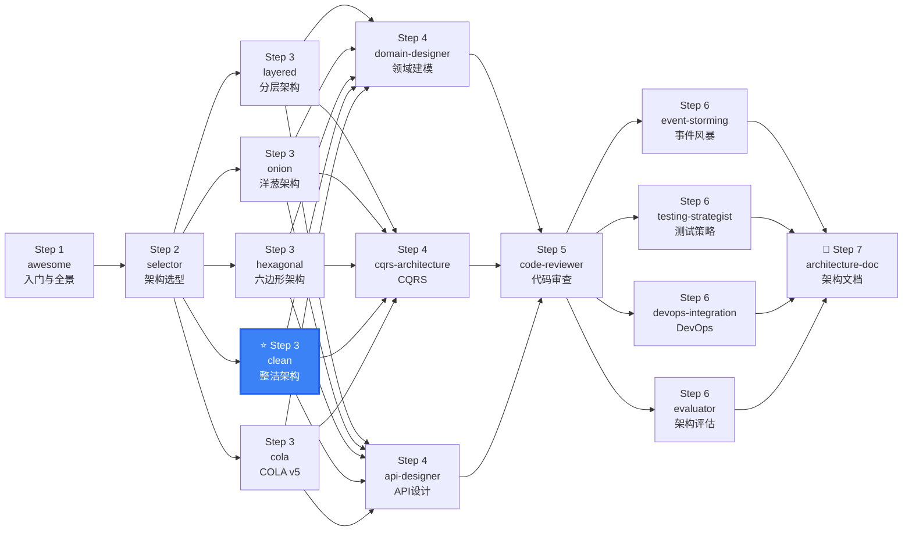

# DDD Architecture - Clean

Clean Architecture implementation guide — organized around UseCases with strict dependency rules. Based on Robert C. Martin's "Clean Architecture".

## When to use this skill

**ALWAYS use this skill when the user mentions:**
- "整洁架构"、"Clean Architecture"、"Robert Martin"、"Uncle Bob"
- "用例驱动"、"use case driven"
- "企业级架构"、"enterprise architecture"
- "严格模块隔离"、"strict module isolation"
- Large team (15-50 people) DDD standardization
- Core enterprise systems (order, payment, etc.)
- Business rules independent of delivery mechanism
- Need physical module isolation with strict boundaries

## Architecture Overview

### Core Concept

```
Clean Architecture: UseCase-centric, strict dependency rules

                    ┌──────────────────────┐
                    │    Frameworks &       │
                    │    Drivers             │
                    │  ┌────────────────┐   │
                    │  │  Interface      │   │
                    │  │  Adapters       │   │
                    │  │  ┌──────────┐   │   │
                    │  │  │   App    │   │   │
                    │  │  │ Business │   │   │
                    │  │  │  Rules   │   │   │
                    │  │  │ ┌──────┐ │   │   │
                    │  │  │ │Entity│ │   │   │
                    │  │  │ │  ★   │ │   │   │
                    │  │  │ └──────┘ │   │   │
                    │  │  └──────────┘   │   │
                    │  └────────────────┘   │
                    └──────────────────────┘
```

**Dependency Rule**: Source code dependencies must point only inward. Outer layers can depend on inner layers; inner layers never know about outer layers.

### Four Layer Structure

| Layer (outer → inner) | Responsibility | Depends On |
|------------------------|---------------|------------|
| Frameworks & Drivers | Web framework, DB, UI | → Adapters |
| Interface Adapters | Controller, Gateway, Presenter | → Application |
| Application Business Rules | Use Cases (orchestration) | → Enterprise |
| Enterprise Business Rules | Entity, core business rules ★ | Nothing |

## Applicability Check

| ✓ Applicable | ✗ Not Applicable |
|--------------|-------------------|
| Enterprise core systems (order, payment) | Temporary scripts, small tools |
| Business rules independent of delivery | Frontend-heavy, backend-light CRUD |
| Need strict module physical isolation | Team < 5, rapid iteration |
| Microservice internal standardization | Simple 3-layer suffices |

## Complete Directory Structure

```
{project}/
├── {project}-core/                    # Enterprise Business Rules
│   ├── entity/                        # ★ Core Entities
│   │   ├── Order.java
│   │   ├── OrderId.java
│   │   ├── OrderStatus.java
│   │   └── Money.java
│   ├── rule/                          # ★ Enterprise Business Rules
│   │   ├── OrderValidationRule.java
│   │   └── PricingRule.java
│   └── exception/                     # ★ Domain Exceptions
├── {project}-usecase/                 # Application Business Rules (UseCase)
│   ├── port/                          # UseCase Input/Output Ports
│   │   ├── input/                     # Input Ports (UseCase interfaces)
│   │   │   ├── CreateOrderUseCase.java
│   │   │   └── PayOrderUseCase.java
│   │   └── output/                    # Output Ports (Repository/Gateway interfaces)
│   │       ├── OrderRepository.java
│   │       └── PaymentGateway.java
│   ├── interactor/                    # UseCase Implementation (Interactor)
│   │   ├── CreateOrderInteractor.java
│   │   └── PayOrderInteractor.java
│   └── dto/                           # UseCase-specific DTOs
│       ├── CreateOrderRequest.java
│       └── PayOrderResponse.java
├── {project}-adapter/                 # Interface Adapters Layer
│   ├── controller/                    # REST / gRPC Controllers
│   ├── presenter/                     # Response format conversion
│   ├── repository/                    # DB implementation (implements UseCase output ports)
│   ├── gateway/                       # External API implementation
│   └── converter/                     # DTO/PO ↔ Entity conversion
└── {project}-framework/               # Frameworks & Drivers Layer
    ├── config/                        # Spring/DI configuration
    ├── persistence/                   # JPA Entity, Mapper
    └── web/                           # Web config (CORS, Security)
```

## Code Templates

### Enterprise Layer (Core)

```java
// ★ Core Entity — zero framework dependencies
public class Order {
    private final OrderId id;
    private Money totalAmount;
    private OrderStatus status;

    public void pay() {
        if (!this.status.canPay()) {
            throw new OrderDomainException("Cannot pay in current status");
        }
        this.status = OrderStatus.PAID;
    }
}
```

### UseCase Layer (Application)

```java
// ★ Input Port (UseCase interface)
public interface CreateOrderUseCase {
    CreateOrderOutput execute(CreateOrderInput input);
}

// ★ Output Port (Repository interface)
public interface OrderRepository {
    Order save(Order order);
    Optional<Order> findById(OrderId id);
}

// ★ Interactor (UseCase implementation)
public class CreateOrderInteractor implements CreateOrderUseCase {
    private final OrderRepository orderRepository;

    @Override
    public CreateOrderOutput execute(CreateOrderInput input) {
        Order order = Order.create(/* ... */);   // Enterprise layer
        orderRepository.save(order);              // Through port
        return CreateOrderOutput.from(order);
    }
}
```

### Adapter Layer

```java
// Controller
@RestController
public class OrderController {
    private final CreateOrderUseCase createOrderUseCase;

    @PostMapping("/orders")
    public ResponseEntity<CreateOrderResponse> createOrder(
            @RequestBody CreateOrderRequest request) {
        var input = request.toInput();
        var output = createOrderUseCase.execute(input);
        return ResponseEntity.ok(CreateOrderResponse.from(output));
    }
}

// Repository Implementation
@Repository
public class JpaOrderRepository implements OrderRepository {
    private final JpaOrderRepo jpaRepo;
    private final OrderMapper mapper;

    @Override
    public Order save(Order order) {
        return mapper.toDomain(jpaRepo.save(mapper.toPO(order)));
    }

    @Override
    public Optional<Order> findById(OrderId id) {
        return jpaRepo.findById(id.getValue()).map(mapper::toDomain);
    }
}
```

### Framework Layer

```java
@Configuration
public class UseCaseConfig {
    @Bean
    public CreateOrderUseCase createOrderUseCase(OrderRepository repo) {
        return new CreateOrderInteractor(repo);
    }
}
```

## Testing Strategy

```
Enterprise Layer (Unit Test):
  ✓ Entity business rules
  ✓ Validation rules
  ✓ No mocking needed (pure logic)

UseCase Layer (Integration Test):
  ✓ Interactor with Mock output ports
  ✓ Verify correct Entity interaction

Adapter Layer (Integration Test):
  ✓ Controller with Mock UseCase
  ✓ Repository with Testcontainers

Framework Layer (E2E Test):
  ✓ Complete request → response
```

## Implementation Phases

```
Phase 1: Enterprise Business Rules (1-3 days)
  → Core entities → Business rules → Domain exceptions

Phase 2: UseCase + Ports (1-2 days)
  → Input ports (UseCase) → Output ports (Repository/Gateway)

Phase 3: UseCase Interactors (1-2 days)
  → UseCase implementations → DTO definitions

Phase 4: Adapters + Framework (2-3 days)
  → Controllers/Gateways → Repository implementations → DI config

Phase 5: Testing (1-2 days)
  → Enterprise unit tests → UseCase integration tests (mock ports) → Adapter E2E tests
```

## Quick Decision: Where Does This Code Go?

```
├─ Is it a core business rule with NO external knowledge? → Enterprise layer (core/entity, core/rule)
├─ Is it a business validation or invariant? → Enterprise layer (core/exception)
├─ Is it a UseCase input interface? → UseCase layer (usecase/port/input)
├─ Is it a Repository or Gateway interface? → UseCase layer (usecase/port/output)
├─ Is it implementing a UseCase (orchestrating entities + ports)? → UseCase layer (usecase/interactor)
├─ Is it an HTTP/gRPC/CLI entry point? → Adapter layer (adapter/controller, adapter/presenter)
├─ Is it implementing a DB/Gateway? → Adapter layer (adapter/repository, adapter/gateway)
├─ Is it Spring/DI wiring, JPA entities, Web config? → Framework layer (framework/config, framework/persistence)
└─ Golden rule: "Source code dependencies must point only inward"
```

## Sources

### Primary Sources
- [The Clean Architecture](https://blog.cleancoder.com/uncle-bob/2012/08/13/the-clean-architecture.html) — Robert C. Martin (2012)
- [Clean Architecture: A Craftsman's Guide](https://www.oreilly.com/library/view/clean-architecture-a/9780134494272/) — Robert C. Martin (2017)
- [Domain-Driven Design: The Blue Book](https://www.domainlanguage.com/ddd/blue-book/) — Eric Evans (2003)
- [Explicit Architecture](https://herbertograca.com/2017/11/16/explicit-architecture-01-ddd-hexagonal-onion-clean-cqrs-how-i-put-it-all-together/) — Herberto Graça

### Implementation Guides
- [Get Your Hands Dirty on Clean Architecture](https://reflectoring.io/book/) — Tom Hombergs

### Reference Implementations
| Language | Repository |
|----------|-----------|
| Java | [thombergs/buckpal](https://github.com/thombergs/buckpal) |
| Go | [bxcodec/go-clean-arch](https://github.com/bxcodec/go-clean-arch) |
| .NET | [jasontaylordev/CleanArchitecture](https://github.com/jasontaylordev/CleanArchitecture) |

## Output

When assisting with this skill, provide:
- Complete Clean Architecture project directory structure
- Enterprise entity base classes + rule templates
- UseCase ports (Input/Output) + Interactor templates
- Adapter layer code templates
- Framework layer DI configuration
- Complete testing strategy (unit → integration → E2E)

---

## clean-ddd-hexagonal References

| File | Purpose |
|------|--------|
| [references/clean-ddd-hexagonal-hexagonal.md](references/clean-ddd-hexagonal-hexagonal.md) | Hexagonal Architecture ports & adapters — driver/driven ports, naming conventions, configurability |

## Skill Boundary

### ✅ 擅长处理
1. 严格分层的大型企业系统（15-50 人团队）
2. UseCase 驱动的设计：每个用例有独立 Interactor + Port
3. 模块间强隔离：外圆永远不能影响内圆
4. 多语言落地：Go/Java/TypeScript/C# 均可实现

### ⚠️ 需要条件
1. 团队理解 Interactor 模式：否则学习成本高
2. 项目有一定规模：小项目用 Layered/Onion 更合适
3. 需要配合 DDD 领域模型：单独使用 Clean Architecture 过于抽象

### ❌ 超出范围
1. 简单 CRUD 项目 → 用 `ddd-architecture-layered`
2. 中文 Spring Boot 生态 → 用 `ddd-architecture-cola`
3. 需要可视化的环状模型 → 用 `ddd-architecture-onion`


## Security & Stability

- All code templates are educational. Replace placeholder credentials with environment variables.
- Clean Architecture's dependency rule (only inward) prevents domain code from accessing I/O — built-in security advantage.
- Interactor pattern ensures each UseCase is independently testable without framework dependencies.
- No executable scripts bundled. This skill provides architecture guidance and code generation patterns only.


## Gotchas — Common Pitfalls

- **UseCase 包含业务逻辑**: UseCase（Interactor）只做编排，不包含业务规则。业务规则在 Entity（Enterprise Business Rule）层。如果 UseCase 中有状态转移判断，抽到 Domain Service。
- **Input/Output Port 滥用**: 每个 UseCase 应有独立的 Input Port 和 Output Port。不要多个 UseCase 共享同一个 Port 接口 — 违反了接口隔离原则。
- **跨层类型转换遗漏**: Adapter 层返回给 UseCase 的数据必须转换为领域类型。不要让 Controller 的 DTO 直接穿越到 UseCase 层。
- **Framework 层代码泄露**: Entity 层（最内层）绝不能 import Spring、JPA、Jackson 等框架类。如果 Entity 中有 `@Entity` 注解，整洁架构就破了。
- **过度设计**: 简单 CRUD 操作不需要完整的 Input Port → Interactor → Output Port → Presenter 链路。简单查询可以跳过 Interactor 直接使用 Repository。

## When NOT to Use This Skill

| ❌ Skip | ✅ Use Instead |
|---------|---------------|
| Simple CRUD, few business rules | `architecture-layered` (much simpler) |
| Need visual clarity (rings model) | `architecture-onion` (easier to explain to team) |
| Chinese enterprise Spring Boot stack | `architecture-cola` (better ecosystem fit) |
| Team unfamiliar with UseCase pattern | `architecture-hexagonal` or `architecture-layered` |
| Single service, no multi-module need | `architecture-layered` (single module suffices) |

## Security & Stability

- All code templates are educational. Replace placeholder credentials with environment variables or secrets management.
- Clean Architecture's strict dependency rule (only inward) naturally prevents domain code from accessing I/O — this isolation is a security advantage.
- Interactor pattern ensures each UseCase is independently testable. Unit test UseCases without any framework or database dependencies.
- No executable scripts bundled. This skill provides architecture guidance and code generation patterns only.

## 🧭 DDD Skills Journey

> 📍 **You are here: `ddd-architecture-clean` — Step 3: 整洁架构落地**



**← Previous**: [selector](../ddd-architecture-selector/) — 为什么选整洁架构？
**→ Next**: [domain-designer](../ddd-domain-designer/) — 为整洁架构设计 Enterprise 实体和 UseCase
**🔗 Related**: [api-designer](../ddd-api-designer/) — 设计 API 接口 | [testing-strategist](../ddd-testing-strategist/) — 分层测试策略
**🏠 Home**: [awesome](../ddd-architecture-awesome/) — DDD 概念全景

💡 整洁架构黄金法则：源码依赖只能指向内层。Enterprise → UseCase → Adapter → Framework，永远向内。

> 📋 See [DESIGN.md](../DESIGN.md) for the complete 16-skill ecosystem map.