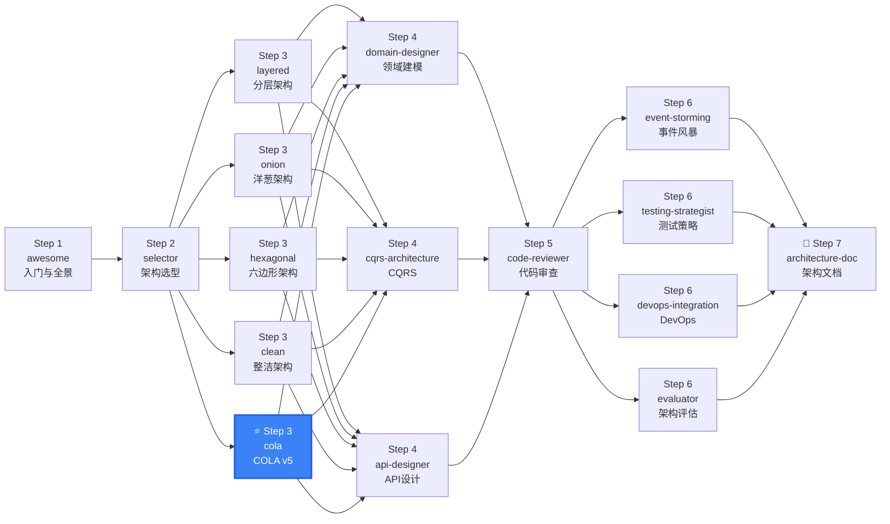

# DDD Architecture - COLA v5

COLA v5 (Clean Object-oriented Layered Architecture) implementation guide — Alibaba's DDD architecture framework. Merges project scaffolding + architecture validation.

## When to use this skill

**ALWAYS use this skill when the user mentions:**
- "COLA 架构"、"COLA v5"、"cola architecture"、"Alibaba COLA"
- "创建 COLA 项目"、"cola creator"、"COLA 脚手架"
- "COLA 校验"、"cola validator"、"检查 COLA 架构"
- "依赖方向检查"、"dependency direction check"
- Spring Boot + MyBatis Chinese enterprise projects
- Wants automated architecture compliance in CI/CD
- Needs archunit validation for DDD layering

## Architecture Overview

### COLA v5 Diamond Architecture

```
                ┌──────────────┐
                │   Adapter    │  ← Adapter Layer: HTTP, MQ, RPC
                └──────┬───────┘
                       │
                ┌──────▼───────┐
                │   Application│  ← Application Layer: orchestration, transaction, CQRS routing
        ┌───────┴───────┬───────┴───────┐
        ▼               ▼               ▼
  ┌──────────┐   ┌──────────┐   ┌──────────┐
  │  Domain  │   │  Domain  │   │  Domain  │  ← Domain Layer: core business logic
  │   ★      │   │   ★      │   │   ★      │
  └──────────┘   └──────────┘   └──────────┘
        ▲               ▲               ▲
        └───────────────┴───────────────┘
                       │
                ┌──────▼───────┐
                │Infrastructure│  ← Infrastructure Layer: DB, MQ, Cache, External API
                └──────────────┘
```

### Four Core Constraints

1. **Domain Zero Dependency**: No Spring/JPA/MyBatis imports in Domain layer
2. **App No Business Logic**: No if/else business judgments in App layer
3. **Adapter No SQL/Business**: No SQL or business logic in Adapter layer
4. **No Circular Dependencies**: No cyclic dependencies between modules

## Part A: Project Scaffolding (cola-creator)

### Interactive Setup Flow

```
User: "Create a COLA project"
  →
Confirmation questions:
  1. Project name and package base
  2. Java/Kotlin language
  3. Spring Boot version
  4. Enable CQRS? (default: no)
  5. Include Demo code? (default: Order example)
  →
Generate:
  ├── Complete pom.xml / build.gradle (multi-module)
  ├── COLA standard directory structure
  ├── Base classes: Entity/AggregateRoot/ValueObject/DomainEvent
  ├── Demo aggregate (Order complete example)
  ├── DDD middleware config (DomainEventBus, etc.)
  └── ArchUnit tests (automated dependency direction checks)
```

### Directory Structure (COLA v5 Multi-Module)

```
{project}/
├── {project}-adapter/               # Adapter Layer
│   ├── web/                         # REST Controllers
│   │   ├── controller/
│   │   └── dto/                     # Interface layer DTOs
│   └── consumer/                    # Message consumers
├── {project}-app/                   # Application Layer
│   ├── service/                     # Application services (orchestration, no business logic)
│   ├── command/                     # Command objects
│   ├── query/                       # Query objects
│   └── event/                       # Event handlers
├── {project}-domain/                # Domain Layer (Core, zero dependencies)
│   ├── {aggregate}/                 # By aggregate package
│   │   ├── entity/                  # Entity + Aggregate Root
│   │   ├── valueobject/             # Value Objects
│   │   ├── event/                   # Domain Events
│   │   ├── service/                 # Domain Services
│   │   └── repository/              # Repository interfaces (definition only)
│   ├── gateway/                     # Anti-corruption layer interfaces
│   └── shared/                      # Shared value objects/enums/exceptions
├── {project}-infrastructure/        # Infrastructure Layer
│   ├── repository/                  # Repository implementations
│   ├── gateway/                     # Anti-corruption layer implementations
│   ├── converter/                   # PO ↔ DO converter
│   └── config/                      # Configuration
└── start/                           # Bootstrap module
    └── Application.java
```

### Generated Content

| Item | Description |
|------|-------------|
| Directory Structure | Complete Maven/Gradle multi-module structure |
| Base Classes | Entity, AggregateRoot, ValueObject, DomainEvent base classes |
| Dependencies | pom.xml / build.gradle with COLA + Spring dependencies |
| Demo Code | Simple Order aggregate (entity, repository, app service, controller) |
| Unit Test Skeletons | Domain layer + Application layer test templates |
| ArchUnit Tests | Automated dependency direction validation |
| .gitignore / README | Project configuration |

## Part B: Architecture Validation (cola-validator)

### Validation Checklist

| Check Item | Severity | Description |
|------------|:--:|-------------|
| **Dependency Direction** | P0 | Domain must not depend on infrastructure/app/adapter |
| **Package Naming** | P1 | Must conform to COLA package naming conventions |
| **Layer Responsibility** | P0 | Adapter no business logic, App no SQL |
| **Domain Purity** | P0 | Domain layer zero framework dependencies (no Spring/JPA/MyBatis imports) |
| **Module Dependencies** | P1 | No cyclic dependencies between modules |
| **Aggregate Design** | P1 | Aggregate size, cross-aggregate references |

### Dependency Direction Check Algorithm

```
Rules:
  domain/          → must not depend on any other module
  infrastructure/  → can depend on domain/
  app/             → can depend on domain/ + infrastructure/
  adapter/         → can depend on app/ + domain/

Detection method:
  1. Parse import statements of each module
  2. Check domain/ for import com.example.infrastructure.* → P0 violation
  3. Check domain/ for import org.springframework.*     → P0 violation
  4. Check domain/ for import javax.persistence.*        → P0 violation
  5. Check app/ for import java.sql.*                    → P1 violation
  6. Check adapter/ for if-else business branches        → P0 violation
```

### Compliance Scoring

```
Compliance = (passed checks / total checks) * 100%

≥ 90%  → 🟢 Excellent
70-89% → 🟡 Good
50-69% → 🟠 Fair
< 50%  → 🔴 Failed, recommend rebuild
```

## Implementation Phases

```
Phase 1: Project Scaffolding (1 day)
  → Use ddd-architecture-cola creator → Generate complete project skeleton

Phase 2: Domain Modeling (2-3 days)
  → Pair with ddd-domain-designer → Generate aggregate code

Phase 3: Infrastructure Implementation (2-3 days)
  → Repository implementation → Gateway implementation → Config

Phase 4: Application + Adapter (1-2 days)
  → AppService → Controller → DTO

Phase 5: Architecture Validation (0.5 day)
  → Use ddd-architecture-cola validator → Fix violations

Phase 6: Continuous Validation
  → CI/CD integration with ArchUnit → Auto-check on every commit
```

## Code Templates

### Domain Layer

```java
// Aggregate Root — zero framework dependencies
public class Order extends AggregateRoot<OrderId> {
    private OrderStatus status;
    private Money totalAmount;
    private List<OrderItem> items;

    public void pay() {
        if (!status.canPay()) {
            throw new OrderDomainException("Cannot pay in current status");
        }
        this.status = OrderStatus.PAID;
        addDomainEvent(new OrderPaidEvent(this.id));
    }
}

// Repository Interface — defined in Domain
public interface OrderRepository {
    Optional<Order> findById(OrderId id);
    void save(Order order);
}
```

### Application Layer

```java
// Application Service — pure orchestration
@Service
public class OrderApplicationService {
    private final OrderRepository orderRepository;

    @Transactional
    public void payOrder(PayOrderCommand command) {
        Order order = orderRepository.findById(new OrderId(command.getOrderId()))
            .orElseThrow(() -> new OrderNotFoundException(command.getOrderId()));
        order.pay();
        orderRepository.save(order);
    }
}
```

### ArchUnit Validation

```java
@Test
public void domainShouldNotDependOnInfrastructure() {
    noClasses()
        .that().resideInAPackage("..domain..")
        .should().dependOnClassesThat()
        .resideInAPackage("..infrastructure..")
        .because("Domain layer must not depend on infrastructure")
        .check(classes);
}

@Test
public void domainShouldNotDependOnSpring() {
    noClasses()
        .that().resideInAPackage("..domain..")
        .should().dependOnClassesThat()
        .resideInAPackage("org.springframework..")
        .because("Domain layer must have zero framework dependencies")
        .check(classes);
}
```

## CI/CD Integration

```yaml
# GitHub Actions Example
- name: COLA Architecture Check
  run: mvn test -pl {project}-domain -Dtest=ArchitectureComplianceTest
```

## Quick Decision: Where Does This Code Go?

```
├─ Is it handling HTTP/RPC/MQ protocol? → Adapter layer (adapter/web, adapter/consumer)
├─ Is it orchestrating a use case (transaction boundary)? → Application layer (app/service)
├─ Is it a CQRS command? → Application layer (app/command)
├─ Is it a CQRS query? → Application layer (app/query)
├─ Is it a business rule, entity, value object, domain event? → Domain layer (domain/{aggregate}/)
├─ Is it a Repository interface? → Domain layer (domain/{aggregate}/repository/)
├─ Is it implementing a Repository? → Infrastructure layer (infrastructure/repository/)
├─ Is it a Gateway interface? → Domain layer (domain/gateway/)
├─ Is it implementing a Gateway? → Infrastructure layer (infrastructure/gateway/)
├─ Is it PO ↔ DO conversion? → Infrastructure layer (infrastructure/converter/)
└─ ArchUnit test: "Domain must not import org.springframework.*"
```

## Sources

### Primary Sources
- [COLA 5.0 Architecture](https://github.com/alibaba/COLA) — Alibaba
- [Domain-Driven Design: The Blue Book](https://www.domainlanguage.com/ddd/blue-book/) — Eric Evans (2003)
- [The Clean Architecture](https://blog.cleancoder.com/uncle-bob/2012/08/13/the-clean-architecture.html) — Robert C. Martin (2012)
- [Hexagonal Architecture](https://alistair.cockburn.us/hexagonal-architecture/) — Alistair Cockburn (2005)

### Chinese Resources
- [COLA 5.0 架构设计文档](https://wiki.hiwepy.com/docs/ddd/ddd-1gvro1llhtqni)
- [PartMe DDD 实战: COLA 完整代码示例](https://wiki.hiwepy.com/docs/llm-app)
- [ArchUnit User Guide](https://www.archunit.org/userguide/html/000_Index.html)

## Output

When assisting with this skill, provide:
- Complete COLA v5 project scaffolding
- Architecture validation report (violation list + fix suggestions)
- Compliance score
- ArchUnit automated validation configuration
- CI/CD integration guide

## References

See `references/` directory for:
- `cola-structure.md` — Complete COLA v5 directory structure reference
- `cola-conventions.md` — Coding conventions and best practices
- `cola-migration.md` — Migration guide from other architectures

## Next Steps

After project setup:
1. [ddd-domain-designer](../ddd-domain-designer/) — Design your domain aggregates
2. [ddd-api-designer](../ddd-api-designer/) — Design your API layer
3. [ddd-code-reviewer](../ddd-code-reviewer/) — Review your COLA compliance

---

## Skill Boundary

### ✅ 擅长处理
1. 中文企业 Spring Boot + MyBatis 技术栈
2. 需要脚手架自动生成项目的团队
3. 需要 ArchUnit 自动校验架构合规
4. COLA v5 菱形架构（Adapter→App→Domain←Infrastructure）

### ⚠️ 需要条件
1. Java + Spring Boot 项目：COLA 强绑定 Spring 生态
2. 团队愿意接受 COLA 的包命名约定
3. 需要配合 DDD 领域建模使用

### ❌ 超出范围
1. Go/Python/TypeScript 项目 → 用 `ddd-architecture-clean` 或 `ddd-architecture-hexagonal`
2. 非 Spring Boot → COLA 强绑定 Spring
3. 2 人创业团队简单 CRUD → 用 `ddd-architecture-layered`


## Security & Stability

- All code templates are educational. Replace database credentials and external URLs with environment variables.
- COLA's ArchUnit validation enforces layer boundaries at build time. Add check_cola.py (bundled in scripts/) to CI.
- The diamond architecture isolates domain logic from infrastructure — reducing attack surface.
- Script: scripts/check_cola.py validates COLA package naming and dependency rules. Run in CI to prevent violations.


## Gotchas — Common Pitfalls

- **Domain 层存放 Controller 接口**: COLA 的 Controller 接口定义在 Adapter 层，而不是 Domain 层。Domain 层只放领域对象。如果 Domain 中有 `@RestController`，分层就错了。
- **App 层直接操作数据库**: App 层（Application）通过 Gateway 接口访问数据，不能直接使用 Mapper/JdbcTemplate。Gateway 接口在 Domain 层定义，实现在 Infrastructure 层。
- **Module 命名不匹配 COLA 约定**: COLA v5 有严格的模块命名规范：`{project}-adapter`、`{project}-app`、`{project}-domain`、`{project}-infrastructure`。随机命名会导致 ArchUnit 校验失败。
- **Command/Query 放在 Domain 层**: COLA 的 Command 和 Query 对象属于 App 层（Application），用于 DTO 传输。不要把它们和 Domain 的 Entity/ValueObject 混淆。
- **忘记 COLA Archetype 版本**: 使用 `cola-archetype` 生成项目时注意 Spring Boot 和 COLA 版本匹配。不匹配的版本会导致编译失败。

## When NOT to Use This Skill

| ❌ Skip | ✅ Use Instead |
|---------|---------------|
| Non-Java project (Go, Python, TypeScript) | `architecture-clean` or `architecture-hexagonal` (language-agnostic) |
| Non-Spring Boot project | COLA is tightly coupled to Spring Boot |
| Simple CRUD, 2-person team | `architecture-layered` (much lower ceremony) |
| Already on Clean Architecture | COLA is an opinionated Clean variant — stay if Clean works |
| Startup prototyping, not enterprise | Skip DDD, use simple Spring Boot MVC |

## Security & Stability

- All code templates are educational. Replace database credentials and external service URLs with environment variables.
- COLA's ArchUnit-based validation enforces layer boundaries at build time. Add `check_cola.py` (bundled in `scripts/`) to CI for automated compliance checking.
- The diamond architecture isolates domain logic from infrastructure — reducing attack surface and making security audits focused.
- Script: `scripts/check_cola.py` validates COLA package naming conventions and dependency rules. Run in CI to prevent architectural violations.

## 🧭 DDD Skills Journey

> 📍 **You are here: `ddd-architecture-cola` — Step 3: COLA v5 架构落地**



**← Previous**: [selector](../ddd-architecture-selector/) — 为什么选 COLA？
**→ Next**: [domain-designer](../ddd-domain-designer/) — 为 COLA 项目设计聚合和领域模型
**🔗 Related**: [api-designer](../ddd-api-designer/) — 设计 API 接口 | [code-reviewer](../ddd-code-reviewer/) — ArchUnit 合规检查
**🏠 Home**: [awesome](../ddd-architecture-awesome/) — DDD 概念全景

💡 COLA 是国内企业的最佳选择：脚手架 + 校验 + Spring Boot 生态。先运行 `scripts/check_cola.py` 做一次合规检查，再开始写领域代码。

> 📋 See [DESIGN.md](../DESIGN.md) for the complete 16-skill ecosystem map.