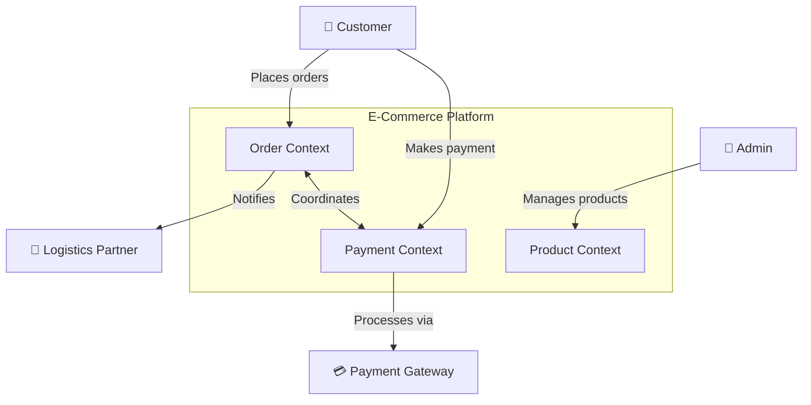
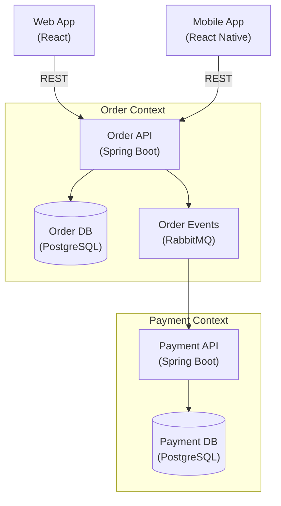
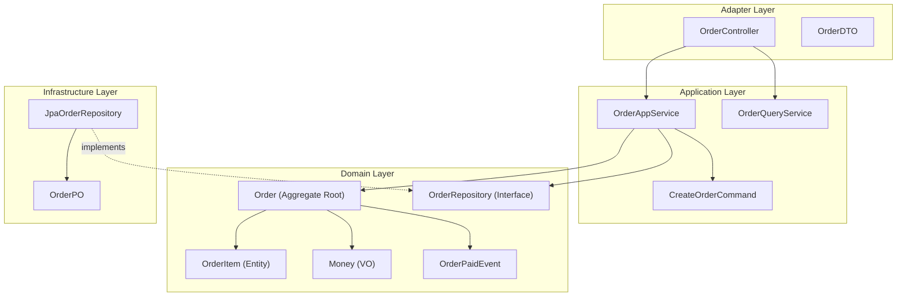
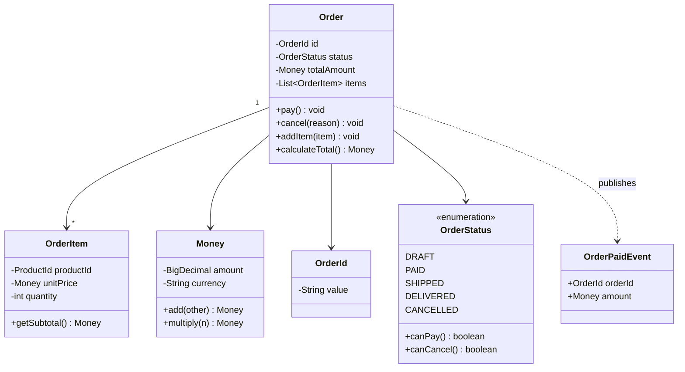

# DDD Architecture Documentation

Architecture documentation — ADR + C4 Model + Decision Tracking for DDD systems.

## When to use this skill

**ALWAYS use this skill when the user mentions:**
- "架构文档"、"architecture documentation"、"architecture doc"
- "ADR"、"Architecture Decision Record"、"架构决策记录"
- "C4 模型"、"C4 model"、"C4 diagram"
- "架构图"、"architecture diagram"、"system context"
- "技术文档"、"technical documentation"
- "怎么把架构讲清楚"、"how to document architecture"
- "架构评审"、"architecture review checklist"

## ADR (Architecture Decision Record)

### ADR Template

```markdown
# ADR-{NNN}: {Short Descriptive Title}

## Status
{Proposed / Accepted / Deprecated / Superseded}

## Context
Why do we need this decision? What forces are at play?

## Decision
What did we decide to do?

## Alternatives Considered
| Option | Pros | Cons | Decision |
|--------|------|------|:--------:|
| Option A | ... | ... | ✗ |
| Option B | ... | ... | ✗ |
| **Option C** | ... | ... | ✓ |

## Consequences
What becomes easier? What becomes harder?
- Positive: ...
- Negative: ...
- Neutral: ...

## Related
- ADR-{NNN}: {related decision}
```

### ADR Example

```markdown
# ADR-001: Choose COLA Architecture as Project Foundation

## Status
Accepted (2024-03-15)

## Context
E-commerce platform project, estimated 5 bounded contexts,
team of 8 (4 backend + 2 frontend + 1 PM + 1 QA).
Needs unified architecture conventions.

## Decision
Adopt COLA v5 architecture (diamond pattern), simplified single-module version.

## Alternatives Considered
| Option | Pros | Cons | Decision |
|--------|------|------|:--------:|
| Traditional 3-Layer | Team familiar | Hard to maintain complex business | ✗ |
| Hexagonal | Excellent testability | High learning curve | ✗ |
| Clean Architecture | Enterprise standard | Overly complex for team size | ✗ |
| **COLA v5** | Strong Chinese ecosystem | — | ✓ |

## Consequences
- Modules increase from 1 to 4 (adapter/app/domain/infrastructure)
- New team members need 1-week DDD + COLA training
- CI/CD must add ArchUnit check step
- Domain layer zero-dependency enforced

## Related
- ADR-002: CQRS Implementation Strategy
- ADR-003: Domain Event Middleware Selection
```

### ADR Status Tracking

```markdown
## ADR Index

| ADR# | Title | Status | Date | Superseded By |
|------|-------|--------|------|---------------|
| 001 | Choose COLA Architecture | Accepted | 2024-03-15 | — |
| 002 | CQRS Strategy L1 | Accepted | 2024-03-20 | — |
| 003 | Event Middleware: Spring Events | Accepted | 2024-03-25 | WIP |
| 004 | MySQL over PostgreSQL | Deprecated | 2024-02-01 | ADR-006 |
| 005 | Monolith over Microservices | Accepted | 2024-04-01 | — |
```

## C4 Model Diagrams

### DDD to C4 Mapping

```
C4 Level     | DDD Context               | Audience
─────────────┼───────────────────────────┼──────────
L1: System   | Entire system with all    | Business,
   Context   | bounded contexts           | Architecture
L2: Container| Per-BC independent        | Architecture,
             | deployment units           | DevOps
L3: Component| BC internal module        | Development
             | structure (Adapter/App/    | Team
             | Domain/Infra)
L4: Code     | Aggregate internals        | Developers
             | (entities, VOs, events)
```

### L1: System Context Diagram (Mermaid)



### L2: Container Diagram (Mermaid)



### L3: Component Diagram — Order Context (Mermaid)



### L4: Code Diagram — Order Aggregate (Mermaid)



## Architecture Document Template

```markdown
# {Project Name} Architecture Document

## 1. Architecture Overview
- Architecture Pattern: {Layered/Onion/Hexagonal/Clean/COLA}
- CQRS Level: {None/L1/L2/L3}
- Architecture Diagram (C4 L1 + L2)

## 2. Bounded Contexts
| Context | Type | Responsibility | Microservice |
|---------|------|----------------|:-----------:|
| Order | Core | Order management | ✓ |
| Payment | Core | Payment processing | ✓ |
| Product | Supporting | Product catalog | ✓ |
| Auth | Generic | Authentication | Shared |

## 3. Layering Conventions
(Reference specific Architecture Skill conventions)

## 4. Technology Stack
| Component | Technology | Version |
|-----------|-----------|---------|
| Framework | Spring Boot | 3.4.x |
| ORM | MyBatis Plus | 3.5.x |
| Database | PostgreSQL | 16 |
| Cache | Redis | 7.x |
| Message Queue | RabbitMQ | 3.13 |
| Search | Elasticsearch | 8.x |

## 5. Deployment Architecture
(K8s/Docker Compose deployment diagrams)

## 6. Architecture Decision Records
(ADR list + index)

## 7. Security Architecture
(Authentication/Authorization/Data Protection)

## 8. Operations Manual
(Monitoring/Alerting/Logging/Disaster Recovery)

## 9. Architecture Review Checklist
- [ ] Dependency direction correct
- [ ] Domain layer zero framework dependencies
- [ ] No circular module dependencies
- [ ] Rich domain models for core aggregates
- [ ] Domain events for key business operations
- [ ] ADR records up to date
```

## Architecture Review Checklist

```
□ Architecture pattern clearly documented and communicated
□ Bounded contexts identified with clear boundaries
□ Context mapping relationships defined (ACL, OHS, Partnership, etc.)
□ Layer dependencies follow defined direction
□ Domain layer is free of framework dependencies
□ Key aggregates have rich domain models
□ Cross-aggregate operations use domain events
□ ADRs recorded for all significant decisions
□ C4 diagrams kept up to date with code
□ Architecture validation automated in CI/CD
□ New team members have onboarding guide
```

## Diagram Generation Guidelines

### When to Use Each Diagram Type

| Diagram | When | Mermaid Type |
|---------|------|-------------|
| System Context | Show overall system + external actors | `graph TB` |
| Container | Show deployment units + communication | `graph TB` |
| Component | Show module internals (Adapter→App→Domain←Infra) | `graph TB` |
| Code / Class | Show aggregate structure (entities, VOs, events) | `classDiagram` |
| Sequence | Show domain event flow across contexts | `sequenceDiagram` |
| ER | Show database schema | `erDiagram` |
| Context Map | Show bounded context relationships | `graph LR` |
| State | Show aggregate lifecycle (status transitions) | `stateDiagram-v2` |

## Output

When assisting with this skill, provide:
- Architecture Decision Records (ADR template + examples)
- C4 model L1/L2/L3 diagrams (Mermaid format)
- Complete architecture document template
- ADR index + status tracking table
- Architecture review checklist

## Related Skills

- [ddd-architecture-selector](../ddd-architecture-selector/) — Initial architecture selection
- [ddd-architecture-evaluator](../ddd-architecture-evaluator/) — Periodic architecture assessment
- [ddd-code-reviewer](../ddd-code-reviewer/) — Code-level compliance check

---

## Skill Boundary

### ✅ 擅长处理
1. 架构文档生成（C4 模型 L1-L4）
2. ADR（架构决策记录）模板和状态追踪
3. Mermaid 图表生成（DDD→C4 映射）
4. 架构审查检查清单

### ⚠️ 需要条件
1. 已有架构决策需要记录
2. 团队需要文档共享和评审

### ❌ 超出范围
1. 无架构决策 → 先做决策再文档
2. 单人项目 → README + 行内注释即可
3. 需架构选型 → `ddd-architecture-selector`


## Security & Stability

- Architecture docs may contain system topology and deployment configs. Store in private repos only.
- C4 diagrams and ADRs should not include credentials or internal IPs in public documents.
- When generating Mermaid diagrams, ensure they don't expose internal service URLs.
- No executable scripts bundled. This skill provides documentation templates and patterns.


## Gotchas — Common Pitfalls

- **C4 Level 不对应**: L1（System Context）画了模块内部细节，L2（Container）跳到代码级别。C4 每层有明确定义：L1=系统与外部关系，L2=容器/服务，L3=组件/模块，L4=代码/类。
- **ADR 写太晚**: 架构决策做完几个月后才补写 ADR。ADR 应该在决策时同步记录，否则记忆会失真，决策上下文丢失。
- **文档与代码不同步**: 文档写了 Hexagonal 但代码实际是 Layered。每次架构变更后必须更新文档。推荐在 CI 中加入 ArchUnit 检查，确保文档和代码一致。
- **只画图不写决策理由**: C4 图只展示结构，不说明为什么这样设计。图 + ADR 组合才完整：图展示 What，ADR 解释 Why。
- **Mermaid 图过于复杂**: 把 10+ 个 bounded context 全塞进一张图。复杂系统应该分层画：总览图 → 逐 BC 展开图。一张图不应超过 5-7 个节点。

## When NOT to Use This Skill

| ❌ Skip | ✅ Use Instead |
|---------|---------------|
| No architecture decisions made yet | Build the system first, document later |
| Solo developer, no team | Minimal README + inline comments suffice |
| Need architecture selection first | `architecture-selector` |
| Want to review architecture quality | `architecture-evaluator` |
| Just started coding, architecture fluid | Wait until key decisions stabilize |

## Security & Stability

- Architecture documentation may contain system topology, technology choices, and deployment configurations. Store these in private team repositories only.
- C4 diagrams and ADRs should not include credentials, internal IP addresses, or security-sensitive infrastructure details in public-facing documents.
- When generating Mermaid diagrams, ensure they don't expose internal service URLs or security group configurations.
- No executable scripts bundled. This skill provides documentation templates and diagram generation patterns.

## 🧭 DDD Skills Journey

> 📍 **You are here: `ddd-architecture-doc` — 🏁 Step 7: 架构文档输出**


**← Previous**: [evaluator](../ddd-architecture-evaluator/) — 先完成架构评估，再输出文档
**→ Next**: 🏁 终点 — 也可以回到 [awesome](../ddd-architecture-awesome/) 回顾全景
**🔗 Related**: [awesome](../ddd-architecture-awesome/) — 回顾 DDD 概念全景 | [selector](../ddd-architecture-selector/) — 记录 ADR 选型决策
**🏠 Home**: [awesome](../ddd-architecture-awesome/) — DDD 概念全景

💡 ADR + C4 模型 + 架构评审 Checklist。这是 DDD 旅程最后一站——把架构讲清楚给团队看。

> 📋 See [DESIGN.md](../DESIGN.md) for the complete 16-skill ecosystem map.