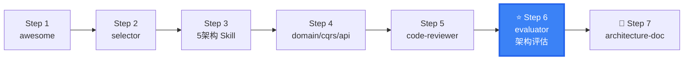

# DDD Architecture Evaluator

Architecture evaluation & evolution — assess DDD health, quantify technical debt, and plan architecture evolution.

## When to use this skill

**ALWAYS use this skill when the user mentions:**
- "架构评估"、"architecture assessment"、"architecture evaluation"
- "架构演进"、"architecture evolution"、"架构升级"
- "技术债务"、"technical debt"、"tech debt"
- "DDD 成熟度"、"DDD maturity"、"maturity model"
- "架构重构"、"architecture refactoring"
- "迁移评估"、"migration assessment"
- "架构健康度"、"architecture fitness"

## DDD Maturity Model (5 Levels)

```
Level 1 — Ad Hoc (初始级)
  □ Traditional 3-layer, no DDD concepts
  □ Anemic entities
  □ No aggregates, no domain events

Level 2 — Aware (认知级)
  □ Some entities have rich domain model
  □ Starting to use value objects (Money, Email, etc.)
  □ Business logic still in Services

Level 3 — Applied (实践级)
  □ Clear aggregate boundaries, ID references between aggregates
  □ Repository interfaces in Domain, implementations in Infrastructure
  □ Domain events for core processes
  □ Correct layered dependency direction

Level 4 — Scaled (规模化)
  □ Multiple bounded contexts, clear context mapping
  □ CQRS adopted where appropriate
  □ Automated architecture validation (CI/CD + ArchUnit)
  □ Event-driven cross-context communication

Level 5 — Optimized (优化级)
  □ Continuous architecture evolution mechanism
  □ Event Sourcing in audit scenarios
  □ Domain model 100% aligned with business language
  □ Complete ADR (Architecture Decision Records) traceability
```

## Architecture Fitness Evaluation

### 4 Dimensions

| Dimension | Check Points |
|-----------|-------------|
| **Business Alignment** | Does architecture match business complexity? Over/under-engineered? |
| **Team Fit** | Does team understand and follow architecture conventions? Need simplification? |
| **Technology Fit** | Does architecture match tech stack? Any blockers? |
| **Evolution Capability** | Does architecture support future business expansion? Refactoring cost? |
| **Delivery Efficiency** | Is feature delivery cycle reasonable with current architecture? |

### Fitness Score Matrix

```
Score each dimension 1-5:

Business Alignment:
  5 — Architecture perfectly matches complexity
  3 — Some mismatch (slightly over or under)
  1 — Major mismatch (e.g., Clean Architecture for simple CRUD)

Team Fit:
  5 — Team fully understands and follows conventions
  3 — Partial understanding, some violations
  1 — Team ignores architecture, code drifts

Technology Fit:
  5 — Architecture and tech stack perfectly aligned
  3 — Some friction (e.g., JPA doesn't fit Clean Architecture well)
  1 — Significant mismatch, need architecture or tech change

Evolution Capability:
  5 — Easy to add new BCs, swap infrastructure
  3 — Possible but requires significant refactoring
  1 — Monolith with tightly coupled modules
```

## Technical Debt Quantification

### Debt Categories

```
Structural Debt (P0):
  - Layer violations / total modules
  - Circular dependency count
  - Anemic entity percentage

Design Debt (P1):
  - Oversized aggregate count (> 5 entities)
  - Missing domain events for key operations
  - Value object missing rate (String instead of VO)

Testing Debt (P2):
  - Domain layer unit test coverage
  - Aggregate root test coverage

Debt Score:
  Total = Structural × 0.5 + Design × 0.3 + Testing × 0.2

  ≤ 20  → 🟢 Healthy
  21-40 → 🟡 Mild
  41-60 → 🟠 Moderate (create repayment plan)
  > 60  → 🔴 Severe (start refactoring immediately)
```

## Architecture Evolution Roadmap

```
Traditional 3-Layer
  → DDD 4-Layer
    → DDD Layered + Partial Rich Domain
      → Hexagonal / Clean
        → Microservices + DDD

Evolution Strategy:

Phase 1: Stop the Bleeding (Emergency) — 1-2 weeks
  → Fix P0 layer violations
  → Cut circular dependencies
  → Fix cross-aggregate direct references

Phase 2: Micro-Refactoring (Short-term) — 2-4 weeks
  → Rich-fy core aggregates (Order → pay)
  → Introduce value objects (Money → Phone → Address)
  → Add key domain events

Phase 3: Architecture Upgrade (Mid-term) — 1-3 months
  → Split monolith into bounded contexts
  → Introduce CQRS (start from L1)
  → Upgrade architecture pattern (as needed)

Phase 4: Continuous Evolution (Long-term) — Ongoing
  → Monthly architecture assessment
  → Technical debt dashboard
  → Continuous ADR recording
```

## Migration Assessment

### Pre-Migration Checklist

```
□ Current architecture pattern identified
□ Team DDD knowledge assessment complete
□ Business complexity assessment (worth migrating?)
□ Migration scope defined (full vs incremental)
□ Rollback plan established
```

### Strangler Fig Pattern (Progressive Migration)

```
1. New features → Target architecture (DDD)
2. Old features → Keep as-is, gradually replace
3. Core aggregates → Migrate first
4. Non-core modules → Migrate last or never

Migration Risk Matrix:
┌──────────┬──────────┬──────────┐
│ Risk Level│ Impact   │ Response  │
├──────────┼──────────┼──────────┤
│ High     │ Core     │ Canary + Rollback │
│ Medium   │ Non-core │ Parallel run      │
│ Low      │ Read-only│ Direct switch     │
└──────────┴──────────┴──────────┘
```

### Migration Phasing Example

```
Week 1-2: Core Order aggregate → Rich domain model
Week 3-4: Order + Payment → Extract bounded context
Week 5-6: Add CQRS L1 for Order query
Week 7-8: Introduce domain events for cross-BC communication
```

## Output

When assisting with this skill, provide:

```markdown
## Architecture Evaluation Report

### Maturity Level
- Current: {Level X}
- Target: {Level Y}
- Gap Analysis: ...

### Fitness Score
| Dimension | Score | Notes |
|-----------|:-----:|-------|
| Business Alignment | 4/5 | ... |
| Team Fit | 3/5 | ... |
| Technology Fit | 4/5 | ... |
| Evolution Capability | 2/5 | ... |

### Technical Debt
- Total Score: {N}/100
- P0 Items: {count}
- P1 Items: {count}
- P2 Items: {count}

### Evolution Roadmap
| Phase | Duration | Actions | Priority |
|-------|----------|---------|----------|
| 1. Emergency | 1-2 weeks | ... | P0 |
| 2. Short-term | 2-4 weeks | ... | P1 |
| 3. Mid-term | 1-3 months | ... | P2 |

### Migration Risk Assessment
| Risk | Level | Mitigation |
|------|:-----:|------------|
| ... | High | ... |

### Next Assessment
- Schedule: {date}
- Focus areas: ...
```

## Next Steps

After evaluation:
1. [ddd-code-reviewer](../ddd-code-reviewer/) — Detailed code-level review
2. Architecture Skill — Implement recommended changes
3. [ddd-architecture-doc](../ddd-architecture-doc/) — Record architecture decisions

---

## Skill Boundary

### ✅ 擅长处理
1. DDD 成熟度评估（5 级）
2. 架构适配度四维评估（业务/团队/技术/演进）
3. 技术债务量化 + Strangler Fig 迁移路线图
4. 周期性架构健康检查

### ⚠️ 需要条件
1. 项目已运行一段时间（非全新项目）
2. 有代码和架构文档可审查

### ❌ 超出范围
1. 代码级审查 → `ddd-code-reviewer`
2. 新项目架构选型 → `ddd-architecture-selector`
3. DDD 入门学习 → `ddd-architecture-awesome`


## Security & Stability

- Architecture evaluation is non-invasive analysis. It does NOT execute code or access production.
- Evaluation results may reference project structure — visible only in current conversation context.
- Maturity scores are relative indicators, not security audit results.
- No executable scripts bundled. This skill provides evaluation frameworks and templates.


## Gotchas — Common Pitfalls

- **只评代码不评架构**: 评估时只关注代码质量反模式，忘记评估架构本身是否匹配当前业务。代码好不等于架构对。架构评估必须包含业务对齐度维度。
- **评分当绝对真理**: 成熟度 5 级评分是相对指标，用于指导改进方向。不是用来做团队排名或绩效评估的。不要过度解读数字。
- **忽略迁移成本**: 评估出"需要迁移到 Hexagonal"但没量化迁移成本。Strangler Fig 模式需要分阶段，不能一蹴而就。评估报告必须包含分期迁移路线图。
- **评估频率不当**: 评估太频繁（每月）浪费精力，太稀疏（每年）错过问题信号。推荐频率：季度评估 + 重大业务变更时触发。
- **只评不跟**: 做完评估出报告就结束了，没有跟踪改进结果。下次评估时应对比上次的改进项完成情况。

## When NOT to Use This Skill

| ❌ Skip | ✅ Use Instead |
|---------|---------------|
| Need code-level review, not architecture | `code-reviewer` |
| Just starting a new project | `architecture-selector` |
| Haven't adopted DDD yet | `architecture-awesome` (learn first) |
| Simple architecture, no evolution needed | Evaluation is overkill |
| Need fast code quality check | `code-reviewer` (lighter) |

## Security & Stability

- Architecture evaluation is a non-invasive analysis process. It does NOT execute code, modify systems, or access production environments.
- Evaluation results may reference project structure and technology choices. These are visible only in the current conversation context.
- Maturity assessment scores are relative indicators, not security audit results. For security-specific assessment, use dedicated security review tools.
- No executable scripts bundled. This skill provides evaluation frameworks and assessment templates.

## 🧭 DDD Skills Journey

> 📍 **You are here: `ddd-architecture-evaluator` — Step 6: 架构评估与演进**



**← Previous**: [code-reviewer](../ddd-code-reviewer/) — 代码审查 → 架构级别评估
**→ Next**: [architecture-doc](../ddd-architecture-doc/) — 输出架构评估文档和 ADR
**🔗 Related**: [selector](../ddd-architecture-selector/) — 重新选型 | [devops-integration](../ddd-devops-integration/) — 自动化评估
**🏠 Home**: [awesome](../ddd-architecture-awesome/) — DDD 概念全景

💡 DDD 成熟度 5 级 + 技术债务量化 + Strangler Fig 渐进迁移。建议每季度做一次架构评估。

> 📋 See [DESIGN.md](../DESIGN.md) for the complete 16-skill ecosystem map.