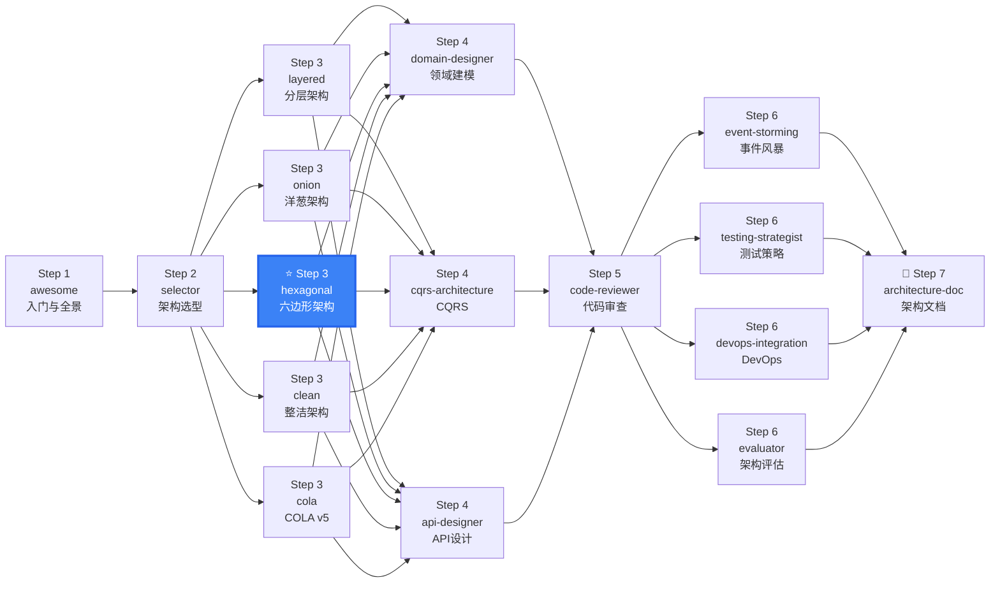

# DDD Architecture - Hexagonal

Hexagonal Architecture (Ports & Adapters) implementation guide — isolate business logic through Ports, connect external systems via Adapters. Based on Alistair Cockburn's pattern.

## When to use this skill

**ALWAYS use this skill when the user mentions:**
- "六边形架构"、"hexagonal architecture"、"Ports & Adapters"
- "端口适配器"、"Alistair Cockburn"
- "多入口系统"、"multi-entry system" (REST + CLI + MQ + gRPC)
- "基础设施可替换"、"infrastructure replaceability"
- "我需要 highest testability"、"端口隔离"
- Microservice internal architecture standardization
- Need to swap databases or message queues frequently

## Architecture Overview

### Core Concept

```
Business logic isolated through "Ports" (interfaces),
external systems connected via "Adapters"

            ┌───────────────────────┐
    Web ──▶│                       │──▶ DB
            │    ┌───────────┐     │
    CLI ──▶│    │  Domain   │     │──▶ MQ
            │    │   ★       │     │
    Event▶│    └───────────┘     │──▶ Cache
            │                       │
    Test ──▶│                       │──▶ External API
            └───────────────────────┘

    Driving Side (Left/Primary)  Domain Core  Driven Side (Right/Secondary)
```

### Three Core Abstractions

| Concept | Description | Code Representation |
|---------|-------------|---------------------|
| **Port (端口)** | Interface defined in Domain, isolates external dependencies | `interface OrderRepository` (in Domain) |
| **Primary/Driving Adapter (主适配器)** | How external systems drive your system | REST Controller, CLI Command |
| **Secondary/Driven Adapter (次适配器)** | How your system drives external systems | JPA RepositoryImpl, Kafka Producer |

## Applicability Check

| ✓ Applicable | ✗ Not Applicable |
|--------------|-------------------|
| Multi-entry systems (REST + CLI + MQ + gRPC) | Single REST API + simple CRUD |
| Infrastructure frequently replaced | Infrastructure is stable |
| Need excellent testability | Team < 3 people |
| Microservice internal architecture standard | Rapid prototyping |

## Complete Directory Structure

```
{project}/
├── {project}-domain/                  # Domain Core + Port Definitions
│   ├── model/                         # Aggregates, Entities, Value Objects
│   │   ├── order/
│   │   │   ├── Order.java             # Aggregate Root
│   │   │   ├── OrderItem.java         # Entity
│   │   │   ├── OrderId.java           # Value Object
│   │   │   └── OrderStatus.java       # Value Object / Enum
│   │   └── shared/
│   ├── service/                       # Domain Services
│   ├── event/                         # Domain Events
│   └── port/                          # ★ Ports (Interface Definitions)
│       ├── inbound/                   # Inbound Ports (UseCase interfaces)
│       │   ├── CreateOrderUseCase.java
│       │   ├── PayOrderUseCase.java
│       │   └── QueryOrderUseCase.java
│       └── outbound/                  # Outbound Ports (Repository/External interfaces)
│           ├── OrderRepository.java
│           ├── PaymentGateway.java
│           └── NotificationPort.java
├── {project}-application/             # Application Layer (UseCase Implementation)
│   └── service/
│       ├── CreateOrderService.java
│       ├── PayOrderService.java
│       └── QueryOrderService.java
├── {project}-adapter/                 # Adapter Layer
│   ├── inbound/                       # ★ Primary Adapters (Driving Side)
│   │   ├── web/                       # REST API
│   │   │   ├── controller/
│   │   │   └── dto/
│   │   ├── cli/                       # Command Line
│   │   └── event/                     # Event Listeners
│   └── outbound/                      # ★ Secondary Adapters (Driven Side)
│       ├── persistence/               # Database
│       │   ├── OrderRepositoryImpl.java
│       │   ├── entity/                # JPA Entity
│       │   └── mapper/                # PO ↔ Domain
│       ├── messaging/                 # Message Queue
│       └── external/                  # External API Clients
└── {project}-configuration/           # Configuration + DI Assembly
    └── config/
```

## Code Templates

### Ports (Domain Layer)

```java
// ★ Inbound Port (UseCase) — defined in Domain
public interface CreateOrderUseCase {
    OrderCreated handle(CreateOrderCommand command);
}

// ★ Outbound Port (Repository) — defined in Domain
public interface OrderRepository {
    Order save(Order order);
    Optional<Order> findById(OrderId id);
}

// ★ Outbound Port (External Gateway) — defined in Domain
public interface PaymentGateway {
    PaymentResult charge(Money amount);
}
```

### Application Layer (UseCase Implementation)

```java
// Application Service — implements inbound port, injects outbound ports
@ApplicationService  // Custom annotation, not Spring @Service
public class CreateOrderService implements CreateOrderUseCase {
    private final OrderRepository orderRepository;   // Inject outbound port
    private final PaymentGateway paymentGateway;

    @Override
    public OrderCreated handle(CreateOrderCommand command) {
        Order order = Order.create(command);    // Domain logic
        orderRepository.save(order);            // Outbound port
        return OrderCreated.from(order);
    }
}
```

### Primary Adapter (REST Controller)

```java
// Primary Adapter — REST Controller
@RestController
public class OrderController {
    private final CreateOrderUseCase createOrderUseCase;

    @PostMapping("/orders")
    public OrderResponse createOrder(@RequestBody CreateOrderRequest request) {
        var command = request.toCommand();
        var result = createOrderUseCase.handle(command);
        return OrderResponse.from(result);
    }
}
```

### Secondary Adapter (JPA Repository)

```java
// Secondary Adapter — JPA Repository Implementation
@Repository
public class JpaOrderRepository implements OrderRepository {
    private final JpaOrderRepo jpaRepo;   // Spring Data JPA
    private final OrderMapper mapper;     // PO ↔ Domain

    @Override
    public Order save(Order order) {
        OrderPO po = mapper.toPO(order);
        OrderPO saved = jpaRepo.save(po);
        return mapper.toDomain(saved);
    }
}
```

## Testing Strategy

```java
// Unit Test — Mock outbound ports, test UseCase
@Test
public void createOrder_should_save_and_return_order() {
    // Given
    var mockRepo = mock(OrderRepository.class);
    var useCase = new CreateOrderService(mockRepo);

    // When
    var result = useCase.handle(command);

    // Then
    verify(mockRepo).save(any(Order.class));
    assertNotNull(result.getOrderId());
}

// Integration Test — Real secondary adapter
@SpringBootTest
@Testcontainers
public class JpaOrderRepositoryTest {
    @Autowired private OrderRepository orderRepository;

    @Test
    public void should_save_and_load_aggregate_completely() {
        Order order = Order.create(/* ... */);
        orderRepository.save(order);
        var loaded = orderRepository.findById(order.getId());
        assertTrue(loaded.isPresent());
    }
}
```

## Implementation Phases

```
Phase 1: Define Ports (1-2 days)
  → Inbound ports (UseCase interfaces) → Outbound ports (Repository/External interfaces)

Phase 2: Implement Domain Model (2-3 days)
  → Aggregate roots/entities/value objects → Domain services → Domain events

Phase 3: Implement Application Layer (1-2 days)
  → UseCase implementations (inject ports, orchestrate calls)

Phase 4: Implement Adapters (2-4 days)
  → Primary: REST/gRPC/CLI → Secondary: DB/MQ/External API

Phase 5: DI Assembly + Testing (1-2 days)
  → Dependency injection config → Port mock testing → Adapter integration testing
```

## Quick Decision: Where Does This Code Go?

```
├─ Defines a contract (interface) for inbound operations? → Domain layer (domain/port/inbound)
├─ Defines a contract (interface) for outbound operations? → Domain layer (domain/port/outbound)
├─ Implements a UseCase (inbound port)? → Application layer (application/service)
├─ Is it a business rule, entity, or value object? → Domain layer (domain/model)
├─ Converts HTTP/REST to port calls? → Adapter layer (adapter/inbound/web)
├─ Implements a Repository or external API client? → Adapter layer (adapter/outbound/persistence)
├─ Assembles all adapters with ports (DI)? → Configuration layer (configuration/config)
└─ Primary test: "Can I run domain logic from a unit test with NO infrastructure?" → Yes = correct
```

## Sources

### Primary Sources
- [Hexagonal Architecture](https://alistair.cockburn.us/hexagonal-architecture/) — Alistair Cockburn (2005)
- [Hexagonal Architecture Explained](https://openlibrary.org/works/OL38388131W) — Cockburn & Garrido de Paz (2024)
- [Domain-Driven Design: The Blue Book](https://www.domainlanguage.com/ddd/blue-book/) — Eric Evans (2003)
- [The Clean Architecture](https://blog.cleancoder.com/uncle-bob/2012/08/13/the-clean-architecture.html) — Robert C. Martin (2012)

### Implementation Guides
- [AWS: Hexagonal Architecture Pattern](https://docs.aws.amazon.com/prescriptive-guidance/latest/cloud-design-patterns/hexagonal-architecture.html)
- [Microsoft: DDD + CQRS Microservices](https://learn.microsoft.com/en-us/dotnet/architecture/microservices/microservice-ddd-cqrs-patterns/)

### Reference Implementations
| Language | Repository |
|----------|-----------|
| Java | [thombergs/buckpal](https://github.com/thombergs/buckpal) |
| Go | [bxcodec/go-clean-arch](https://github.com/bxcodec/go-clean-arch) |
| TypeScript | [jbuget/nodejs-clean-architecture-app](https://github.com/jbuget/nodejs-clean-architecture-app) |

## Output

When assisting with this skill, provide:
- Complete hexagonal project directory structure
- Domain Ports (UseCase + Repository interfaces)
- Primary + Secondary adapter code templates
- Demo aggregate implementation
- Mock test + Adapter integration tests
- Complete UseCase call chain (Controller → UseCase → Port → Adapter)

---

## clean-ddd-hexagonal References

| File | Purpose |
|------|--------|
| [references/clean-ddd-hexagonal-hexagonal.md](references/clean-ddd-hexagonal-hexagonal.md) | Hexagonal Architecture ports & adapters — driver/driven ports, naming conventions, configurability |

## Skill Boundary

### ✅ 擅长处理
1. 多入口系统（REST + CLI + MQ + gRPC）
2. 基础设施频繁变更（换 DB/换 MQ/换缓存）
3. 需要极致可测试性（端口 Mock 即可测试全部领域逻辑）
4. 团队理解 Port/Adapter 模式

### ⚠️ 需要条件
1. 团队理解抽象设计：否则 Port 定义不当
2. 项目规模适中：小项目用 Layered 更简单
3. 需要配合 DDD 领域模型：Port 接口定义需要领域知识

### ❌ 超出范围
1. 单一 REST API 入口 → 用 `ddd-architecture-layered`
2. 中文企业 MyBatis 生态 → 用 `ddd-architecture-cola`
3. 需要 UseCase 驱动 → 用 `ddd-architecture-clean`


## Security & Stability

- All code templates are educational. Replace external service URLs and credentials.
- Port/Adapter isolation means domain logic never directly depends on HTTP/DB/MQ libraries — adapter layer handles all I/O.
- When implementing Secondary Adapters for external APIs, always set timeouts and implement circuit breaker patterns.
- No executable scripts bundled. This skill provides architecture guidance and code generation patterns only.


## Gotchas — Common Pitfalls

- **Port 接口定义过宽**: 每个 Port 应该只做一件事。不要创建 "god port" 包含 10+ 方法。如果 Port 变大，拆分它。
- **Primary Adapter 包含业务逻辑**: REST Controller 只能做参数转换和调用 UseCase，不能包含 if/else 业务判断。业务逻辑在 Domain，编排在 Application/UseCase。
- **Secondary Adapter 忘记错误转换**: 外部系统异常（SQLException、HttpTimeoutException）必须在 Adapter 内部转换为领域异常，不能让领域层看到技术异常。
- **"端口爆炸"反模式**: 不是每个外部依赖都需要独立端口。例如日志框架、序列化库不需要抽象。只为可能替换的外部系统定义 Port。
- **忘记测试端口隔离**: 如果不启动数据库就能跑通 Domain 层全部单元测试，说明六边形边界正确。如果单元测试需要数据库，Port 边界有泄露。

## When NOT to Use This Skill

| ❌ Skip | ✅ Use Instead |
|---------|---------------|
| Single REST API, no other entry points | `architecture-layered` (less abstraction overhead) |
| Chinese enterprise MyBatis + Spring Boot | `architecture-cola` (better Chinese ecosystem fit) |
| Need use-case-centric organization | `architecture-clean` (Interactor pattern) |
| Small team, tight deadline | `architecture-layered` (simpler onboarding) |
| Existing working architecture | Don't rewrite — evaluate with `architecture-evaluator` first |

## Security & Stability

- All code templates are educational. Replace external service URLs and credentials with environment-specific configuration.
- Port/Adapter isolation means domain logic never directly depends on HTTP, database, or messaging libraries — the adapter layer handles all I/O.
- When implementing Secondary Adapters for external APIs, always set connection/read timeouts and implement circuit breaker patterns for resilience.
- No executable scripts bundled. This skill provides architecture guidance and code generation patterns only.

## 🧭 DDD Skills Journey

> 📍 **You are here: `ddd-architecture-hexagonal` — Step 3: 六边形架构落地**



**← Previous**: [selector](../ddd-architecture-selector/) — 为什么选六边形架构？
**→ Next**: [domain-designer](../ddd-domain-designer/) — 为六边形架构设计端口对应的领域模型
**🔗 Related**: [api-designer](../ddd-api-designer/) — 设计六边形 API 接口 | [testing-strategist](../ddd-testing-strategist/) — 端口 Mock 测试
**🏠 Home**: [awesome](../ddd-architecture-awesome/) — DDD 概念全景

💡 六边形 = 端口 + 适配器。设计验证法：如果不用数据库和 HTTP 就能跑通领域逻辑的单元测试，你的六边形边界就对了。

> 📋 See [DESIGN.md](../DESIGN.md) for the complete 16-skill ecosystem map.