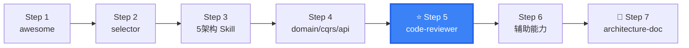

# DDD Code Reviewer

DDD code review + anti-pattern detection + compliance scoring — validate your code against DDD best practices.

## When to use this skill

**ALWAYS use this skill when the user mentions:**
- "代码审查"、"DDD 审查"、"DDD review"
- "架构审查"、"architecture review"
- "反模式检测"、"anti-pattern detection"
- "检查代码"、"review my code"
- "充血模型检查"、"rich domain check"
- "分层合规"、"layering compliance"
- "代码质量评分"、"code quality score"

## DDD Anti-Pattern Checklist

| Anti-Pattern | Severity | Detection Points |
|-------------|:--:|-----------------|
| **Anemic Model** | P0 | Entity has only getters/setters, no business methods |
| **God Service** | P0 | Single Service > 500 lines, contains all business logic |
| **Cross-Aggregate Direct Reference** | P0 | Aggregate A's field type is Aggregate B (should be ID reference) |
| **Domain Layer Framework Dependency** | P0 | Domain layer imports Spring/JPA/MyBatis |
| **Repository Returns DTO** | P1 | Repository returns non-aggregate-root type |
| **Controller Business Logic** | P1 | if/else business logic in Controller |
| **Application Service SQL** | P1 | App layer directly operates Mapper/JdbcTemplate |
| **Mutable Value Object** | P1 | ValueObject has setters or non-final fields |
| **Oversized Aggregate** | P2 | Single aggregate > 5 entities |
| **Circular Dependency** | P0 | A → B → A module circular dependency |
| **Missing Domain Events** | P2 | Key business actions without domain event publication |
| **Cross-Aggregate Transaction** | P2 | One transaction spans 2+ aggregates |

## Layered Compliance Matrix

```
Check rules (based on ArchUnit):

┌──────────────────┬─────┬─────┬─────┬─────┐
│ Layer / May Depend│ Infra│ Dom │ App │ Adap│
├──────────────────┼─────┼─────┼─────┼─────┤
│ Infrastructure   │  ✓  │  ✗  │  ✗  │  ✗  │
│ Domain           │  ✗  │  ✓  │  ✗  │  ✗  │
│ Application      │  ✓  │  ✓  │  ✓  │  ✗  │
│ Adapter          │  ✓  │  ✓  │  ✓  │  ✓  │
└──────────────────┴─────┴─────┴─────┴─────┘

Domain Layer Zero-Dependency Rule (P0):
  ✗ import org.springframework.stereotype.Service
  ✗ import javax.persistence.Entity
  ✗ import org.apache.ibatis.annotations.Mapper
  ✓ import java.util.Optional
  ✓ import java.math.BigDecimal
```

## Rich Domain Model Validation

```java
// ✅ PASSES Review — Rich Domain Model
public class Order extends AggregateRoot<OrderId> {
    private OrderStatus status;
    private List<OrderItem> items;

    public void pay() {                    // Behavior in entity
        if (!status.canPay()) {
            throw new OrderException("Cannot pay");
        }
        this.status = OrderStatus.PAID;
        addDomainEvent(new OrderPaidEvent(this.id));
    }
}

// ❌ FAILS Review — Anemic Model
public class Order {
    private Long id;
    private String status;                // String instead of Value Object
    // Only getters/setters, no business methods ← ANTI-PATTERN
}

public class OrderService {               // God Service
    @Transactional
    public void pay(Long orderId) {       // Behavior in Service, not Entity
        Order order = orderMapper.findById(orderId);
        if ("DRAFT".equals(order.getStatus())) { // Raw string comparison
            order.setStatus("PAID");
            orderMapper.update(order);
        }
    }
}
```

## Scoring System

### 5 Dimensions

```
1. Layering Compliance (30%)
   - Dependency direction correctness
   - Layer responsibility singularity
   - Cross-layer call detection

2. Domain Model Quality (30%)
   - Rich model coverage (entities with business methods / total entities)
   - Value object usage rate (VOs / primitive-type fields)
   - Aggregate design rationality

3. Naming Conventions (15%)
   - Aggregate root → Order (business name)
   - Repository → OrderRepository
   - Domain service → OrderPricingService
   - Domain event → OrderPaid (past tense)

4. Code Structure (15%)
   - Package organization by aggregate
   - Class size (aggregate root < 200 lines, service < 100 lines)
   - Method complexity (cyclomatic complexity < 10)

5. Test Coverage (10%)
   - Domain layer unit test coverage
   - Aggregate root test coverage

Total Score = Σ(dimension score × weight)
```

### Score Interpretation

```
≥ 85  → 🟢 A: Excellent DDD practice
70-84 → 🟡 B: Basically compliant, room for improvement
50-69 → 🟠 C: Obvious anti-patterns present
< 50  → 🔴 D: Refactoring needed
```

## ArchUnit Automation

```java
@AnalyzeClasses(packages = "com.example")
public class ArchitectureComplianceTest {

    @ArchTest
    static final ArchRule domain_no_infrastructure =
        noClasses()
            .that().resideInAPackage("..domain..")
            .should().dependOnClassesThat()
            .resideInAPackage("..infrastructure..")
            .because("Domain layer must not depend on infrastructure");

    @ArchTest
    static final ArchRule domain_no_spring =
        noClasses()
            .that().resideInAPackage("..domain..")
            .should().dependOnClassesThat()
            .resideInAPackage("org.springframework..")
            .because("Domain layer must have zero framework dependencies");

    @ArchTest
    static final ArchRule app_no_sql =
        noClasses()
            .that().resideInAPackage("..app..")
            .should().dependOnClassesThat()
            .resideInAPackage("java.sql..")
            .because("Application layer should not directly access SQL");

    @ArchTest
    static final ArchRule controller_no_repository =
        noClasses()
            .that().resideInAPackage("..adapter..controller..")
            .should().dependOnClassesThat()
            .resideInAPackage("..infrastructure..repository..")
            .because("Controllers should not directly access repositories");
}
```

## Review Report Template

When generating a review, use this structure:

```markdown
# DDD Code Review Report

## Overall Score: 78/100 (B级 🟡)

### 1. Layering Compliance (24/30)
| Check Item | Result | Note |
|-------------|:--:|------|
| Domain zero-dependency | ✅ | No framework dependencies |
| App layer no SQL | ❌ | OrderAppService L45 directly calls Mapper |
| Dependency direction | ✅ | No reverse dependencies |

### 2. Domain Model Quality (22/30)
| Check Item | Result | Note |
|-------------|:--:|------|
| Rich domain model | ⚠️ | User entity still anemic |
| Value objects | ⚠️ | Money/Email done, Phone still String |

### 3. Anti-Pattern List
| Anti-Pattern | Location | Fix Suggestion |
|-------------|----------|----------------|
| God Service | OrderService.java:45-320 | Split into OrderPricingService + OrderFulfillmentService |

### 4. Improvement Suggestions (by priority)
1. [P0] Move SQL from OrderAppService to Repository implementation
2. [P1] Convert User entity to rich domain model
3. [P2] Add domain events for key business operations
```

## Output

When assisting with this skill, provide:
- Code review scoring report (5 dimensions + total)
- Anti-pattern checklist (with locations + fix suggestions)
- Layered compliance matrix
- Rich domain model refactoring guide
- ArchUnit compliance detection scripts

## Next Steps

After code review:
1. [ddd-architecture-evaluator](../ddd-architecture-evaluator/) — Architecture-level assessment
2. Architecture Skill — Fix directory structure issues
3. [ddd-testing-strategist](../ddd-testing-strategist/) — Improve test coverage

---

## clean-ddd-hexagonal References

| File | Purpose |
|------|--------|
| [references/clean-ddd-hexagonal-layers.md](references/clean-ddd-hexagonal-layers.md) | Complete four-layer structure for dependency rule validation |
| [references/clean-ddd-hexagonal-tactical.md](references/clean-ddd-hexagonal-tactical.md) | DDD tactical patterns — Entity, Value Object, Aggregate, Repository anti-pattern reference |
| [references/clean-ddd-hexagonal-testing.md](references/clean-ddd-hexagonal-testing.md) | Testing patterns for Clean Architecture + DDD + Hexagonal systems |

## Skill Boundary

### ✅ 擅长处理
1. DDD 项目代码审查：检查反模式（贫血模型/跨聚合引用/框架泄露等）
2. 分层合规检查：Domain 零依赖、依赖方向校验
3. 代码质量评分（5 维度 + ArchUnit 规则）

### ⚠️ 需要条件
1. 项目已采用 DDD：非 DDD 项目无审查基础
2. 有可审查的源代码：需提供代码路径

### ❌ 超出范围
1. 非 DDD 项目 → Standard code review (SonarQube/Checkstyle)
2. 需架构选型 → `ddd-architecture-selector`
3. 需架构评估 → `ddd-architecture-evaluator`


## Security & Stability

- This skill reviews code patterns, not runtime behavior. It does NOT execute code or access systems.
- Review results may contain file paths and code snippets — visible only in current conversation context.
- Scoring dimensions are pattern-based — results should be reviewed by human, not treated as automated gate.
- No executable scripts bundled. All review operations are code reading and analysis.


## Gotchas — Common Pitfalls

- **检验遗漏 Report 生成**: 评分完成后必须输出结构化的 Review Report。只口述问题不输出文档，团队无法追踪改进。必须包含：反模式列表 + 违规代码位置 + 修复建议 + 评分。
- **机械套用规则，忽略业务上下文**: 不是所有 "Service > 500 行" 都是反模式。如果 Service 全是编排（调用 Domain Service），行数多只是编排复杂度，不是 God Service。区分编排厚度 vs 业务逻辑泄露。
- **漏检跨聚合引用**: 跨聚合引用很隐蔽 — 不只是 `Order.customer`（对象引用），还有 `orderService.getCustomerId()` 返回 Customer 对象。搜索所有跨聚合的方法返回类型。
- **PO/DTO 混用未检出**: 检查 Repository 返回类型是否为 Domain Aggregate，而不是 JPA Entity 或 DTO。如果 Repository 返回 DTO，Domain 层收到了贫血对象。
- **只检查主代码，忽略测试**: 测试代码中的反模式同样危险。Mock 了不该 Mock 的（Domain Service 内部调用），该 Mock 的没 Mock（数据库连接）。

## When NOT to Use This Skill

| ❌ Skip | ✅ Use Instead |
|---------|---------------|
| Non-DDD project (simple CRUD) | Standard code review (SonarQube, Checkstyle) |
| Project hasn't adopted DDD yet | `architecture-awesome` (learn DDD first) |
| Just committed first DDD code | Write code first, review later |
| Need architecture selection | `architecture-selector` |
| Want to evaluate architecture fitness (not code) | `architecture-evaluator` |

## Security & Stability

- This skill reviews code patterns, not runtime behavior. It does NOT execute user code, scan for vulnerabilities, or access external systems.
- Review results may contain file paths and code snippets from the user's project. These are only visible to the user in the current conversation context.
- Scoring dimensions are based on static analysis patterns — results should be reviewed by a human, not treated as automated gate decisions.
- No executable scripts bundled. All review operations are code reading and analysis.

## 🧭 DDD Skills Journey

> 📍 **You are here: `ddd-code-reviewer` — Step 5: 代码审查与质量保障**



**← Previous**: [domain-designer](../ddd-domain-designer/) — 审查领域模型质量
**→ Next**: [architecture-evaluator](../ddd-architecture-evaluator/) — 上升到架构级别评估
**🔗 Related**: [testing-strategist](../ddd-testing-strategist/) — 测试覆盖率审查 | [architecture-cola](../ddd-architecture-cola/) — COLA 合规检查
**🏠 Home**: [awesome](../ddd-architecture-awesome/) — DDD 概念全景

💡 12 种反模式 + 5 维度评分。推荐集成到 CI/CD Pipeline 作为质量门禁。

> 📋 See [DESIGN.md](../DESIGN.md) for the complete 16-skill ecosystem map.