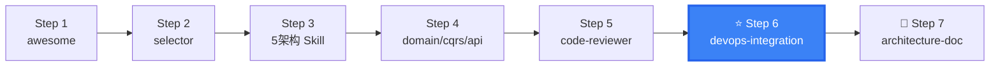

# DDD DevOps Integration

DDD + DevOps integration — CI/CD pipelines with DDD quality gates, containerization, observability, and database deployment.

## When to use this skill

**ALWAYS use this skill when the user mentions:**
- "DevOps DDD"、"CI/CD DDD"、"DDD 部署"
- "DDD 容器化"、"DDD Docker"、"DDD Kubernetes"
- "DDD 监控"、"DDD monitoring"、"DDD observability"
- "流水线集成"、"pipeline integration"
- "架构自动化检查"、"ArchUnit CI/CD"
- "DDD 质量门禁"、"DDD quality gate"
- "数据库部署 DDD"、"database deployment"

## CI/CD Pipeline with DDD Quality Gates

### Pipeline Flow

```
Code Commit → Static Analysis → Build → Test → Architecture Validation → Security → Deploy
                 │              │      │           │                      │
                 ▼              ▼      ▼           ▼                      ▼
             Checkstyle     Maven   Unit Tests   ArchUnit              OWASP
             PMD           Gradle   Integration  Module Deps
                                     Coverage     Naming Check
```

### Architecture Validation Stage (Critical Gate)

```
1. ArchUnit layered dependency direction check
2. Domain layer zero-dependency check (no Spring/JPA/MyBatis imports)
3. Module circular dependency detection
4. Package naming convention (COLA/DDD compliance)
5. Public path access check

Failure Policy:
  P0 check fails → Block merge
  P1 check fails → Warning + approval required
  P2 check fails → Report only
```

### GitHub Actions Pipeline Example

```yaml
name: DDD Quality Gate

on:
  pull_request:
    branches: [main]

jobs:
  architecture-check:
    runs-on: ubuntu-latest
    steps:
      - uses: actions/checkout@v4
      
      - name: Set up JDK 17
        uses: actions/setup-java@v4
        with:
          java-version: '17'
          distribution: 'temurin'
      
      - name: Build
        run: mvn clean compile
      
      - name: Domain Layer Purity Check
        run: mvn test -pl domain -Dtest=DomainPurityTest
      
      - name: Layering Compliance Check
        run: mvn test -pl domain -Dtest=LayeringComplianceTest
      
      - name: Module Dependency Check
        run: mvn test -pl domain -Dtest=ModuleDependencyTest
```

### GitLab CI Pipeline Example

```yaml
stages:
  - build
  - test
  - architecture-check

architecture-validation:
  stage: architecture-check
  script:
    - mvn test -pl domain -Dtest=ArchitectureComplianceTest
  rules:
    - if: $CI_PIPELINE_SOURCE == "merge_request_event"
  artifacts:
    reports:
      junit: domain/target/surefire-reports/TEST-*.xml
```

## ArchUnit Automation Configuration

```java
@AnalyzeClasses(packages = "com.example")
public class ArchitectureComplianceTest {

    @ArchTest
    static final ArchRule domain_no_spring =
        noClasses()
            .that().resideInAPackage("..domain..")
            .should().dependOnClassesThat()
            .resideInAPackage("org.springframework..")
            .because("Domain layer must have zero Spring dependencies");

    @ArchTest
    static final ArchRule domain_no_infrastructure =
        noClasses()
            .that().resideInAPackage("..domain..")
            .should().dependOnClassesThat()
            .resideInAPackage("..infrastructure..")
            .because("Domain layer must not depend on infrastructure");

    @ArchTest
    static final ArchRule app_no_sql =
        noClasses()
            .that().resideInAPackage("..app..")
            .should().dependOnClassesThat()
            .resideInAPackage("java.sql..")
            .because("App layer should not directly access SQL");

    @ArchTest
    static final ArchRule no_cycles =
        slices()
            .matching("com.example.(*)..")
            .should().beFreeOfCycles();
}
```

## Containerization Strategies

### Scenario 1: Monolith DDD

```dockerfile
FROM eclipse-temurin:17-jre-alpine
COPY start/target/*.jar app.jar
HEALTHCHECK --interval=30s CMD curl -f http://localhost:8080/actuator/health || exit 1
ENTRYPOINT ["java", "-jar", "app.jar"]
```

```yaml
# docker-compose.yml
services:
  app:
    build: .
    ports:
      - "8080:8080"
    environment:
      - SPRING_DATASOURCE_URL=jdbc:postgresql://db:5432/orders
    depends_on:
      db:
        condition: service_healthy
  db:
    image: postgres:16-alpine
    environment:
      POSTGRES_DB: orders
    healthcheck:
      test: ["CMD-SHELL", "pg_isready -U postgres"]
      interval: 10s
```

### Scenario 2: DDD + CQRS (Read/Write Separation)

```yaml
# docker-compose.yml — CQRS deployment
services:
  order-command:
    build:
      context: .
      dockerfile: Dockerfile.command
    ports:
      - "8081:8080"
    environment:
      - DB_URL=jdbc:postgresql://write-db:5432/orders
    depends_on:
      - write-db

  order-query:
    build:
      context: .
      dockerfile: Dockerfile.query
    ports:
      - "8082:8080"
    environment:
      - ES_HOST=elasticsearch:9200
    depends_on:
      - elasticsearch

  write-db:
    image: postgres:16-alpine

  elasticsearch:
    image: elasticsearch:8.12.0
```

### Scenario 3: Microservices + DDD

```yaml
# Per bounded context independent deployment
services:
  order-service:
    build: ./services/order
    environment:
      - DB_URL=jdbc:postgresql://order-db:5432/orders
    depends_on:
      - order-db

  payment-service:
    build: ./services/payment
    environment:
      - DB_URL=jdbc:postgresql://payment-db:5432/payments
    depends_on:
      - payment-db

  order-db:
    image: postgres:16-alpine

  payment-db:
    image: postgres:16-alpine
```

## Observability

### DDD Observability Three Pillars

```
Logging:
  - Domain event publication records (Event Type + Aggregate ID)
  - Repository slow query logs (> 100ms)
  - Cross-aggregate operation trace (TraceId)
  - Business exception logging with domain context

Metrics:
  - Domain event publication rate (events/sec)
  - Repository query latency distribution (p50/p95/p99)
  - Aggregate load entity count distribution (N+1 detection)
  - CQRS command processing latency (Command → Event delay)
  - Aggregate size distribution

Tracing:
  Controller → AppService → DomainService → Repository
  TraceId贯穿整个调用链
  Key nodes: UseCase entry, Repository call, Domain event publication
```

### Logback Configuration for DDD

```xml
<appender name="DOMAIN" class="ch.qos.logback.core.rolling.RollingFileAppender">
    <file>logs/domain.log</file>
    <encoder>
        <pattern>%d{ISO8601} [%thread] %-5level %logger{36} - %msg%n</pattern>
    </encoder>
</appender>

<logger name="com.example.domain.event" level="INFO" additivity="false">
    <appender-ref ref="DOMAIN"/>
</logger>
```

### Micrometer Metrics for DDD

```java
@Component
public class DomainEventMetrics {
    private final MeterRegistry registry;

    public DomainEventMetrics(MeterRegistry registry) {
        this.registry = registry;
    }

    public void recordEventPublished(String eventType, String aggregateType) {
        registry.counter("domain.events.published",
            "event_type", eventType,
            "aggregate_type", aggregateType
        ).increment();
    }

    public Timer.Sample startRepositoryCall() {
        return Timer.start(registry);
    }

    public void stopRepositoryCall(Timer.Sample sample, String repository) {
        sample.stop(Timer.builder("domain.repository.call")
            .tag("repository", repository)
            .register(registry));
    }
}
```

## Database Deployment Strategies

| Scenario | Strategy | Tool |
|----------|----------|------|
| DDD Layered/Onion | Single DB + Flyway/Liquibase | Flyway |
| CQRS L2 (Read/Write Separation) | Primary-Replica sync + read lag tolerance | MySQL Replication / PG Streaming |
| Event Sourcing | Event Store + Projection DB | Axon / EventStoreDB |
| Microservices + DDD | Per BC independent DB | Per-service independent Flyway migration |

### Flyway Migration Example

```
resources/db/migration/
├── V1__create_order_table.sql
├── V2__create_order_item_table.sql
├── V3__add_order_status_column.sql
└── V4__create_domain_event_table.sql
```

```sql
-- V4__create_domain_event_table.sql
CREATE TABLE domain_event (
    id VARCHAR(36) PRIMARY KEY,
    aggregate_id VARCHAR(36) NOT NULL,
    event_type VARCHAR(100) NOT NULL,
    event_data JSONB NOT NULL,
    occurred_at TIMESTAMP NOT NULL,
    published BOOLEAN DEFAULT FALSE,
    INDEX idx_aggregate_id (aggregate_id),
    INDEX idx_published (published)
);
```

## Deployment Health Checks

```java
@Component
public class DDDHealthIndicator implements HealthIndicator {
    private final EventBus eventBus;
    private final DataSource dataSource;

    @Override
    public Health health() {
        Health.Builder builder = new Health.Builder();
        
        // Check domain event bus
        if (eventBus.isHealthy()) {
            builder.withDetail("eventBus", "UP");
        } else {
            builder.down().withDetail("eventBus", "DOWN");
        }
        
        // Check aggregate loading performance
        // ... (custom aggregate health checks)
        
        return builder.build();
    }
}
```

## Output

When assisting with this skill, provide:
- CI/CD pipeline configuration files (GitHub Actions / GitLab CI)
- ArchUnit dependency check rule configuration
- Dockerfile templates (monolith / CQRS / microservices)
- Observability configuration (Logback / Micrometer / OpenTelemetry)
- Database migration strategy recommendations
- Health check configuration

## Next Steps

After DevOps setup:
1. [ddd-code-reviewer](../ddd-code-reviewer/) — Add automated review to pipeline
2. [ddd-architecture-evaluator](../ddd-architecture-evaluator/) — Periodic architecture health check
3. [ddd-architecture-doc](../ddd-architecture-doc/) — Document deployment architecture

---

## Skill Boundary

### ✅ 擅长处理
1. DDD 质量门禁集成到 CI/CD
2. 不同 DDD 架构的容器化策略
3. 领域事件和聚合的可观测性设置
4. ArchUnit 自动化检查

### ⚠️ 需要条件
1. 已有 CI/CD 基础设施
2. 项目已采用 DDD 架构

### ❌ 超出范围
1. 无 CI/CD → 先建基础 pipeline
2. 纯单体服务 → 标准 DevOps 即可
3. 尚未采用 DDD → `ddd-architecture-awesome` 先入门


## Security & Stability

- CI/CD configs and Docker/K8s templates are educational. Replace credentials and registry URLs.
- DDD quality gates run at build time and do NOT access production.
- Container images must NOT include secrets. Use K8s Secrets or Vault.
- No executable scripts bundled. This skill provides pipeline configs and deployment templates.


## Gotchas — Common Pitfalls

- **ArchUnit CI 过严导致开发受阻**: 不要在主分支保护规则上直接加严格的 ArchUnit 规则。先用 warning 模式运行 2-3 个 sprint，让团队适应后再改为 error 模式。
- **忽视 DDD 架构对部署策略的影响**: Onion/Hexagonal 架构的模块化特性允许独立部署适配器，但很多人还是打包成一个 fat jar 部署。利用架构优势做分层部署。
- **CQRS 读写的 Dockerfile 不分开**: Command 服务和 Query 服务需要独立的 Dockerfile。Command 侧重写入吞吐，Query 侧重读取和缓存。分开构建可以独立优化。
- **事件基础设施监控遗漏**: Domain Event 的投递延迟、DLQ 堆积、消费者 lag 必须监控。事件驱动架构的可靠性依赖事件基础设施健康度。
- **Monolith 打成微服务镜像**: 即使在 K8s 中部署也不要盲目拆分。先按 Bounded Context 评估是否真的需要独立部署。过度微服务化增加运维复杂度。

## When NOT to Use This Skill

| ❌ Skip | ✅ Use Instead |
|---------|---------------|
| No CI/CD pipeline yet | Set up basic CI/CD first, then add DDD gates |
| Simple single service | Standard DevOps practices suffice |
| Haven't adopted DDD | `architecture-awesome` (learn DDD first) |
| Need deployment strategy only | K8s/Docker documentation |
| Already have mature DevOps platform | Just add DDD-specific quality gates |

## Security & Stability

- CI/CD pipeline configurations and Docker/K8s templates are educational. Replace credentials, registry URLs, and cluster endpoints with environment-specific values.
- DDD quality gates (ArchUnit, dependency checks) run at build time and do NOT access production systems.
- Container images should NOT include secrets. Use K8s Secrets, Vault, or cloud secret management.
- No executable scripts bundled. This skill provides pipeline configurations and deployment templates.

## 🧭 DDD Skills Journey

> 📍 **You are here: `ddd-devops-integration` — Step 6: DevOps 集成**



**← Previous**: [testing-strategist](../ddd-testing-strategist/) — 先有测试策略再集成到 CI/CD
**→ Next**: [architecture-doc](../ddd-architecture-doc/) — 文档化部署架构
**🔗 Related**: [architecture-cola](../ddd-architecture-cola/) — COLA ArchUnit CI/CD | [cqrs-architecture](../ddd-cqrs-architecture/) — 事件基础设施
**🏠 Home**: [awesome](../ddd-architecture-awesome/) — DDD 概念全景

💡 DDD 质量门禁 = ArchUnit 依赖检查 + Domain 层零依赖 + 模块循环依赖检测。在 PR 阶段自动运行。

> 📋 See [DESIGN.md](../DESIGN.md) for the complete 16-skill ecosystem map.