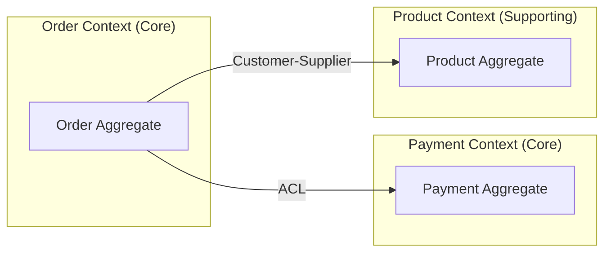
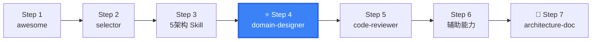

# DDD Domain Designer

Domain design full workflow — from event storming results to code-ready domain models, aggregates, and bounded contexts.

## When to use this skill

**ALWAYS use this skill when the user mentions:**
- "领域建模"、"领域设计"、"domain modeling"、"domain design"
- "聚合设计"、"aggregate design"、"怎么设计聚合"
- "限界上下文"、"bounded context"、"上下文划分"
- "实体设计"、"值对象设计"、"entity value object design"
- "领域对象映射"、"domain object mapping"
- "DDD detailed design"、"DDD 详细设计"
- Transforming requirements into domain model
- After event storming, ready to design aggregates

## Relationship with ddd-event-storming

| Skill | Focus | Output |
|-------|-------|--------|
| `ddd-event-storming` | Workshop facilitation (multi-role collaboration) | Event timeline, aggregate candidates, hotspot list |
| `ddd-domain-designer` | Aggregate design + code mapping (developer-focused) | Aggregate specs, code structure, persistence strategy |

**Recommended path**: `event-storming` (workshop output) → `domain-designer` (detailed design) → `(Architecture Skill)` (implementation)

## 6-Step Domain Design Process

```
Step 1: Product Vision — Elevator Pitch
Step 2: Scenario Analysis — User Journey
Step 3: Domain Modeling — Aggregates + Bounded Contexts
Step 4: Microservice Splitting — Bounded Context → Microservice
Step 5: Detailed Design — Entities, Value Objects, Aggregate Roots, Domain Events
Step 6: Development & Testing — Organize development by aggregate
```

## Aggregate Design — 5 Steps + 6 Principles

### Design Process

```
Step 1: Identify entities and value objects from business narrative
Step 2: Group entities by consistency boundary (what must change together?)
Step 3: Select aggregate root (the entity others reference through)
Step 4: Define invariants (business rules that must always hold)
Step 5: Review with domain expert, validate boundaries
```

### Six Principles

| # | Principle | Description | Review Check |
|---|-----------|-------------|--------------|
| 1 | Model true invariants within consistency boundary | Aggregate encapsulates invariants | Are invariants broken from outside? |
| 2 | Design small aggregates | Large aggregates cause concurrency conflicts | > 5 entities? N+1 risk? |
| 3 | Reference other aggregates by identity | Cross-aggregate ID references only | Direct object references across aggregates? |
| 4 | Use eventual consistency outside boundary | Strong consistency within, eventual across | One transaction spans multiple aggregates? |
| 5 | Cross-aggregate service calls via application layer | Avoid cross-aggregate domain service calls | Domain service directly calls other aggregate? |
| 6 | What works best for you | Principles can be bent | — |

### Aggregate Design Anti-Patterns

```
❌ God Aggregate: 15+ entities in one aggregate
   → Problem: Concurrency bottleneck, N+1 queries
   → Fix: Split by business sub-processes

❌ Anemic Aggregate Root: All logic in domain services
   → Problem: Violates "tell, don't ask" principle
   → Fix: Move behavior into aggregate root methods

❌ Deep Object Graph: Aggregate root → Entity → Entity → Entity
   → Problem: Loading full graph for simple operations
   → Fix: Flatten or use lazy loading patterns

❌ Cross-Aggregate Direct Reference: Order.user = User object
   → Problem: Breaks aggregate boundary, tempting to traverse
   → Fix: Order.userId = UserId value object
```

## Bounded Context Partitioning

### Context Mapping Patterns

```
Partnership (合作关系)
  Team A ←→ Team B: Cooperate on interface evolution

Shared Kernel (共享内核)
  Two contexts share a subset of the domain model

Customer-Supplier (客户-供应商)
  Upstream defines, downstream consumes (with SLA)

Conformist (遵奉者)
  Downstream conforms to upstream model without translation

Anti-Corruption Layer (防腐层)
  Downstream builds translation layer to protect its model

Open Host Service (开放主机)
  Upstream provides well-defined API for all consumers

Published Language (发布语言)
  Standard data format (XML/JSON schema) between contexts
```

### Context Mapping Diagram Template (Mermaid)



## Domain Object → Code Object Mapping

### Object Type Definitions

| Object | Full Name | Layer | Description |
|--------|-----------|-------|-------------|
| **PO** | Persistent Object | Infrastructure | Database structure mapping |
| **DO** | Domain Object | Domain | Runtime entity, rich domain model |
| **DTO** | Data Transfer Object | Interface/App | Transport between services/layers |
| **VO** | View Object | Interface | Display-specific page/component data |

### Transformation Chain

```
Frontend VO ←→ Interface DTO ←→ Application DO ←→ Infrastructure PO
    │               │               │              │
Display Layer   Interface Layer  Domain Layer   Infrastructure Layer
```

### Mapping Rules

```
DO → PO: Repository handles persistence
PO → DO: Repository handles loading
DO → DTO: Assembler/Converter. One DO can map to multiple DTOs (different scenarios)
DTO → VO: Frontend BFF assembly. One page may combine multiple DTOs
VO → DTO → DO: Command/Request → DTO → Domain (write direction)
```

## Value Object Persistence Strategies

### Strategy Selection

| Strategy | Description | When to Use |
|----------|-------------|-------------|
| **Inline Columns** | Store VO fields as separate DB columns | Simple VOs (Money as amount + currency) |
| **Single Column JSON** | Store whole VO as JSON column | Complex but rarely queried VOs |
| **Separate Table** | VO gets its own table with FK | VO shared across entities, queried independently |
| **JPA @Embeddable** | Embed VO in entity table | Simple, single-owner VOs |

```java
// Strategy 1: Inline Columns
@Entity
public class OrderPO {
    private BigDecimal totalAmount;   // from Money.amount
    private String currency;           // from Money.currency
}

// Strategy 2: JSON Column
@Entity
public class OrderPO {
    @Column(columnDefinition = "jsonb")
    private String address;  // Address VO serialized as JSON
}

// Strategy 4: JPA @Embeddable
@Embeddable
public class Money {
    private BigDecimal amount;
    private String currency;
}
```

## Design Outputs

| Output | Format | Purpose |
|--------|--------|---------|
| Event Storming Records | Markdown | Business process documentation |
| Bounded Context Map | Mermaid | Architecture overview |
| Aggregate Design Sheet | Table | Each aggregate: root, entities, VOs, events |
| Domain→Code Object Map | Markdown Table | Mapping guide for developers |
| VO Persistence Strategy | Markdown | Implementation guidance |
| Edge Case Notes | Markdown | Non-standard scenario handling |

## Output Format

When assisting with this skill, produce structured output:

```markdown
## Domain Design Report

### 1. Bounded Contexts
| Context | Type | Responsibility |
|---------|------|---------------|
| Order | Core | Order lifecycle management |

### 2. Aggregate: Order
- **Aggregate Root**: Order
- **Entities**: OrderItem
- **Value Objects**: OrderId, Money, OrderStatus, Address
- **Invariants**:
  1. Total = sum(item.price × item.quantity)
  2. Status transitions: DRAFT → PAID → SHIPPED → DELIVERED
- **Domain Events**: OrderCreated, OrderPaid, OrderShipped

### 3. Code Mapping
| Domain Object | PO | DTO | Converter |
|---------------|----|----|-----------|-----------|
| Order | OrderPO | OrderDTO | OrderConverter |
| OrderItem | OrderItemPO | OrderItemDTO | — |

### 4. Persistence Strategy
| Value Object | Strategy | Implementation |
|--------------|----------|---------------|
| Money | Inline (amount + currency columns) | JPA @Embeddable |
| Address | JSON column | Jackson serialize/deserialize |
```

## Next Steps

After domain design:
1. [Architecture Skill](../ddd-architecture-selector/) — Choose architecture pattern
2. [ddd-cqrs-architecture](../ddd-cqrs-architecture/) — Add CQRS if needed
3. [ddd-api-designer](../ddd-api-designer/) — Design API from domain model

---

## clean-ddd-hexagonal References

| File | Purpose |
|------|--------|
| [references/clean-ddd-hexagonal-strategic.md](references/clean-ddd-hexagonal-strategic.md) | DDD strategic patterns — bounded contexts, context mapping, integration patterns |
| [references/clean-ddd-hexagonal-tactical.md](references/clean-ddd-hexagonal-tactical.md) | DDD tactical patterns — Entity, Value Object, Aggregate, Repository, Domain Event, Factory, Specification |

## Skill Boundary

### ✅ 擅长处理
1. 从事件风暴结果到代码就绪的领域模型
2. 聚合设计 6 原则落地：一致性边界、小聚合、ID引用等
3. 限界上下文划分和上下文映射
4. 领域对象→代码对象映射

### ⚠️ 需要条件
1. 已有事件风暴输出或明确业务需求
2. 已选定架构模式（Layered/Onion/Hexagonal/Clean/COLA）

### ❌ 超出范围
1. 无事件风暴结果 → 先用 `ddd-event-storming`
2. 只需 DDD 基础概念 → `ddd-architecture-awesome`
3. 需审查已有模型 → `ddd-code-reviewer`


## Security & Stability

- All domain model examples are educational. No real user data or credentials.
- Aggregate design decisions directly affect data consistency and concurrency safety.
- When defining Repository interfaces, specify transaction boundaries. Domain events publish AFTER transaction commits.
- No executable scripts bundled. This skill provides domain modeling patterns and design guidance.


## Gotchas — Common Pitfalls

- **聚合过大**: 一个聚合包含 10+ 个实体。参考 6 原则中的 "Small Aggregate" 原则：能用 ID 引用的不要用对象引用。大聚合导致事务范围过大、并发冲突增多。
- **没有聚合根的一致性边界意识**: 一个事务修改了 2 个聚合根。DDD 铁律：一个事务只修改一个聚合。跨聚合操作用领域事件异步处理。
- **值对象被当实体**: 把 Address、Money、Email 设计成了 Entity（有 ID）。如果两个对象的所有属性值相同时它们就相等，那它应该是 Value Object，不需要 ID。
- **聚合根 ID 用数据库自增 ID**: 聚合根 ID 应该是业务标识（UUID 或业务编号），不应该依赖数据库的自增 ID。否则在领域事件和分布式场景中无法唯一标识聚合。
- **忘记聚合内的不变量**: 聚合根必须保证聚合内所有对象的不变量。如果 Order 状态为 PAID，OrderItem 不能出现 price=0。这些约束应该在聚合根的方法中检查。

## When NOT to Use This Skill

| ❌ Skip | ✅ Use Instead |
|---------|---------------|
| No event storming output yet | `event-storming` (run workshop first) |
| Just want DDD basics | `architecture-awesome` |
| Haven't selected architecture | `architecture-selector` |
| Need to review existing domain model | `code-reviewer` |
| Simple data model, no invariants | Skip domain modeling, use simple entities |

## Security & Stability

- All domain model examples are educational. No real user data or credentials are included.
- Aggregate design decisions (especially aggregate size and transaction boundaries) directly affect data consistency and concurrency safety. Incorrect boundaries can lead to data corruption.
- When defining Repository interfaces, always specify transaction boundaries explicitly. Domain events should be published AFTER the transaction commits successfully.
- No executable scripts bundled. This skill provides domain modeling patterns and design guidance.

## 🧭 DDD Skills Journey

> 📍 **You are here: `ddd-domain-designer` — Step 4: 领域设计与建模**



**← Previous**: [selector](../ddd-architecture-selector/) — 先选好架构再来建模
**→ Next**: [api-designer](../ddd-api-designer/) — 从领域模型生成 API 设计
**🔗 Related**: [cqrs-architecture](../ddd-cqrs-architecture/) — 加入 CQRS | [event-storming](../ddd-event-storming/) — 先用事件风暴探索 | [code-reviewer](../ddd-code-reviewer/) — 审查聚合设计
**🏠 Home**: [awesome](../ddd-architecture-awesome/) — DDD 概念全景

💡 聚合设计 6 原则是最重要的工具。一个事务只改一个聚合，聚合间用 ID 引用。

> 📋 See [DESIGN.md](../DESIGN.md) for the complete 16-skill ecosystem map.