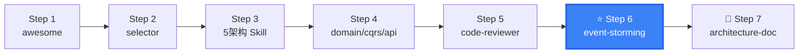

# DDD Event Storming

Event Storming workshop facilitation — collaborative domain exploration methodology based on Alberto Brandolini's pattern.

## When to use this skill

**ALWAYS use this skill when the user mentions:**
- "事件风暴"、"Event Storming"、"event storming workshop"
- "工作坊"、"workshop facilitation"、"collaborative workshop"
- "领域探索"、"domain exploration"、"domain discovery"
- "业务梳理"、"business process mapping"
- "collaborative modeling"、"协作建模"
- Needs to run a DDD discovery workshop
- Wants to gather domain knowledge from multiple stakeholders

## Relationship with ddd-domain-designer

| Skill | Focus | When to Use |
|-------|-------|-------------|
| `ddd-event-storming` | Workshop facilitation (multi-role collaboration) | Before coding, exploring domain |
| `ddd-domain-designer` | Aggregate design + code mapping (developer-focused) | After workshop, before implementation |

**Recommended path**: `event-storming` (workshop output) → `domain-designer` (detailed design) → `(Architecture Skill)` (implementation)

## 6-Step Workshop Process

### Step 1: Brainstorming (30 min)

```
Activity: Participants freely post domain events (orange sticky notes)
Focus: "What happened?" (past tense verbs)
Rules: No discussion, no questioning, no sorting

Example sticky notes:
  🟠 Order Created
  🟠 Payment Completed  
  🟠 Inventory Deducted
  🟠 Shipment Arranged
  🟠 Invoice Generated
```

### Step 2: Timeline (20 min)

```
Activity: Arrange events in chronological order
Identify event stream branches and merges
Mark the "happy path" flow

Example:
  🟠 Order Created → 🟠 Payment Completed → 🟠 Inventory Deducted → 🟠 Shipment Arranged
                          ↘ (payment failed) 🟠 Order Cancelled
```

### Step 3: Pivotal Events (15 min)

```
Activity: Mark key business process turning points
These are the anchors of your domain model

Example:
  ★ Pivotal: Order Paid — triggers fulfillment process
  ★ Pivotal: Shipment Delivered — triggers revenue recognition
```

### Step 4: Commands & Actors (30 min)

```
Activity: Add command (blue) and actor (yellow) for each event

Example:
  👤 Customer  →  🔵 Create Order  →  🟠 Order Created
  👤 Customer  →  🔵 Submit Payment  →  🟠 Payment Completed
  🤖 System    →  🔵 Deduct Stock  →  🟠 Inventory Deducted
  👤 Warehouse →  🔵 Arrange Shipment  →  🟠 Shipment Arranged
```

### Step 5: Aggregate Discovery (30 min)

```
Activity: Cluster related events and commands → identify aggregate boundaries
Name aggregates in business language (not technical)

Example Clusters:
  ┌─ Order Aggregate ──────────────┐
  │ 🟠 Order Created               │
  │ 🟠 Order Item Added            │
  │ 🟠 Order Paid                  │
  │ 🟠 Order Cancelled             │
  └────────────────────────────────┘
  ┌─ Shipment Aggregate ───────────┐
  │ 🟠 Shipment Arranged           │
  │ 🟠 Shipment Picked Up          │
  │ 🟠 Shipment Delivered          │
  └────────────────────────────────┘
```

### Step 6: Bounded Context Partitioning (20 min)

```
Activity: Group aggregates by coupling → define bounded contexts
Determine context mapping relationships

Example:
  Order Context: Order Aggregate, Payment Aggregate
  Logistics Context: Shipment Aggregate, Inventory Aggregate
  
  Order Context → Logistics Context: Customer-Supplier (via anti-corruption layer)
```

**Total duration**: ~2.5 hours
**Participants**: Domain experts, product manager, architect, tech lead

## Sticky Note Color Convention

| Color | Meaning | Format | Example |
|-------|---------|--------|---------|
| 🟠 Orange | Domain Event | Verb past tense | Order Created, Payment Completed |
| 🔵 Blue | Command | Verb base form | Create Order, Confirm Payment |
| 🟡 Yellow | Actor / Policy | Noun | Customer, Seller, Support Agent |
| 🟢 Green | Read Model | Noun | Order Detail Page, Pending Orders Dashboard |
| 🔴 Pink | External System | Noun | Alipay, WeChat Pay, Logistics API |
| 🟣 Purple | Policy / Constraint | Sentence | Max ¥50000 per order, VIP gets 10% off |

## Facilitator Guidelines

### Before the Workshop

```
- Prepare sticky notes (5+ colors) + large whiteboard
  OR online tool (Miro/Mural)
- Invite key roles:
  - Domain experts: 2-3 people
  - Developers: 2-3 people
  - Product: 1 person
- Define workshop scope (one bounded context vs entire system)
- Brief participants on the process (5 min intro)
```

### During the Workshop

```
- Enforce "no discussion" rule in Step 1 (avoid premature details)
- Guide using business language (not technical terms)
- Record Hot Spots (controversial areas), don't resolve immediately
- Keep energy high — move fast, revisit later
- Time-box each step strictly
```

### After the Workshop

```
- Photograph/document the whiteboard → digital
- Organize outputs → input to ddd-domain-designer
- Schedule Hot Spot follow-up session (1-2 days later)
- Distribute workshop summary to all participants
```

## Online Workshop Tools

| Tool | Best For | Features |
|------|----------|----------|
| **Miro** | Distributed teams | Built-in event storming templates |
| **Mural** | Distributed teams | Collaborative whiteboard |
| **draw.io** | Simple scenarios | Free |
| **Physical Whiteboard** | Co-located teams | Best interaction |

## Workshop Outputs

| Output | Format | Used For |
|--------|--------|----------|
| Event Timeline | Mermaid sequence diagram | Understanding business flow |
| Aggregate Candidate List | Markdown table | Input to domain-designer |
| Bounded Context Map | Mermaid C4 diagram | Input to architecture skill + microservice design |
| Context Mapping Diagram | Strategic design diagram | Context relationships (ACL/OpenHost/Partner) |
| Hot Spot List | Markdown | Marking controversial/uncertain areas |
| Action Items | Markdown | Post-workshop follow-up tasks |

### Output Template

```markdown
## Event Storming Workshop Summary

### Scope
- Domain: {name}
- Date: {date}
- Participants: {names + roles}

### Event Timeline
[Insert Mermaid diagram]

### Aggregate Candidates
| Aggregate | Description | Key Events |
|-----------|-------------|------------|
| Order | ... | OrderCreated, OrderPaid |

### Bounded Contexts
| Context | Type | Aggregates |
|---------|------|------------|
| Order | Core | Order, Payment |

### Hot Spots
| # | Topic | Concern | Owner |
|---|-------|---------|-------|
| 1 | ... | ... | ... |

### Next Steps
1. Schedule Hot Spot review
2. Proceed to ddd-domain-designer
3. Select architecture with ddd-architecture-selector
```

## Next Steps

After event storming:
1. [ddd-domain-designer](../ddd-domain-designer/) — Transform workshop results into detailed design
2. [ddd-architecture-selector](../ddd-architecture-selector/) — Choose architecture pattern
3. [ddd-architecture-doc](../ddd-architecture-doc/) — Document the domain design

---

## clean-ddd-hexagonal References

| File | Purpose |
|------|--------|
| [references/clean-ddd-hexagonal-strategic.md](references/clean-ddd-hexagonal-strategic.md) | DDD strategic patterns — domain discovery techniques, bounded contexts, context mapping patterns |

## Skill Boundary

### ✅ 擅长处理
1. 跨角色协作的领域探索工作坊
2. 6 步工作坊流程：愿景→场景→实体→聚合→BC→微服务
3. 便签颜色约定和引导者技巧
4. 工坊产出物：事件时间线、聚合候选、BC 映射

### ⚠️ 需要条件
1. 领域专家能参与：否则产出是技术人员的想象
2. 有实体场地或在线协作工具（Miro/Mural）

### ❌ 超出范围
1. 领域知识已充分文档化 → 直接用 `ddd-domain-designer`
2. 单人开发无利益相关者 → 自建模用 `ddd-domain-designer`
3. 纯技术工具无业务领域 → 跳过 DDD


## Security & Stability

- Event Storming is collaborative facilitation methodology. It does NOT execute code or access systems.
- Workshop outputs may contain business-sensitive information. Store in private team repository.
- Facilitator should avoid recording PII or sensitive data on photographed workshop artifacts.
- No executable scripts bundled. This skill provides workshop facilitation guidance and templates.


## Gotchas — Common Pitfalls

- **跳过 Brainstorming 直接讨论**: 必须先做自由发散（Step 1），再排序（Step 2）。如果一开始就讨论事件是否正确、顺序是否合理，会扼杀创意。先量后质。
- **技术人员主导讨论**: 工作坊必须由领域专家主导发言，技术人员做记录和提问。如果全是开发在说业务，产出的模型是技术人员的想象，不是真实业务。
- **贴着 CRUD 贴便签**: 不要写出 "CRUD Order" 这样的命令。命令应该是业务动作：Place Order、Cancel Order、Modify Delivery Address。业务语言才有领域含义。
- **忘记记录 Hotspot**: 讨论中出现的分歧、不确定的边界、需要进一步调研的问题必须记录为 Hotspot（紫色/红色便签）。不记录的 Hotspot 会后被遗忘。
- **跳过 Aggregate Discovery**: 做完 Command/Actor 就直接结束了。Step 5（聚合发现）是把便签聚类为代码模块的关键步骤。没有这步，事件风暴只是漂亮的便签墙。

## When NOT to Use This Skill

| ❌ Skip | ✅ Use Instead |
|---------|---------------|
| Domain knowledge already well-documented | Jump to `domain-designer` directly |
| Solo developer, no stakeholders | Self-modeling with `domain-designer` |
| Building a technical tool, no business domain | Skip DDD entirely |
| Already have detailed PRD with domain models | `domain-designer` (design from PRD) |
| Team is remote + async across timezones | Async domain modeling with shared docs |

## Security & Stability

- Event Storming is a collaborative facilitation methodology. It does NOT involve executing code, accessing systems, or processing data.
- Workshop outputs (event timelines, aggregate candidates) may contain business-sensitive information. These outputs should be stored in a private team repository, not publicly shared.
- The facilitator should be mindful not to record PII or sensitive business data on workshop artifacts that may be photographed or shared.
- No executable scripts bundled. This skill provides workshop facilitation guidance and templates.

## 🧭 DDD Skills Journey

> 📍 **You are here: `ddd-event-storming` — Step 6: 事件风暴工作坊**



**← Previous**: [awesome](../ddd-architecture-awesome/) — 了解 DDD 基础后再做工作坊
**→ Next**: [domain-designer](../ddd-domain-designer/) — 将工作坊产出转为聚合设计
**🔗 Related**: [selector](../ddd-architecture-selector/) — 根据风暴结果选架构 | [architecture-doc](../ddd-architecture-doc/) — 记录工作坊产出
**🏠 Home**: [awesome](../ddd-architecture-awesome/) — DDD 概念全景

💡 事件风暴是 DDD 项目的起点。先和领域专家一起贴便签，再写代码。6 步法约 2.5 小时。

> 📋 See [DESIGN.md](../DESIGN.md) for the complete 16-skill ecosystem map.