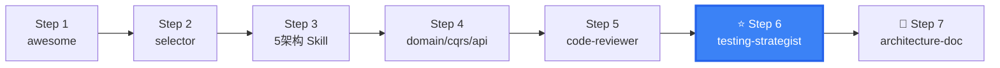

# DDD Testing Strategist

DDD testing strategy — from aggregate root unit tests to end-to-end validation, with architecture-specific testing patterns.

## When to use this skill

**ALWAYS use this skill when the user mentions:**
- "DDD 测试"、"DDD testing"、"domain testing"
- "聚合测试"、"aggregate test"、"aggregate root test"
- "测试策略"、"testing strategy"、"test pyramid"
- "如何测试 DDD"、"how to test DDD"
- "mock repository"、"mock port"、"mock adapter"
- "领域事件测试"、"domain event testing"
- "六边形测试"、"hexagonal testing"
- "CQRS 测试"、"Event Sourcing 测试"

## DDD Testing Pyramid

```
DDD Testing Pyramid (bottom-up):

         ╱  E2E Tests      ╲       ← 10%: User journeys, cross-service integration
        ╱─── Integration ───╲       ← 20%: Repository impl, Gateway, API
       ╱──── Domain Tests ────╲      ← 60%: Aggregate roots, domain services, domain events
      ╱────── Unit Tests ──────╲     ← 10%: Value objects, utility methods

Key differences from classical pyramid:
  - Aggregate root tests = classical Service tests, but focused on business rules
  - Domain event tests = DDD-unique test dimension
  - Repository tests = ensure aggregate root complete load & save
```

## Layer-Specific Testing

### ① Value Object Tests — Pure Functions

```java
@Test
public void money_should_prevent_negative_amount() {
    assertThrows(IllegalArgumentException.class,
        () -> new Money(-1.0, "CNY"));
}

@Test
public void money_add_should_sum_correctly() {
    Money m1 = new Money(10.0, "CNY");
    Money m2 = new Money(20.0, "CNY");
    assertEquals(new Money(30.0, "CNY"), m1.add(m2));
}

@Test
public void money_should_reject_different_currencies() {
    Money m1 = new Money(10.0, "CNY");
    Money m2 = new Money(20.0, "USD");
    assertThrows(IllegalArgumentException.class, () -> m1.add(m2));
}
```

### ② Aggregate Root Tests — Core Business Rules

```java
@Test
public void order_pay_should_change_status_when_draft() {
    // Given: a draft order
    Order order = Order.create(customerId, items);

    // When: pay
    order.pay(mockPaymentGateway);

    // Then: status → PAID + domain event published
    assertEquals(OrderStatus.PAID, order.getStatus());
    assertTrue(order.getDomainEvents().stream()
        .anyMatch(e -> e instanceof OrderPaidEvent));
}

@Test
public void order_pay_should_fail_when_cancelled() {
    // Given: cancelled order
    Order order = Order.create(customerId, items);
    order.cancel("Customer request");

    // When + Then: pay should throw
    assertThrows(OrderException.class,
        () -> order.pay(mockPaymentGateway));
}

@Test
public void order_calculateTotal_should_sum_all_items() {
    Order order = Order.create(customerId, List.of(
        new OrderItem("SKU-1", new Money(10, "CNY"), 2),
        new OrderItem("SKU-2", new Money(20, "CNY"), 1)
    ));
    assertEquals(new Money(40, "CNY"), order.calculateTotal());
}
```

### ③ Domain Service Tests — Mock Repository

```java
@Test
public void pricing_service_should_apply_vip_discount() {
    // Given
    Order order = Order.create(vipCustomerId, items);
    when(orderRepository.findById(order.getId()))
        .thenReturn(Optional.of(order));

    // When
    pricingService.calculatePrice(order.getId());

    // Then: 10% VIP discount
    assertEquals(new Money(90.0, "CNY"), order.getTotalAmount());
}
```

### ④ Repository Integration Tests

```java
@SpringBootTest
@Testcontainers
public class OrderRepositoryImplTest {
    @Autowired private OrderRepository orderRepository;

    @Test
    public void should_save_and_load_aggregate_completely() {
        Order order = Order.create(customerId, items);
        order.pay(mockGateway);

        orderRepository.save(order);
        Optional<Order> loaded = orderRepository.findById(order.getId());

        assertTrue(loaded.isPresent());
        assertEquals(order.getTotalAmount(), loaded.get().getTotalAmount());
        assertEquals(order.getItems().size(), loaded.get().getItems().size());
        assertEquals(OrderStatus.PAID, loaded.get().getStatus());
    }
}
```

## Mock Strategy Matrix

```
┌──────────────────┬──────────┬──────────┬──────────┐
│ Test Target / Mock│ Repository│ Gateway  │ EventBus │
├──────────────────┼──────────┼──────────┼──────────┤
│ Aggregate Root   │ N/A      │ N/A      │ Capture  │
│ Domain Service   │ Mock     │ Mock     │ Capture  │
│ Application Svc  │ Mock     │ Mock     │ Mock     │
│ Repository Int.  │ Real DB  │ N/A      │ N/A      │
│ API Integration  │ Real DB  │ Mock     │ Mock     │
└──────────────────┴──────────┴──────────┴──────────┘
```

### Domain Event Assertion Pattern

```java
// Capture and verify domain events
@Test
public void order_pay_should_publish_correct_event() {
    Order order = Order.create(customerId, items);
    
    order.pay(mockGateway);
    
    assertThat(order.getDomainEvents())
        .hasSize(1)
        .first()
        .isInstanceOf(OrderPaidEvent.class)
        .hasFieldOrPropertyWithValue("orderId", order.getId())
        .extracting("totalAmount")
        .isEqualTo(new Money(100.0, "CNY"));
}
```

## Testing Strategy by Architecture

| Scenario | Recommended Strategy | Reason |
|----------|---------------------|--------|
| Simple CRUD | Traditional Service + Repository tests | No complex domain logic |
| DDD Layered | Aggregate root tests primary | Business logic in aggregates |
| Hexagonal / Clean | Port mock + adapter integration | Inner/outer isolation |
| CQRS | Command aggregate tests + Query integration | Read/write separation |
| Event Sourcing | Event replay tests + Projection tests | Events as data source |
| Microservices | Contract tests + Aggregate tests + E2E | Multi-service collaboration |

## CQRS Testing Patterns

```java
// Command Side — same as aggregate root tests
@Test
public void createOrderCommand_should_create_order() {
    CreateOrderCommand cmd = new CreateOrderCommand(customerId, items);
    OrderCreated result = createOrderService.handle(cmd);
    verify(orderRepository).save(any(Order.class));
    assertNotNull(result.getOrderId());
}

// Query Side — integration test with real read model
@Test
public void query_should_return_from_read_model() {
    // Setup: publish event to populate read model
    orderPaidEventHandler.on(new OrderPaidEvent(orderId, amount));
    
    // Query
    OrderDetailDTO result = orderQueryService.getOrderDetail(orderId);
    
    assertEquals(OrderStatus.PAID, result.getStatus());
}
```

## Event Sourcing Testing

```java
@Test
public void event_sourced_aggregate_should_replay_correctly() {
    // Given: a sequence of events
    List<DomainEvent> events = List.of(
        new OrderCreatedEvent(orderId, customerId),
        new OrderItemAddedEvent(orderId, item1),
        new OrderPaidEvent(orderId)
    );
    
    // When: replay events
    Order order = Order.replay(events);
    
    // Then: aggregate state matches
    assertEquals(OrderStatus.PAID, order.getStatus());
    assertEquals(1, order.getItems().size());
}

@Test
public void projection_should_build_from_events() {
    projection.on(new OrderCreatedEvent("1", "C1"));
    projection.on(new OrderPaidEvent("1"));
    
    OrderDocument doc = esTemplate.get("1", OrderDocument.class);
    assertEquals("PAID", doc.getStatus());
}
```

## CI/CD Test Stages

```
Commit Stage (< 5 min):
  ✓ Value object unit tests
  ✓ Aggregate root tests
  ✓ Domain service tests (mock repository)

PR Stage (< 15 min):
  ✓ Repository integration tests (Testcontainers)
  ✓ Application service integration tests
  ✓ API contract tests

Release Stage (< 30 min):
  ✓ E2E tests (key user journeys)
  ✓ Performance tests (N+1 query detection)
```

### N+1 Query Detection Test

```java
@Test
public void aggregate_loading_should_not_cause_n_plus_1() {
    // Setup test data
    createOrderWith50Items();
    
    // Capture SQL queries
    SQLStatementCountValidator.reset();
    
    // Load aggregate
    Order order = orderRepository.findById(orderId).get();
    
    // Assert: should generate exactly 1 main query (no N+1)
    assertSelectCount(1);  // Adjust based on your mapping strategy
}
```

## Test Coverage Targets

| Layer | Coverage Target | Critical Areas |
|-------|:-------------:|----------------|
| Domain (Entity/VO) | ≥ 95% | Business rules, invariants |
| Domain (Service) | ≥ 90% | Orchestration, cross-entity logic |
| Application | ≥ 80% | Use case orchestration |
| Infrastructure | ≥ 70% | Repository, Gateway |
| Adapter | ≥ 60% | Protocol conversion |

## Output

When assisting with this skill, provide:
- DDD testing strategy document (per layer)
- Test code templates (value object / aggregate root / repository / domain event)
- Mock strategy guide
- CI/CD integration test configuration
- Test coverage target recommendations
- N+1 query detection approach

## Test Helpers (Builder Pattern)

Reusable test fixture builders to simplify DDD test setup:

```java
// Test Helpers — Builder pattern for creating test aggregates

public class OrderTestBuilder {
    private CustomerId customerId = CustomerId.from("test-customer");
    private List<OrderItem> items = new ArrayList<>();
    private OrderStatus status = OrderStatus.DRAFT;

    public static OrderTestBuilder anOrder() {
        return new OrderTestBuilder();
    }

    public OrderTestBuilder withCustomer(CustomerId customerId) {
        this.customerId = customerId;
        return this;
    }

    public OrderTestBuilder withItem(ProductId productId, int qty, Money price) {
        this.items.add(new OrderItem(productId, Quantity.of(qty), price));
        return this;
    }

    public OrderTestBuilder withStatus(OrderStatus status) {
        this.status = status;
        return this;
    }

    public Order build() {
        Order order = Order.create(customerId);
        items.forEach(item -> order.addItem(item.getProductId(), item.getQuantity(), item.getUnitPrice()));
        return order;
    }

    // Pre-built fixtures for common scenarios
    public static Order buildDraft() { return anOrder().build(); }
    public static Order buildWithItems() {
        return anOrder()
            .withItem(ProductId.from("p1"), 2, Money.cny(10))
            .withItem(ProductId.from("p2"), 1, Money.cny(25))
            .build();
    }
    public static Order buildPaid() {
        Order order = buildWithItems();
        order.pay(mockPaymentGateway);
        return order;
    }
    public static Order buildCancelled() {
        Order order = buildWithItems();
        order.cancel("Test cancellation");
        return order;
    }
}
```

### Sources

### Primary Sources
- [Unit Testing](https://martinfowler.com/bliki/UnitTest.html) — Martin Fowler
- [Test Pyramid](https://martinfowler.com/bliki/TestPyramid.html) — Martin Fowler
- [Test Driven Development: By Example](https://www.oreilly.com/library/view/test-driven-development/0321146530/) — Kent Beck (2002)

### Implementation Guides
- [Microsoft: DDD Testing Strategy](https://learn.microsoft.com/en-us/dotnet/architecture/microservices/microservice-ddd-cqrs-patterns/)
- [Testcontainers for Java](https://testcontainers.com/guides/)
- [ArchUnit User Guide](https://www.archunit.org/userguide/html/000_Index.html)

## Next Steps

After testing strategy:
1. [ddd-devops-integration](../ddd-devops-integration/) — CI/CD pipeline integration
2. [ddd-code-reviewer](../ddd-code-reviewer/) — Test coverage review

---

## clean-ddd-hexagonal References

| File | Purpose |
|------|--------|
| [references/clean-ddd-hexagonal-testing.md](references/clean-ddd-hexagonal-testing.md) | Testing patterns — unit tests (domain/application), integration tests, architecture tests, naming conventions |

## Skill Boundary

### ✅ 擅长处理
1. DDD 测试金字塔（60% Domain + 20% Integration + 10% E2E）
2. 按测试目标选择 Mock 策略
3. CQRS 和 Event Sourcing 专项测试
4. 按架构类型的测试策略（Layered/Hexagonal/Clean/COLA）

### ⚠️ 需要条件
1. 已有 DDD 项目代码
2. CI/CD 可运行测试

### ❌ 超出范围
1. 非 DDD 项目 → 标准测试框架（JUnit/pytest）
2. 纯前端测试 → 前端专属测试工具
3. 性能/安全测试 → JMeter/k6/OWASP ZAP


## Security & Stability

- Test code examples are educational. Replace test data with fixtures; never include real PII or credentials.
- Mock library choices depend on project language and toolchain. This skill describes patterns, not versions.
- Integration tests connecting to real databases should use Testcontainers, never production databases.
- No executable scripts bundled. This skill provides testing patterns and strategy guidance.


## Gotchas — Common Pitfalls

- **只测 Service 不测 Domain**: DDD 测试的核心是 Domain 层（聚合根 + 领域服务 + 值对象），不是 Application Service。Application Service 测试容易写但价值低，Domain 测试难写但价值高。
- **Mock 了 Domain Service**: 测试 Application Service 时 Mock 了 Domain Service — 这是最常见的反模式。Domain Service 不应该被 Mock，它包含核心业务逻辑。只 Mock 外部依赖（Repository、外部 API）。
- **聚合根测试不够全面**: 只测了 happy path。聚合根测试必须覆盖：不变量违反场景、状态转移边界条件、并发冲突模拟。
- **集成测试等价于 E2E 测试**: 把需要数据库的 Repository 测试和需要 HTTP 的 API 测试都叫"集成测试"。DDD 区分：Repository 集成测试（只测持久化）、API 集成测试（测端口适配器）、E2E（测完整业务流程）。
- **忘记 Event Sourcing 测试的 Event Replay**: 如果有 Event Sourcing，必须测 Event Replay 后的状态是否正确重建。这是 Event Sourcing 最隐蔽的 bug 来源。

## When NOT to Use This Skill

| ❌ Skip | ✅ Use Instead |
|---------|---------------|
| No DDD project | Standard testing frameworks (JUnit, pytest) |
| Pure frontend testing | Frontend-specific testing tools |
| Performance/load testing | JMeter, k6, Gatling |
| Security penetration testing | OWASP ZAP, Burp Suite |
| Haven't written domain code yet | Write code first, test strategy after |
| Unit testing basics | Language-specific testing tutorials |

## Security & Stability

- Test code examples are educational. Replace test data with project-specific fixtures. Never include real PII or credentials in test data.
- Mock library choices (Mockito, MockK, unittest.mock) depend on the project's language and existing toolchain. This skill describes patterns, not specific library versions.
- Integration tests that connect to real databases should use Testcontainers or in-memory databases, never production databases.
- No executable scripts bundled. This skill provides testing patterns and strategy guidance.

## 🧭 DDD Skills Journey

> 📍 **You are here: `ddd-testing-strategist` — Step 6: DDD 测试策略**



**← Previous**: [domain-designer](../ddd-domain-designer/) — 有领域模型后才能定测试策略
**→ Next**: [devops-integration](../ddd-devops-integration/) — 集成测试到 CI/CD
**🔗 Related**: [code-reviewer](../ddd-code-reviewer/) — 测试覆盖率审查 | [cqrs-architecture](../ddd-cqrs-architecture/) — CQRS 测试
**🏠 Home**: [awesome](../ddd-architecture-awesome/) — DDD 概念全景

💡 DDD 测试金字塔：60% 领域测试（聚合根+领域服务），20% 集成测试（仓储+适配器），10% E2E。

> 📋 See [DESIGN.md](../DESIGN.md) for the complete 16-skill ecosystem map.