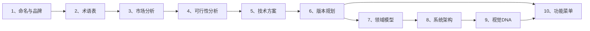

# Product Documentation Standard (full-stack-doc v3.0)

Enforces a fixed directory-and-naming convention for product documentation, aligned with the PartMe / Octo series. Ready-to-copy Markdown templates live under [`templates/`](templates/). Detailed file mappings and conventions in [`references/structure.md`](references/structure.md).

---

## 1. When to Use

- Creating or initializing a product documentation repository
- Scaffolding doc trees for Octo* or PartMe projects
- Auditing or aligning existing repos against the PartMe doc standard
- Generating / renaming docs to match the naming convention
- Aligning `partme-docs/` content with the template structure
- Writing or expanding any of the 10 root-level planning documents

---

## 2. Placeholders

| Placeholder | Meaning | Example |
|:---|:---|:---|
| `{Name}` | Product / brand name | `OctoEcom`, `OpenMem` |
| `{Name-Open}` | Open-source variant name (if dual-track) | `OpenEcom`, `OpenMem` |
| `{V}` | Version directory name | `V1`, `V2` |
| `{模块简称}` | Module short name | `登录页`, `设备中心` |
| `{YYYY-MM-DD}` | Date placeholder | `2026-03-27` |
| `{姓名}` | Author / reviewer name | `张三` |
| `{组织}` | Organization name | `PartMe` |

Replace placeholders in **both filenames and content**. Root keeps one `6、` file. The old `6、详细功能清单` has been merged into `10、功能菜单与版本规划`.

---

## 3. Document Architecture

### 3.1 Four-Layer Structure

```
{产品名}/
├── 1、{Name}-命名与品牌说明.md          ─┐
├── 2、{Name}-术语表与词汇表.md          │
├── 3、{Name}-市场与商业分析.md          │
├── 4、{Name}-技术与可行性分析.md        │ Root (10) — 产品级，与版本无关
├── 5、{Name}-技术方案与路线.md          │
├── 6、{Name}-产品与版本规划.md          │
├── 7、{Name}-领域模型设计.md            │
├── 8、{Name}-系统架构设计.md            │
├── 9、{Name}-视觉与交互DNA规范.md       │
├── 10、{Name}-功能菜单与版本规划.md      ─┘
│
├── V1/                                   ─┐
│   ├── 1、{Name}-需求调研文档-V1.md      │
│   ├── 2、{Name}-需求分析文档-V1.md      │
│   ├── 3、{Name}-系统架构设计-V1.md      │ Version (7) — 版本级实施文档
│   ├── 4、{Name}-功能与界面规划-V1.md    │
│   ├── 5、{Name}-PRD文档-V1.md           │
│   ├── 6、{Name}-功能菜单与版本规划-V1.md│
│   ├── 7、{Name}-UI设计说明-V1.md        │
│   │                                     ─┘
│   ├── 1、{模块A}/                       ─┐
│   │   ├── {Name}-{模块A}-PRD-V1.md      │ Module (3) — 可选，按模块
│   │   ├── {Name}-{模块A}-Stitch设计提示词.md │
│   │   └── {Name}-{模块A}-UI设计说明-V1.md    ─┘
│   └── ...
│
├── 其他/                                 ─┐
│   ├── 1、技术细分模板.md                │
│   ├── 2、功能提测模板.md                │ Delivery (5) — 可选，研发交付
│   ├── 3、测试结果模板.md                │
│   ├── 4、上线通知模板.md                │
│   └── 5、项目运维模板.md                ─┘
│
├── 技术调研/                             ── 技术调研、协议分析（版本无关）
└── assets/                               ── 图片、附件等
```

### 3.2 Scope Summary

| Scope | Count | Templates | Naming Pattern |
|:---|:---:|:---|:---|
| Root | 10 | [`templates/root/`](templates/root/) | `{序号}、{Name}-{文档名}.md` |
| Version (`{V}/`) | 7 | [`templates/version/`](templates/version/) | `{序号}、{Name}-{文档名}-{V}.md` |
| Module (optional) | 3 per module | [`templates/module/`](templates/module/) | `{Name}-{模块简称}-{类型}-{V}.md` |
| Delivery (optional) | 5 | [`templates/delivery/`](templates/delivery/) | Context-dependent |

### 3.3 Root 10 Documents — Authoring Chain

文档间存在严格的上下游依赖关系，编写时应按顺序递进：



| 序号 | 文档 | 关键输入 | 关键输出 | 对标 Mermaid 类型 |
|:---:|:---|:---|:---|:---|
| 1 | 命名与品牌说明 | 产品愿景 | 品牌口径、边界 | `graph LR` (品牌关系) |
| 2 | 术语表与词汇表 | Doc 1 品牌定位 | 统一语言 | 无（纯表格） |
| 3 | 市场与商业分析 | Doc 1 定位 + 外部数据 | TAM/SAM/SOM、竞品、定价 | `quadrantChart` / `funnel` |
| 4 | 技术与可行性分析 | Doc 3 机会 + Doc 5 初步选型 | 可行性结论、风险 | `flowchart` / `sequenceDiagram` |
| 5 | 技术方案与路线 | Doc 4 结论 | 技术栈、ADR、里程碑 | `flowchart` / `gantt` |
| 6 | 产品与版本规划 | Doc 3 商业 + Doc 5 路线 | 版本矩阵、定价、发布策略 | `graph` / `timeline` |
| 7 | 领域模型设计 | Doc 2 术语 + Doc 6 功能边界 | 限界上下文、聚合、事件 | `classDiagram` / `graph TB` |
| 8 | 系统架构设计 | Doc 5 技术栈 + Doc 7 领域 | 分层、数据流、部署 | `flowchart` / `sequenceDiagram` |
| 9 | 视觉与交互DNA规范 | Doc 1 品牌气质 | 色彩、字体、组件、动效 | `flowchart` (页面骨架) |
| 10 | 功能菜单与版本规划 | Doc 6 + Doc 8 + Doc 9 | 导航、路由、功能清单、优先级 | `mindmap` / `pie` / `flowchart` |

---

## 4. Scaffolding Workflow

### Step 1 — Root Docs

Copy all 10 files from `templates/root/` into the project root. Rename each replacing `{Name}`:

```bash
# Example: OctoEcom
for f in templates/root/*.md; do
  name=$(basename "$f" | sed 's/{Name}/OctoEcom/g')
  cp "$f" "partme-docs/18、OctoEcom/$name"
done
```

### Step 2 — Version Docs

Create `{V}/` (e.g., `V1/`). Copy 7 files from `templates/version/`. Replace both `{Name}` and `{V}` in filenames and content.

### Step 3 — Module Docs (optional)

For each functional module, create `{V}/{序号}、{模块名}/`. Copy 3 files from `templates/module/`. Replace `{Name}`, `{模块简称}`, and `{V}`.

Example (OctoEcom V1 商品采集):
```
V1/1、商品采集/
├── OctoEcom-商品采集-PRD-V1.md
├── OctoEcom-商品采集-Stitch设计提示词.md
└── OctoEcom-商品采集-UI设计说明-V1.md
```

### Step 4 — Delivery Docs (optional)

Copy `templates/delivery/` into `其他/` or a dedicated delivery folder. Replace `{Name}` and dates.

### Step 5 — Special Directories

Create `技术调研/` for tech research and `其他/` for non-standard docs. Directories like `demo/`, `assets/`, `.stitch/` stay untouched.

### Step 6 — Validate

Run the validation checklist (Section 7).

---

## 5. Quality Standards

### 5.1 Content Depth Benchmarks

Based on OctoEcom and OpenEcom production documents:

| 文档 | 目标行数 | 最少 Mermaid | 最少表格 | 关键质量标志 |
|:---|:---:|:---:|:---:|:---|
| 1、命名与品牌 | 100–120 | 1 | 2 | 品牌关系图、Open/商业对照表 |
| 2、术语表 | 100–160 | 0 | 8+ | 按层/域分类、中英对照、缩略词 |
| 3、市场分析 | 160–220 | 1–3 | 10+ | TAM 数据源注释、SWOT 表、竞品矩阵 |
| 4、可行性分析 | 180–230 | 2–3 | 10+ | 可行性评级图例、分层评估、风险总表 |
| 5、技术方案 | 260–400 | 3–4 | 9+ | 代码示例、Gantt 路线、部署拓扑 |
| 6、版本规划 | 200–340 | 2–3 | 5+ | 版本功能矩阵、定价表、发布策略 |
| 7、领域模型 | 300–410 | 7–9 | 7+ | classDiagram 每聚合、事件表、仓储接口 |
| 8、系统架构 | 400–510 | 7–14 | 9+ | 分层 subgraph、序列图、状态机 |
| 9、视觉DNA | 250–300 | 0–1 | 12+ | ASCII 线框、CSS 变量、色值表 |
| 10、功能菜单 | 400–560 | 3–5 | 20+ | mindmap 全景、功能枚举、优先级统计 |

### 5.2 Universal Document Structure

每份 root 文档 **必须** 包含以下标准结构：

**文档头部**:
```markdown
# {Name} 文档标题

> **文档说明**：一句话说明文档用途与范围。
>
> **版本**：V1.0.0
> **最后更新**：{YYYY-MM-DD}
```

**文档尾部**:
```markdown
---

**文档版本**：V1.0.0
**创建日期**：{YYYY-MM-DD}
**最后更新**：{YYYY-MM-DD}
**文档状态**：✅ 待评审
```

### 5.3 Formatting Conventions

| 元素 | 规范 |
|:---|:---|
| 章节编号 | `## N.` 顶级，`### N.M` 子级，层级不超过 3 层 |
| 表格对齐 | 使用 `:---` 左对齐 |
| 可行性评级 | ✅ 高可行 / ⚠️ 中可行 / 🔴 低可行 |
| 优先级 | P0（必须）/ P1（重要）/ P2（期望）/ P3（可选） |
| 版本标签 | 🆓 免费 / 👤 个人 / 👥 专业 / 🏢 企业 |
| 状态标记 | ✅ 已实现 / 🔧 开发中 / ⏳ 计划中 / ❌ 不实现 |
| Mermaid | 每图前后空行；diagram 类型应匹配内容（见 3.3 对标列） |
| 代码块 | 标注语言（`typescript`/`go`/`bash`/`yaml`/`sql`） |
| 中英混排 | 中文与英文/数字间加空格：`OpenAI 模型` |

### 5.4 Cross-Reference Rules

- Doc 3 关联文档必须链接 Doc 1（品牌边界）和 Doc 5（技术可行性）
- Doc 5 Gantt 日期必须与 Doc 6 版本里程碑、Doc 10 发布节奏一致
- Doc 7 聚合名称必须在 Doc 2 术语表中有定义
- Doc 8 分层名称必须与 Doc 5 技术选型对应
- Doc 10 功能列表的版本标注必须与 Doc 6 版本矩阵一致

---

## 6. Gotchas

- Sequence numbers `1–7` in version folders are **reserved** for the 7 standard docs. Non-standard docs must use `8+` or go into `其他/`.
- Root has **one** file numbered `6、` (产品与版本规划). Detailed feature lists are embedded in `10、功能菜单与版本规划`.
- Don't reorganize special directories (`demo/`, `assets/`, `.stitch/`, `stitch_*`, `实施指南/`) unless the user explicitly requests it.
- Delivery templates are optional and do **not** occupy root-level standard sequence numbers.
- When a product has open-source + commercial dual-track (e.g., OpenEcom/OctoEcom), each track gets its own full 10-doc set with cross-references.

---

## 7. Validation Checklist

```
Doc Validation:
- [ ] Root contains exactly 10 standard files (1–10)
- [ ] Each file starts with H1 + blockquote doc description
- [ ] Each file ends with version/date/status footer
- [ ] ## section numbering is sequential (no gaps, no duplicates)
- [ ] ### sub-sections use parent number prefix (e.g., ## 3 → ### 3.1)
- [ ] Mermaid diagrams render without syntax errors
- [ ] Cross-document references resolve to existing files
- [ ] Timeline dates are consistent across Doc 3, 5, 6, 10
- [ ] Terminology matches Doc 2 definitions
- [ ] Version folder contains exactly 7 standard files with {V} suffix
- [ ] Module folders have PRD / Stitch / UI triplet (if applicable)
- [ ] 技术调研/ and 其他/ do not contain root-level standard docs
- [ ] No sequence numbers 1–7 used for non-standard docs in version folders
```

---

## 8. Template Inventory

| Template | Location | Lines | Mermaid | Key Sections |
|:---|:---|:---:|:---:|:---|
| 命名与品牌说明 | `templates/root/1、命名与品牌说明.md` | ~120 | 1 | 品牌定位、命名由来、产品边界、核心公式、品牌家族 |
| 术语表与词汇表 | `templates/root/2、术语表与词汇表.md` | ~150 | 0 | 文档信息、产品/架构/业务/平台/治理术语、缩略词 |
| 市场与商业分析 | `templates/root/3、市场与商业分析.md` | ~220 | 3 | 市场机会、TAM/SAM/SOM、竞品矩阵、SWOT、商业模式、定价 |
| 技术与可行性分析 | `templates/root/4、技术与可行性分析.md` | ~230 | 3 | 分层评估、安全合规、性能扩展、风险总表、结论 |
| 技术方案与路线 | `templates/root/5、技术方案与路线.md` | ~300 | 4 | 技术选型、分层方案、ADR、分阶段路线、部署、监控 |
| 产品与版本规划 | `templates/root/6、产品与版本规划.md` | ~240 | 3 | 产品定位、版本矩阵、路线图、定价、发布策略、成功指标 |
| 领域模型设计 | `templates/root/7、领域模型设计.md` | ~350 | 9 | 战略设计、统一语言、聚合设计、领域事件、仓储接口 |
| 系统架构设计 | `templates/root/8、系统架构设计.md` | ~400 | 8 | 分层架构、DDD/COLA、数据流、安全、部署、扩展机制 |
| 视觉与交互DNA | `templates/root/9、视觉与交互DNA规范.md` | ~280 | 1 | 设计原则、色彩、字体、布局、组件、动效、暗色、无障碍 |
| 功能菜单与版本规划 | `templates/root/10、功能菜单与版本规划.md` | ~450 | 5 | 全景、菜单结构、功能明细、版本分布、用户旅程、功能清单 |

---

## 9. Related Skills

- [`documentation-builder`](../dev-utils-skills/documentation-builder): General doc writing and formatting conventions
- [`api-doc-generator`](api-doc-generator): OpenAPI and API documentation generation
