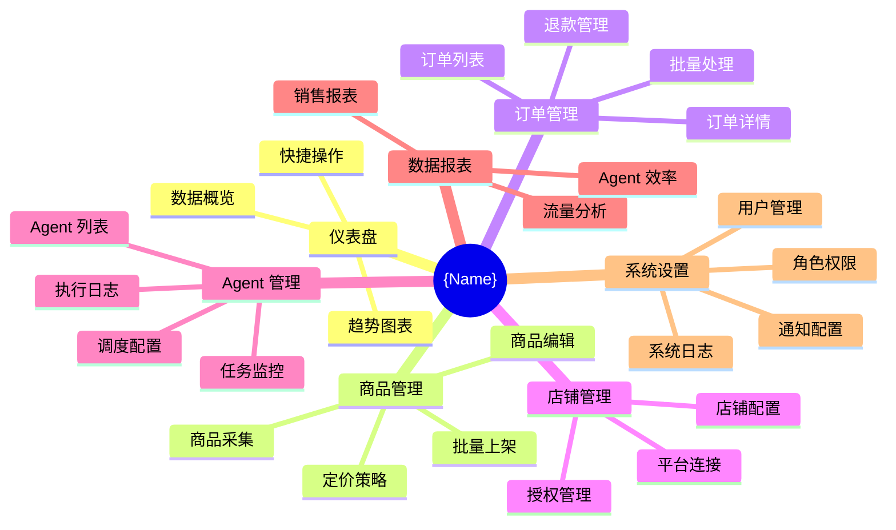
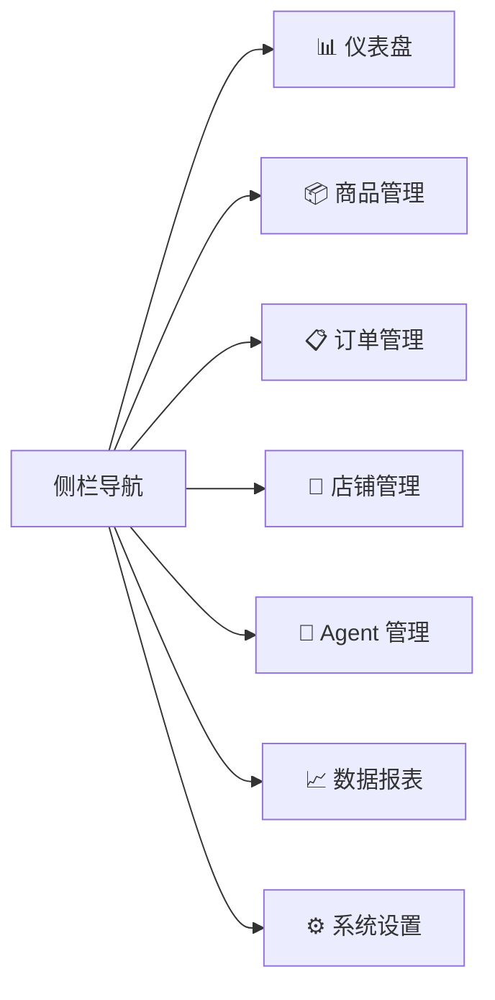
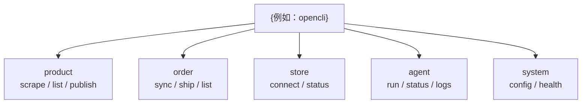
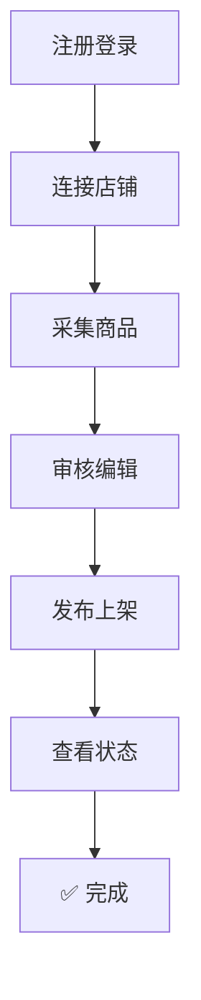
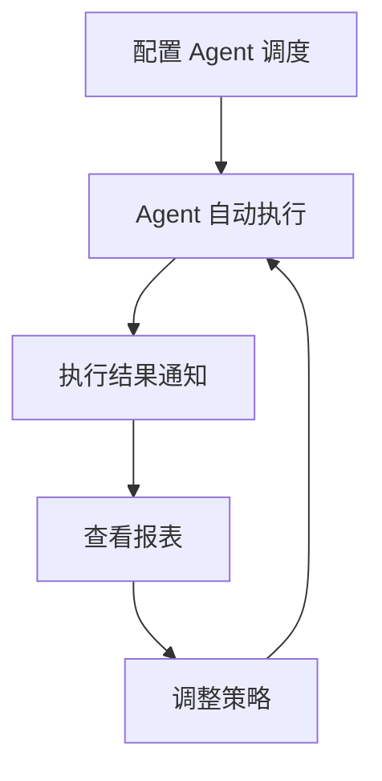
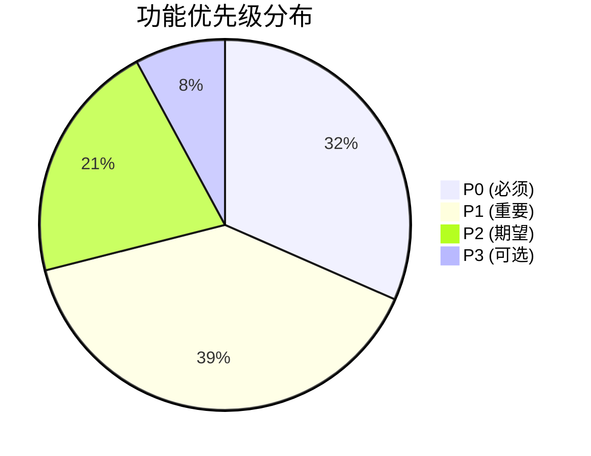

# {Name} 功能菜单与版本规划

> **文档说明**：冻结产品导航结构、页面清单、路由规划、版本分布、核心用户旅程与详细功能清单（含优先级和版本归属）。本文包含原「详细功能清单」内容。
>
> **版本**：V1.0.0
> **最后更新**：{YYYY-MM-DD}

---

## 1. 功能全景



### 1.1 优先级与版本标注说明

| 标注 | 含义 |
| :--- | :--- |
| P0 | 必须实现，阻塞发布 |
| P1 | 重要，影响核心体验 |
| P2 | 期望，提升用户体验 |
| P3 | 可选，低优先级增强 |
| 🆓 | 免费版可用 |
| 👤 | 个人版 (Pro) 可用 |
| 👥 | 专业版 (Team) 可用 |
| 🏢 | 企业版 (Enterprise) 可用 |

---

## 2. 一级导航结构



### 2.1 菜单归位规则

| 规则 | 说明 |
| :--- | :--- |
| 频率优先 | 高频功能排在前面（仪表盘 → 商品 → 订单） |
| 逻辑分组 | 同一业务域功能归入同一菜单 |
| 版本控制 | 高版本功能在低版本中隐藏（非灰色禁用） |
| 角色控制 | 无权限菜单不显示 |

---

## 3. 二级菜单、页面清单与功能明细

### 3.1 {例如：仪表盘 (Dashboard)}

| 二级菜单 | 路由 | 版本 | 优先级 | 说明 |
| :--- | :--- | :---: | :---: | :--- |
| {例如：数据概览} | {例如：`/dashboard`} | 🆓 | P0 | {例如：核心指标卡片 + 趋势图} |
| {例如：快捷操作} | {例如：`/dashboard`} | 🆓 | P1 | {例如：常用操作入口} |

---

### 3.2 {例如：商品管理 (Products)}

| 二级菜单 | 路由 | 版本 | 优先级 | 说明 |
| :--- | :--- | :---: | :---: | :--- |
| {例如：商品列表} | {例如：`/products`} | 🆓 | P0 | {例如：全部商品 + 筛选 + 搜索} |
| {例如：商品详情} | {例如：`/products/:id`} | 🆓 | P0 | {例如：基本信息 + SKU + 上架状态} |
| {例如：商品采集} | {例如：`/products/scrape`} | 👤 | P0 | {例如：从源平台采集商品} |
| {例如：批量上架} | {例如：`/products/batch-list`} | 👤 | P1 | {例如：批量发布到目标平台} |
| {例如：定价策略} | {例如：`/products/pricing`} | 👥 | P1 | {例如：自动定价规则配置} |

---

### 3.3 {例如：订单管理 (Orders)}

| 二级菜单 | 路由 | 版本 | 优先级 | 说明 |
| :--- | :--- | :---: | :---: | :--- |
| {例如：订单列表} | {例如：`/orders`} | 🆓 | P0 | {例如：全部订单 + 状态筛选} |
| {例如：订单详情} | {例如：`/orders/:id`} | 🆓 | P0 | {例如：订单信息 + 物流 + 操作} |
| {例如：批量处理} | {例如：`/orders/batch`} | 👤 | P1 | {例如：批量发货、批量备注} |
| {例如：退款管理} | {例如：`/orders/refunds`} | 👤 | P1 | {例如：退款申请处理} |

---

### 3.4 {例如：店铺管理 (Stores)}

| 二级菜单 | 路由 | 版本 | 优先级 | 说明 |
| :--- | :--- | :---: | :---: | :--- |
| {例如：店铺列表} | {例如：`/stores`} | 🆓 | P0 | {例如：已连接店铺 + 状态} |
| {例如：添加店铺} | {例如：`/stores/add`} | 🆓 | P0 | {例如：选择平台 + 授权连接} |
| {例如：店铺配置} | {例如：`/stores/:id/settings`} | 👤 | P1 | {例如：同步设置、通知规则} |

---

### 3.5 {例如：Agent 管理 (Agents)}

| 二级菜单 | 路由 | 版本 | 优先级 | 说明 |
| :--- | :--- | :---: | :---: | :--- |
| {例如：Agent 列表} | {例如：`/agents`} | 🆓 | P0 | {例如：可用 Agent + 状态} |
| {例如：任务监控} | {例如：`/agents/tasks`} | 🆓 | P0 | {例如：执行中/已完成任务} |
| {例如：执行日志} | {例如：`/agents/logs`} | 👤 | P1 | {例如：Agent 执行详细日志} |
| {例如：调度配置} | {例如：`/agents/schedules`} | 👤 | P1 | {例如：定时任务配置} |
| {例如：Agent 市场} | {例如：`/agents/marketplace`} | 👥 | P2 | {例如：社区 / Premium Agent} |

---

### 3.6 {例如：数据报表 (Reports)}

| 二级菜单 | 路由 | 版本 | 优先级 | 说明 |
| :--- | :--- | :---: | :---: | :--- |
| {例如：销售报表} | {例如：`/reports/sales`} | 👤 | P1 | {例如：GMV、订单量、转化率} |
| {例如：Agent 效率} | {例如：`/reports/agents`} | 👤 | P2 | {例如：Agent 执行成功率、耗时} |
| {例如：导出报表} | {例如：`/reports/export`} | 👥 | P2 | {例如：Excel/PDF 导出} |

---

### 3.7 {例如：系统设置 (Settings)}

| 二级菜单 | 路由 | 版本 | 优先级 | 说明 |
| :--- | :--- | :---: | :---: | :--- |
| {例如：个人设置} | {例如：`/settings/profile`} | 🆓 | P0 | {例如：头像、密码、通知偏好} |
| {例如：团队管理} | {例如：`/settings/team`} | 👥 | P1 | {例如：成员邀请、角色分配} |
| {例如：角色权限} | {例如：`/settings/roles`} | 🏢 | P1 | {例如：自定义角色、权限配置} |
| {例如：审计日志} | {例如：`/settings/audit`} | 🏢 | P1 | {例如：操作日志查询} |
| {例如：API 密钥} | {例如：`/settings/api-keys`} | 👥 | P2 | {例如：API 密钥管理} |

---

## 4. CLI / IM 交互菜单（按需）



```bash
# CLI 命令示例
{例如：opencli} product scrape --platform taobao --keyword "手机壳"
{例如：opencli} product publish --store my-store --ids 1,2,3
{例如：opencli} order sync --store my-store --since 2026-01-01
{例如：opencli} agent run product-selector --config ./config.yaml
{例如：opencli} system health
```

---

## 5. 页面版本分布

### 5.1 版本 → 页面映射

| 页面 | V1.0 | V2.0 | V3.0 | V4.0 |
| :--- | :---: | :---: | :---: | :---: |
| {例如：仪表盘} | ✅ | ✅ | ✅ | ✅ |
| {例如：商品列表} | ✅ | ✅ | ✅ | ✅ |
| {例如：商品采集} | ✅ | ✅ | ✅ | ✅ |
| {例如：订单列表} | ✅ | ✅ | ✅ | ✅ |
| {例如：店铺管理} | ✅ | ✅ | ✅ | ✅ |
| {例如：Agent 列表} | ✅ | ✅ | ✅ | ✅ |
| {例如：团队管理} | — | ✅ | ✅ | ✅ |
| {例如：角色权限} | — | — | ✅ | ✅ |
| {例如：审计日志} | — | — | ✅ | ✅ |
| {例如：Agent 市场} | — | — | — | ✅ |
| {页面} | — | — | — | — |

---

## 6. 导航状态规则

### 6.1 角标规则

| 角标类型 | 触发条件 | 样式 |
| :--- | :--- | :--- |
| 红点 | {例如：有未读通知} | {例如：8px 红色圆点} |
| 数字角标 | {例如：待处理订单数} | {例如：红色圆角矩形 + 白色数字} |
| NEW 标签 | {例如：新功能上线} | {例如：蓝色圆角标签，7 天后消失} |

### 6.2 面包屑规则

```
首页 > 商品管理 > 商品详情 > SKU-12345
```

| 规则 | 说明 |
| :--- | :--- |
| 层级 | {例如：最多 4 级，超过省略中间层} |
| 可点击 | {例如：除最后一级外均可点击跳转} |
| 动态段 | {例如：ID 显示为名称（如商品名）} |

### 6.3 搜索规则

| 规则 | 说明 |
| :--- | :--- |
| 全局搜索 | {例如：顶栏搜索框，搜索商品/订单/Agent} |
| 快捷键 | {例如：`Cmd+K` / `Ctrl+K` 唤起} |
| 搜索范围 | {例如：商品名、订单号、Agent 名称} |

---

## 7. 核心用户旅程

### 7.1 旅程一：{例如：新用户首次采集商品}



| 步骤 | 页面 | 关键操作 | 预期时间 |
| :--- | :--- | :--- | :--- |
| {例如：连接店铺} | {例如：店铺管理 → 添加} | {例如：选择平台 → 扫码授权} | {例如：2 分钟} |
| {例如：采集商品} | {例如：商品采集} | {例如：输入关键词 → 选择来源 → 开始采集} | {例如：5 分钟} |
| {例如：审核发布} | {例如：商品列表 → 批量上架} | {例如：勾选 → 编辑 → 确认发布} | {例如：3 分钟} |

### 7.2 旅程二：{例如：日常 Agent 自动运营}



---

## 8. 版本发布节奏

| 版本 | 发布日期 | 核心功能 | 页面数 |
| :--- | :--- | :--- | :---: |
| V1.0 MVP | {例如：2026 Q2} | {例如：基础采集 + 上架 + 订单} | {例如：15} |
| V2.0 商业版 | {例如：2026 Q3} | {例如：多租户 + 团队 + Premium Agent} | {例如：22} |
| V3.0 企业版 | {例如：2026 Q4} | {例如：RBAC + 审计 + 私有部署} | {例如：28} |
| V4.0 生态版 | {例如：2027 Q1} | {例如：Agent 市场 + 插件 + 开放 API} | {例如：35} |

---

## 9. 详细功能清单（按业务域）

### 9.1 {例如：商品采集}

| # | 功能 | 描述 | 优先级 | 版本 | 状态 |
| :---: | :--- | :--- | :---: | :---: | :---: |
| F-PROD-01 | {例如：关键词采集} | {例如：输入关键词从源平台搜索采集} | P0 | 🆓 V1.0 | ⏳ |
| F-PROD-02 | {例如：链接采集} | {例如：输入商品链接直接采集} | P0 | 🆓 V1.0 | ⏳ |
| F-PROD-03 | {例如：批量采集} | {例如：Excel 导入链接批量采集} | P1 | 👤 V1.0 | ⏳ |
| F-PROD-04 | {例如：智能推荐采集} | {例如：AI 推荐热销商品} | P2 | 👥 V2.0 | ⏳ |
| F-PROD-NN | {功能} | {描述} | — | — | — |

### 9.2 {例如：订单履约}

| # | 功能 | 描述 | 优先级 | 版本 | 状态 |
| :---: | :--- | :--- | :---: | :---: | :---: |
| F-ORD-01 | {例如：订单同步} | {例如：定时从平台同步订单} | P0 | 🆓 V1.0 | ⏳ |
| F-ORD-02 | {例如：自动发货} | {例如：匹配物流单号自动发货} | P1 | 👤 V1.0 | ⏳ |
| F-ORD-03 | {例如：退款处理} | {例如：自动/手动处理退款} | P1 | 👤 V1.0 | ⏳ |
| F-ORD-NN | {功能} | {描述} | — | — | — |

### 9.3 {例如：Agent 调度}

| # | 功能 | 描述 | 优先级 | 版本 | 状态 |
| :---: | :--- | :--- | :---: | :---: | :---: |
| F-AGT-01 | {例如：手动触发} | {例如：一键运行指定 Agent} | P0 | 🆓 V1.0 | ⏳ |
| F-AGT-02 | {例如：定时调度} | {例如：Cron 定时执行} | P1 | 👤 V1.0 | ⏳ |
| F-AGT-03 | {例如：执行日志} | {例如：查看 Agent 执行过程} | P0 | 🆓 V1.0 | ⏳ |
| F-AGT-04 | {例如：Agent 市场} | {例如：浏览安装社区 Agent} | P2 | 👥 V4.0 | ⏳ |
| F-AGT-NN | {功能} | {描述} | — | — | — |

### 9.4 {例如：系统管理}

| # | 功能 | 描述 | 优先级 | 版本 | 状态 |
| :---: | :--- | :--- | :---: | :---: | :---: |
| F-SYS-01 | {例如：用户注册/登录} | {例如：邮箱注册、社交登录} | P0 | 🆓 V1.0 | ⏳ |
| F-SYS-02 | {例如：团队管理} | {例如：邀请成员、分配角色} | P1 | 👥 V2.0 | ⏳ |
| F-SYS-03 | {例如：RBAC 权限} | {例如：自定义角色与权限} | P1 | 🏢 V3.0 | ⏳ |
| F-SYS-04 | {例如：审计日志} | {例如：操作日志查询与导出} | P1 | 🏢 V3.0 | ⏳ |
| F-SYS-NN | {功能} | {描述} | — | — | — |

---

## 10. 功能优先级统计



| 优先级 | 数量 | 占比 | V1.0 交付 | V2.0 交付 |
| :--- | :---: | :---: | :---: | :---: |
| P0 | {例如：12} | {例如：32%} | {例如：12} | {例如：0} |
| P1 | {例如：15} | {例如：39%} | {例如：8} | {例如：7} |
| P2 | {例如：8} | {例如：21%} | {例如：2} | {例如：4} |
| P3 | {例如：3} | {例如：8%} | {例如：0} | {例如：1} |
| **合计** | **38** | **100%** | **22** | **12** |

---

## 11. REST API 菜单（按需）

| 方法 | 路径 | 版本 | 说明 | 状态 |
| :--- | :--- | :---: | :--- | :---: |
| GET | {例如：`/api/v1/products`} | 🆓 | {例如：商品列表} | ⏳ |
| POST | {例如：`/api/v1/products/scrape`} | 👤 | {例如：商品采集} | ⏳ |
| POST | {例如：`/api/v1/products/publish`} | 👤 | {例如：商品发布} | ⏳ |
| GET | {例如：`/api/v1/orders`} | 🆓 | {例如：订单列表} | ⏳ |
| POST | {例如：`/api/v1/agents/:id/run`} | 🆓 | {例如：运行 Agent} | ⏳ |
| GET | {例如：`/api/v1/agents/tasks`} | 🆓 | {例如：任务列表} | ⏳ |
| GET | {例如：`/healthz`} | 🆓 | {例如：健康检查} | ⏳ |
| {方法} | {路径} | — | {说明} | — |

---

**文档版本**：V1.0.0
**创建日期**：{YYYY-MM-DD}
**最后更新**：{YYYY-MM-DD}
**文档状态**：✅ 待评审
