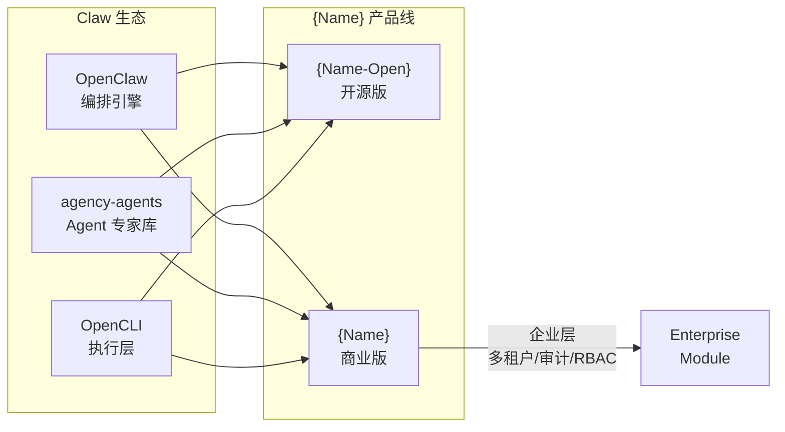

# {Name} 命名与品牌说明

> **文档说明**：用于冻结产品品牌口径、命名规则、对外表达与产品边界。所有对外材料、文档、代码仓库命名均以本文为准。
>
> **版本**：V1.0.0
> **最后更新**：{YYYY-MM-DD}

---

## 1. 品牌定位

- **一句话定位**：{例如：面向中小电商的 AI 自动化运营平台}
- **目标用户**：{例如：独立站卖家、跨境电商团队、MCN 机构}
- **核心价值**：{例如：用 AI Agent 替代重复性电商操作，降低 80% 人工成本}

| 维度 | 内容 |
| :--- | :--- |
| 产品类别 | {例如：AI Agent 平台 / SaaS 工具 / 开源基础设施} |
| 核心受众 | {例如：电商运营人员、独立开发者} |
| 竞争定位 | {例如：比 X 更智能，比 Y 更开放} |
| 开源策略 | {例如：核心引擎开源，商业版增值} |

---

## 2. 命名由来

### 2.1 前缀含义

- **{例如：Octo}**：{例如：源自 Octopus（章鱼），象征多触手并行能力与智能协调}
- 命名意图：{例如：暗示平台能同时操控多个平台、多条流程}

### 2.2 后缀含义

- **{例如：Ecom}**：{例如：Electronic Commerce 缩写，明确电商领域定位}
- 组合效果：{例如：OctoEcom = 章鱼级电商自动化}

### 2.3 开源版 vs 商业版（如适用）

| 维度 | {Name-Open} (开源版) | {Name} (商业版) |
| :--- | :--- | :--- |
| 定位 | {例如：个人/小团队自部署} | {例如：企业级 SaaS} |
| 许可证 | {例如：MIT / Apache 2.0} | {例如：商业许可} |
| 核心差异 | {例如：单租户、本地存储} | {例如：多租户、云端治理} |
| 技术栈 | {例如：Node.js / TypeScript} | {例如：Go + Python + PostgreSQL} |
| 品牌关系 | 社区版、推广引擎 | 商业变现主体 |

---

## 3. 产品边界

### 3.1 {Name} 是什么

- {例如：基于 OpenClaw 编排引擎的电商自动化 Agent 平台}
- {例如：提供选品、上架、定价、订单、客服等全链路 AI 操作}
- {例如：支持淘宝、拼多多、Shopee、Amazon 等多平台}

### 3.2 {Name} 不是什么

- {例如：不是 ERP 系统（不做进销存管理）}
- {例如：不是广告投放平台（不做 ROI 优化）}
- {例如：不是通用 AI 对话工具（专注电商领域）}

---

## 4. 核心公式

{Name} 的能力由以下分层组合而成：

```
{Name} = {例如：OpenClaw (编排层) + agency-agents (专家层) + OpenCLI (执行层) + Enterprise (企业层)}
```

### 4.1 分层职责

| 层级 | 组件 | 职责 | 来源 |
| :--- | :--- | :--- | :--- |
| 编排层 | {例如：OpenClaw} | {例如：任务拆解、Agent 调度} | {例如：开源共享} |
| 专家层 | {例如：agency-agents} | {例如：领域知识、策略执行} | {例如：开源 + 商业 Premium} |
| 执行层 | {例如：OpenCLI} | {例如：平台 API 调用、浏览器控制} | {例如：开源共享} |
| 企业层 | {例如：Enterprise Module} | {例如：多租户、审计、RBAC} | {例如：商业版独有} |

---

## 5. 品牌家族关系



> **说明**：虚线/实线表示依赖强度。开源版与商业版共享编排/专家/执行三层，商业版额外包含企业层。

---

## 6. 对外表达规范

| 场景 | 正确用法 | 错误用法 |
| :--- | :--- | :--- |
| 官方全称 | {Name} | {例如：octo-ecom, OCTOECOM} |
| 代码仓库 | {例如：`octoecom`（全小写）} | {例如：`Octo_Ecom`, `octo-Ecom`} |
| CLI 命令 | {例如：`octoecom`} | {例如：`OctoEcom`, `octo_ecom`} |
| npm/pip 包 | {例如：`@octoecom/core`} | {例如：`@OctoEcom/Core`} |
| 文档标题 | {Name} + 空格 + 文档名 | 无空格连写 |
| 中文语境 | {例如：OctoEcom 电商平台} | {例如：OctoEcom电商平台（缺空格）} |

---

## 7. 品牌标识规范（可选）

| 元素 | 规范 |
| :--- | :--- |
| Logo 主色 | {例如：#1A73E8（科技蓝）} |
| 辅助色 | {例如：#34A853（成功绿）, #EA4335（警告红）} |
| 字体 | {例如：Inter（英文）+ 思源黑体（中文）} |
| 图标风格 | {例如：Outlined, 2px stroke, 24×24 基准} |
| Favicon | {例如：章鱼触手简化图形，32×32} |

---

## 8. 文档体系

本产品文档遵循 `full-stack-doc` 标准，完整文档索引如下：

| 序号 | 文档 | 说明 |
| :---: | :--- | :--- |
| 1 | [命名与品牌说明](1、{Name}-命名与品牌说明.md) | 本文 |
| 2 | [术语表与词汇表](2、{Name}-术语表与词汇表.md) | 统一语言 |
| 3 | [市场与商业分析](3、{Name}-市场与商业分析.md) | 市场规模、竞品、定价 |
| 4 | [技术与可行性分析](4、{Name}-技术与可行性分析.md) | 技术评估、风险 |
| 5 | [技术方案与路线](5、{Name}-技术方案与路线.md) | 技术栈、里程碑 |
| 6 | [产品与版本规划](6、{Name}-产品与版本规划.md) | 版本矩阵、定价 |
| 7 | [领域模型设计](7、{Name}-领域模型设计.md) | DDD 限界上下文、聚合 |
| 8 | [系统架构设计](8、{Name}-系统架构设计.md) | 分层架构、部署 |
| 9 | [视觉与交互DNA规范](9、{Name}-视觉与交互DNA规范.md) | 色彩、字体、组件 |
| 10 | [功能菜单与版本规划](10、{Name}-功能菜单与版本规划.md) | 导航、功能清单 |

---

**文档版本**：V1.0.0
**创建日期**：{YYYY-MM-DD}
**最后更新**：{YYYY-MM-DD}
**文档状态**：✅ 待评审
