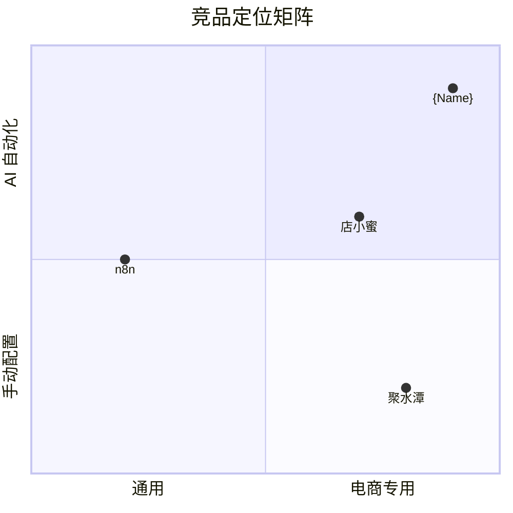

# {Name} 市场与商业分析

> **文档说明**：定义目标市场、客户分层、竞品格局、商业模式与定价策略，给产品路线和销售策略提供依据。
>
> **版本**：V1.0.0
> **最后更新**：{YYYY-MM-DD}

---

## 1. 文档信息 (Document Info)

### 1.1 版本记录

| 版本 | 日期 | 作者 | 变更说明 |
| :--- | :--- | :--- | :--- |
| V1.0.0 | {YYYY-MM-DD} | {姓名} | 初始版本 |

### 1.2 关联文档

| 文档 | 关联说明 |
| :--- | :--- |
| [1、命名与品牌说明](1、{Name}-命名与品牌说明.md) | 产品边界与品牌定位 |
| [5、技术方案与路线](5、{Name}-技术方案与路线.md) | 技术可行性约束 |
| [6、产品与版本规划](6、{Name}-产品与版本规划.md) | 版本矩阵与定价策略 |

---

## 2. 市场机会判断

### 2.1 问题定义

{例如：中小电商卖家面临多平台运营效率低、人工成本高、合规风险大三大痛点。}

### 2.2 机会假设

- **机会 1**：{例如：AI Agent 替代重复性运营操作，效率提升 5–10 倍}
- **机会 2**：{例如：跨平台统一管理减少工具碎片化}
- **机会 3**：{例如：开源生态吸引开发者，形成社区壁垒}
- **机会 4**：{例如：企业级治理需求催生 SaaS 付费意愿}

> 数据来源：{例如：Statista 2025, 艾瑞咨询, 行业访谈}

---

## 3. 市场规模 (TAM / SAM / SOM)

| 市场层级 | 定义 | 估算 | 数据来源 |
| :--- | :--- | :--- | :--- |
| TAM (Total Addressable Market) | {例如：全球电商 SaaS 工具市场} | {例如：$150B} | {例如：Gartner 2025} |
| SAM (Serviceable Available Market) | {例如：AI 电商运营工具市场} | {例如：$8B} | {例如：CB Insights} |
| SOM (Serviceable Obtainable Market) | {例如：中国 + 东南亚中小卖家} | {例如：$200M, 3 年目标} | {例如：行业估算} |

> **估算方法**：{例如：自下而上 = 目标用户数 × ARPU × 付费率}

---

## 4. 目标客户

### 4.1 按规模细分

| 客户类型 | 特征 | 痛点 | 付费意愿 |
| :--- | :--- | :--- | :--- |
| {例如：个人卖家} | {例如：1-2 人，月 GMV <10 万} | {例如：时间不够，多平台切换} | {例如：低，偏免费/低价} |
| {例如：小微团队} | {例如：3-10 人，月 GMV 10-100 万} | {例如：人效低，缺自动化} | {例如：中，¥99-299/月} |
| {例如：中型企业} | {例如：10-50 人，月 GMV >100 万} | {例如：合规、审计、多账号管理} | {例如：高，¥999+/月} |

### 4.2 按场景细分

| 场景 | 用户画像 | 核心需求 |
| :--- | :--- | :--- |
| {例如：跨境电商} | {例如：Amazon/Shopee 卖家} | {例如：多语言上架、汇率定价} |
| {例如：国内电商} | {例如：淘宝/拼多多卖家} | {例如：批量铺货、自动改价} |
| {场景} | {画像} | {需求} |

---

## 5. 竞品分析

### 5.1 竞品类型

| 类型 | 代表产品 | 与 {Name} 关系 |
| :--- | :--- | :--- |
| {例如：传统 ERP} | {例如：聚水潭、旺店通} | {例如：互补（ERP 管库存，{Name} 管运营）} |
| {例如：AI 运营工具} | {例如：DataHunter, 店小蜜} | {例如：直接竞争} |
| {例如：开源自动化} | {例如：n8n, Dify} | {例如：通用竞争（非电商专用）} |

### 5.2 对比矩阵



### 5.3 竞品功能矩阵

| 能力 | {Name} | {例如：竞品 A} | {例如：竞品 B} | {例如：竞品 C} |
| :--- | :---: | :---: | :---: | :---: |
| {例如：多平台支持} | ✅ | ⚠️ | ✅ | ❌ |
| {例如：AI Agent 编排} | ✅ | ❌ | ⚠️ | ❌ |
| {例如：开源可自部署} | ✅ | ❌ | ❌ | ✅ |
| {例如：企业级 RBAC} | ✅ | ✅ | ❌ | ❌ |
| {能力} | — | — | — | — |

---

## 6. SWOT 分析

| | 有利 | 不利 |
| :--- | :--- | :--- |
| **内部** | **Strengths**<br/>- {例如：开源生态获客成本低}<br/>- {例如：AI Agent 技术壁垒}<br/>- {例如：多平台执行层成熟} | **Weaknesses**<br/>- {例如：团队规模小}<br/>- {例如：品牌知名度不足}<br/>- {例如：企业级功能尚不完整} |
| **外部** | **Opportunities**<br/>- {例如：AI 电商赛道快速增长}<br/>- {例如：中小卖家降本需求强烈}<br/>- {例如：竞品缺乏开源方案} | **Threats**<br/>- {例如：大厂入场（如阿里/字节）}<br/>- {例如：平台 API 政策变化}<br/>- {例如：开源竞品模仿} |

---

## 7. 商业模式与定价

### 7.1 商业模式画布

| 要素 | 内容 |
| :--- | :--- |
| 价值主张 | {例如：AI 驱动的电商全自动运营} |
| 客户关系 | {例如：开源社区 → 免费用户 → 付费转化} |
| 渠道 | {例如：GitHub、技术社区、KOL 推广} |
| 关键资源 | {例如：AI 模型、平台 Adapter、社区} |
| 收入来源 | {例如：订阅 + 增值 + 企业定制} |

### 7.2 定价方案

| 档位 | 标签 | 月价 | 核心权益 |
| :--- | :--- | :--- | :--- |
| 免费版 | 🆓 Free | ¥0 | {例如：3 个 Agent、1 个店铺、社区支持} |
| 个人版 | 👤 Pro | {例如：¥99} | {例如：10 个 Agent、5 个店铺、邮件支持} |
| 专业版 | 👥 Team | {例如：¥299} | {例如：无限 Agent、20 个店铺、优先支持} |
| 企业版 | 🏢 Enterprise | {例如：议价} | {例如：私有部署、RBAC、SLA、专属顾问} |

### 7.3 增值收入

- {例如：Premium Agent 市场（按 Agent 付费）}
- {例如：数据分析增值包}
- {例如：API 调用量计费}

### 7.4 开源转商业漏斗

```mermaid
---
config:
  sankey:
    showValues: false
---
sankey-beta
    GitHub Star,开源用户,1000
    开源用户,免费注册,400
    免费注册,活跃使用,200
    活跃使用,付费转化,40
    付费转化,企业版,8
```

---

## 8. 风险与应对

### 8.1 市场风险

| 风险 | 影响 | 概率 | 应对措施 |
| :--- | :--- | :--- | :--- |
| {例如：大厂推出类似产品} | 高 | 中 | {例如：深耕垂直场景，保持开源优势} |
| {例如：目标市场增速放缓} | 中 | 低 | {例如：拓展东南亚/拉美市场} |

### 8.2 技术风险

| 风险 | 影响 | 概率 | 应对措施 |
| :--- | :--- | :--- | :--- |
| {例如：平台 API 限制/封号} | 高 | 中 | {例如：多通道降级、浏览器 fallback} |
| {例如：AI 模型成本过高} | 中 | 中 | {例如：本地模型 + 缓存策略} |

### 8.3 商业风险

| 风险 | 影响 | 概率 | 应对措施 |
| :--- | :--- | :--- | :--- |
| {例如：付费转化率低于预期} | 高 | 中 | {例如：优化 onboarding、增加试用期} |
| {例如：客户流失率过高} | 中 | 低 | {例如：增值功能锁定、社区粘性} |

---

## 9. 里程碑与关键指标

| 里程碑 | 时间 | 关键指标 |
| :--- | :--- | :--- |
| {例如：开源版发布} | {例如：2026 Q2} | {例如：GitHub Stars >500, 周活 >100} |
| {例如：商业版 Beta} | {例如：2026 Q3} | {例如：付费用户 >50, MRR >¥10K} |
| {例如：商业版 GA} | {例如：2026 Q4} | {例如：付费用户 >200, MRR >¥50K} |
| {里程碑} | {时间} | {指标} |

---

**文档版本**：V1.0.0
**创建日期**：{YYYY-MM-DD}
**最后更新**：{YYYY-MM-DD}
**文档状态**：✅ 待评审
