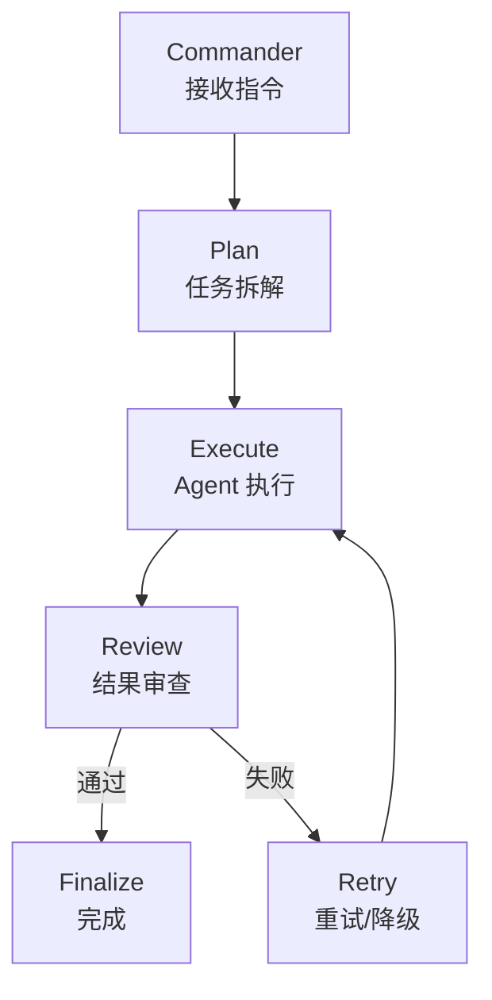
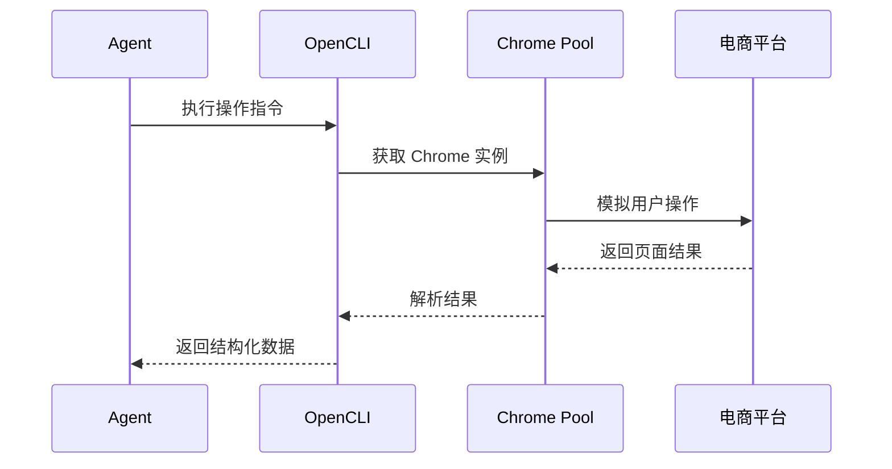
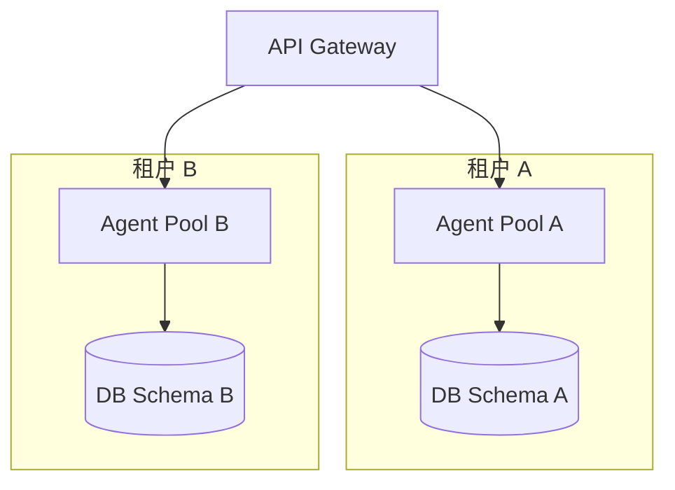

# {Name} 技术与可行性分析

> **文档说明**：分析技术成熟度、实现成本、安全合规与性能扩展性，为技术方案与架构设计提供决策依据。按产品分层逐一评估可行性。
>
> **版本**：V1.0.0
> **最后更新**：{YYYY-MM-DD}

---

## 1. 文档信息

### 1.1 版本记录

| 版本 | 日期 | 作者 | 变更说明 |
| :--- | :--- | :--- | :--- |
| V1.0.0 | {YYYY-MM-DD} | {姓名} | 初始版本 |

### 1.2 关联文档

| 文档 | 关联说明 |
| :--- | :--- |
| [3、市场与商业分析](3、{Name}-市场与商业分析.md) | 市场机会与商业约束 |
| [5、技术方案与路线](5、{Name}-技术方案与路线.md) | 技术选型与实施方案 |
| [8、系统架构设计](8、{Name}-系统架构设计.md) | 架构设计承接 |

### 1.3 评估标准

| 等级 | 图标 | 定义 |
| :--- | :---: | :--- |
| 高可行 | ✅ | 技术成熟、团队有经验、风险可控 |
| 中可行 | ⚠️ | 技术可用但需额外投入或验证 |
| 低可行 | 🔴 | 技术不成熟或风险过高，需替代方案 |

---

## 2. 编排层可行性（{例如：OpenClaw}）

### 2.1 评估结论：✅ 高可行

| 维度 | 评估 | 说明 |
| :--- | :---: | :--- |
| 技术成熟度 | ✅ | {例如：已有生产环境验证，稳定运行 6+ 月} |
| 团队适配度 | ✅ | {例如：核心团队为框架原作者} |
| 业务适配度 | ✅ | {例如：任务编排、DAG 调度完全匹配需求} |

### 2.2 关键技术点

- {例如：任务拆解（Divide & Conquer）}
- {例如：状态机管理（Plan → Execute → Review → Finalize）}
- {例如：多 Agent 并行调度}

---

## 3. 专家层可行性（{例如：agency-agents}）

### 3.1 评估结论：✅ 高可行

| 维度 | 评估 | 说明 |
| :--- | :---: | :--- |
| 技术成熟度 | ✅ | {例如：LLM 调用链成熟，Prompt 模板体系完善} |
| 团队适配度 | ✅ | {例如：团队有 AI 工程经验} |
| 业务适配度 | ⚠️ | {例如：部分垂直场景 Agent 需要行业数据训练} |

### 3.2 Agent 技术栈

| 组件 | 技术 | 说明 |
| :--- | :--- | :--- |
| {例如：LLM 调用} | {例如：OpenAI API / 本地 Ollama} | {例如：可切换模型} |
| {例如：Prompt 管理} | {例如：Template + Few-shot} | {例如：版本化管理} |
| {例如：工具调用} | {例如：Function Calling} | {例如：平台 API 映射} |

### 3.3 Agent 分级体系

| 级别 | 来源 | 质量保证 | 可用范围 |
| :--- | :--- | :--- | :--- |
| {例如：Core Agent} | {例如：官方开发} | {例如：全量测试 + SLA} | {例如：全版本} |
| {例如：Premium Agent} | {例如：官方 + 合作伙伴} | {例如：审核 + 测试} | {例如：商业版} |
| {例如：Community Agent} | {例如：社区贡献} | {例如：社区评分} | {例如：开源版} |

---

## 4. 执行层可行性（{例如：OpenCLI}）

### 4.1 评估结论：✅ 高可行

| 维度 | 评估 | 说明 |
| :--- | :---: | :--- |
| 技术成熟度 | ✅ | {例如：CLI + Adapter 模式已验证} |
| 团队适配度 | ✅ | {例如：团队有 Puppeteer/Playwright 经验} |
| 业务适配度 | ⚠️ | {例如：平台 API 变更频繁，需持续维护} |

### 4.2 平台接入验证

| 平台 | 接入方式 | 验证状态 | 备注 |
| :--- | :--- | :---: | :--- |
| {例如：淘宝} | {例如：开放 API + 浏览器} | ✅ | {例如：需商家授权} |
| {例如：拼多多} | {例如：开放 API} | ✅ | {例如：API 限流较严} |
| {例如：Amazon} | {例如：SP-API + MWS} | ⚠️ | {例如：需 Developer 注册} |
| {平台} | {方式} | — | {备注} |

### 4.3 浏览器控制方案

---

## 5. 企业层可行性（{Name} 独有，按需）

### 5.1 评估结论：✅ 高可行

| 维度 | 评估 | 说明 |
| :--- | :---: | :--- |
| 技术成熟度 | ✅ | {例如：多租户、RBAC 为成熟模式} |
| 团队适配度 | ⚠️ | {例如：需补充 SaaS 运营经验} |
| 业务适配度 | ✅ | {例如：企业客户明确需要审计与权限} |

### 5.2 多租户隔离方案

| 隔离策略 | 优点 | 缺点 | 推荐场景 |
| :--- | :--- | :--- | :--- |
| {例如：Schema 级隔离} | {例如：成本低，迁移简单} | {例如：大租户可能有噪声邻居} | {例如：专业版} |
| {例如：Database 级隔离} | {例如：完全隔离} | {例如：运维成本高} | {例如：企业版} |

### 5.3 RBAC 角色矩阵

| 角色 | 查看 | 编辑 | 管理 Agent | 管理团队 | 审计日志 |
| :--- | :---: | :---: | :---: | :---: | :---: |
| {例如：Owner} | ✅ | ✅ | ✅ | ✅ | ✅ |
| {例如：Admin} | ✅ | ✅ | ✅ | ✅ | ❌ |
| {例如：Operator} | ✅ | ✅ | ✅ | ❌ | ❌ |
| {例如：Viewer} | ✅ | ❌ | ❌ | ❌ | ❌ |

---

## 6. 安全与合规可行性

### 6.1 评估结论：⚠️ 中可行（需持续建设）

| 安全维度 | 现状 | 目标 | 差距 |
| :--- | :--- | :--- | :--- |
| {例如：数据加密} | {例如：传输 TLS 已实现} | {例如：静态 AES-256} | {例如：存储加密待实现} |
| {例如：凭证管理} | {例如：环境变量} | {例如：Vault/KMS} | {例如：需引入密钥管理} |
| {例如：审计} | {例如：无} | {例如：全操作审计} | {例如：需新建审计模块} |
| {例如：合规认证} | {例如：无} | {例如：SOC2 / 等保} | {例如：V3.0 启动} |

---

## 7. 性能与扩展性评估

| 维度 | 目标 | 当前能力 | 差距 | 优化方向 |
| :--- | :--- | :--- | :--- | :--- |
| {例如：并发 Agent} | {例如：100 并发/租户} | {例如：10 并发} | {例如：10×} | {例如：Worker Pool + 队列} |
| {例如：API 响应} | {例如：P99 < 500ms} | {例如：P99 ~800ms} | {例如：优化 DB 查询} | {例如：索引 + 缓存} |
| {例如：存储扩展} | {例如：TB 级} | {例如：GB 级} | {例如：需分片} | {例如：对象存储 + 归档} |

---

## 8. 技术风险总表

| # | 风险描述 | 影响 | 概率 | 缓解措施 | 负责人 |
| :---: | :--- | :---: | :---: | :--- | :--- |
| R1 | {例如：平台 API 限流导致任务堆积} | 高 | 中 | {例如：限流降级 + 队列缓冲} | {姓名} |
| R2 | {例如：LLM 调用成本超预算} | 中 | 高 | {例如：本地模型 fallback + Token 缓存} | {姓名} |
| R3 | {例如：浏览器指纹被平台识别} | 高 | 中 | {例如：指纹随机化 + IP 轮换} | {姓名} |
| R4 | {例如：多租户数据泄露} | 高 | 低 | {例如：Schema 隔离 + 行级安全} | {姓名} |
| RN | {风险} | — | — | {措施} | {姓名} |

---

## 9. 结论

### 9.1 总体评估

| 层级 | 可行性 | 核心优势 | 主要风险 |
| :--- | :---: | :--- | :--- |
| 编排层 | ✅ | {例如：成熟引擎，团队自研} | {例如：状态机复杂度} |
| 专家层 | ✅ | {例如：LLM 能力成熟} | {例如：领域 Agent 需持续训练} |
| 执行层 | ✅ | {例如：多平台 Adapter 验证} | {例如：平台 API 变更频繁} |
| 企业层 | ✅ | {例如：多租户模式成熟} | {例如：安全合规需持续投入} |

### 9.2 建议

1. {例如：V1.0 优先交付编排层 + 执行层，专家层使用 Core Agent}
2. {例如：V2.0 补齐企业层 RBAC + 审计}
3. {例如：安全合规作为持续性投入，V3.0 前完成等保/SOC2 基线}

---

**文档版本**：V1.0.0
**创建日期**：{YYYY-MM-DD}
**最后更新**：{YYYY-MM-DD}
**文档状态**：✅ 待评审
