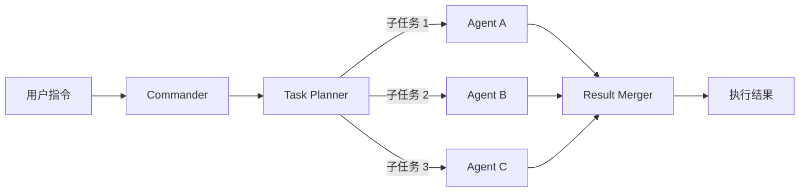
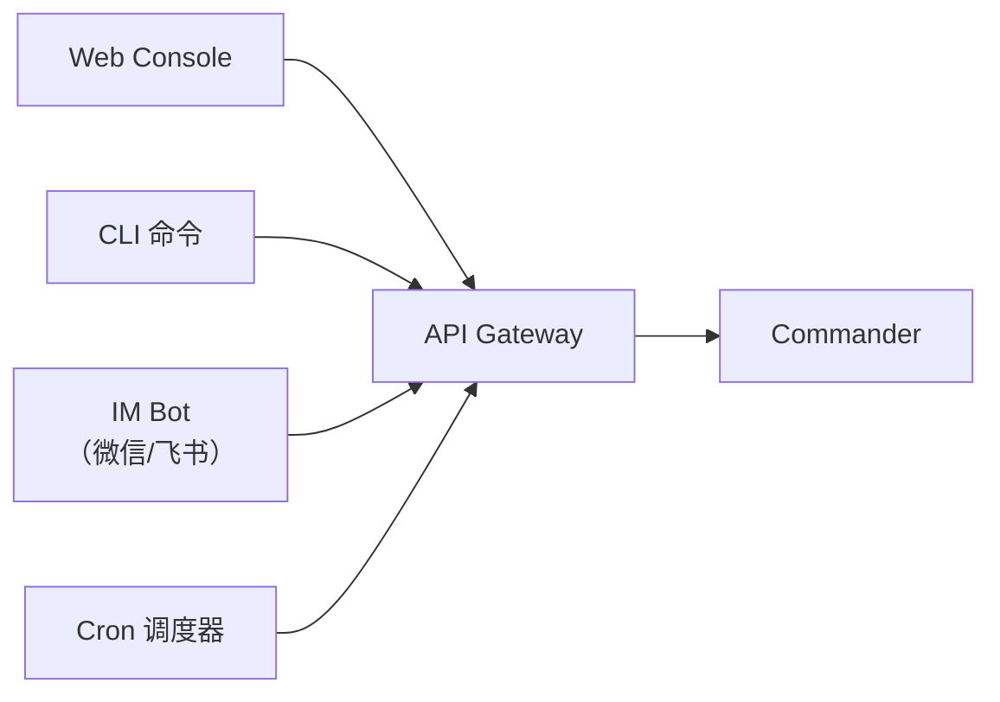
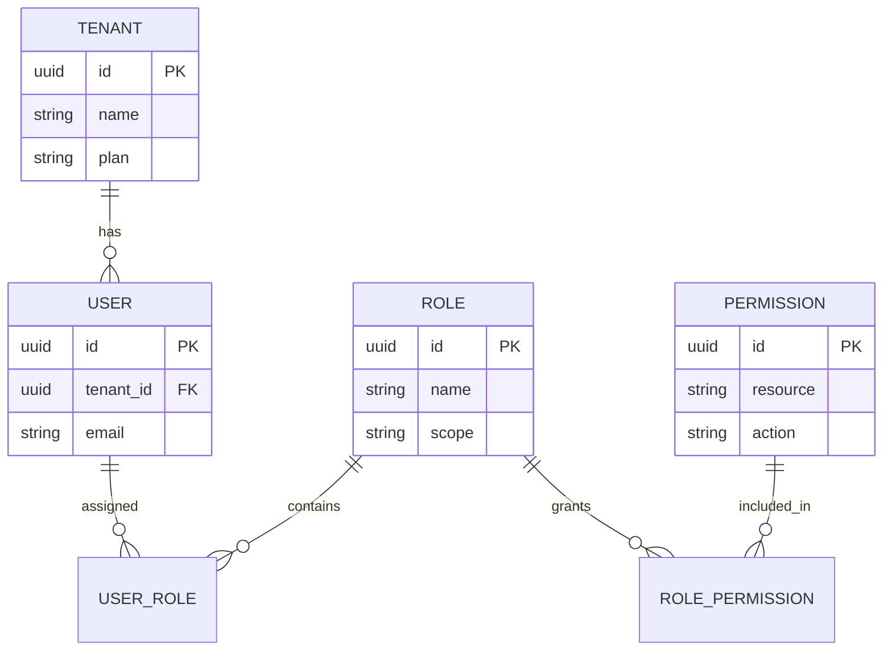
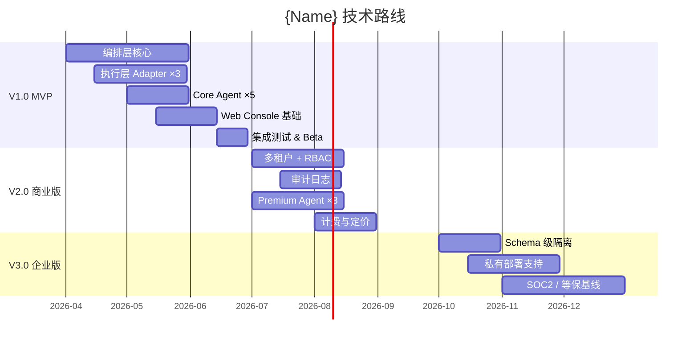
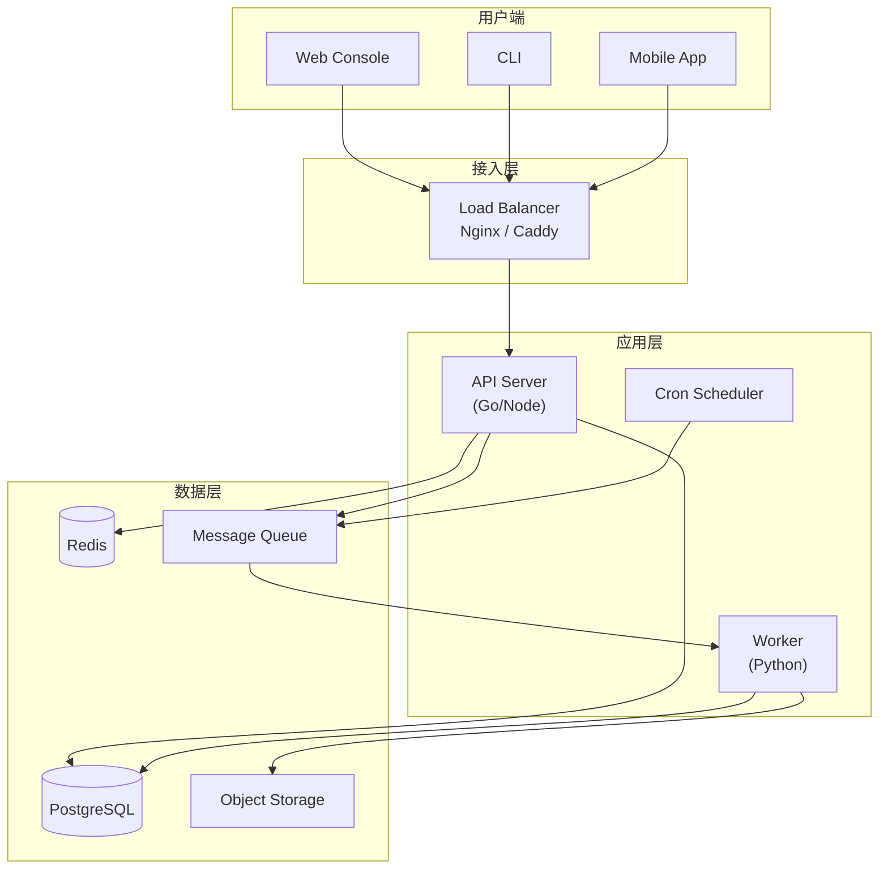

# {Name} 技术方案与路线

> **文档说明**：沉淀技术选型结论、分层方案设计、关键组件细节、ADR 决策记录与里程碑路线。为系统架构设计和版本研发提供技术基线。
>
> **版本**：V1.0.0
> **最后更新**：{YYYY-MM-DD}

---

## 1. 文档信息

### 1.1 版本记录

| 版本 | 日期 | 作者 | 变更说明 |
| :--- | :--- | :--- | :--- |
| V1.0.0 | {YYYY-MM-DD} | {姓名} | 初始版本 |

### 1.2 关联文档

| 文档 | 关联说明 |
| :--- | :--- |
| [4、技术与可行性分析](4、{Name}-技术与可行性分析.md) | 可行性评估结论 |
| [6、产品与版本规划](6、{Name}-产品与版本规划.md) | 版本节奏对齐 |
| [8、系统架构设计](8、{Name}-系统架构设计.md) | 架构设计承接 |

---

## 2. 技术选型总览

### 2.1 核心技术栈

| 层级 | 技术 | 版本 | 说明 |
| :--- | :--- | :--- | :--- |
| {例如：编排引擎} | {例如：OpenClaw (Rust)} | {例如：≥0.5} | {例如：任务编排与 Agent 调度} |
| {例如：后端 API} | {例如：Go / Node.js} | {例如：≥1.22 / ≥20} | {例如：REST API 服务} |
| {例如：AI 推理} | {例如：Python} | {例如：≥3.11} | {例如：LLM 调用、数据提取} |
| {例如：前端 Web} | {例如：Vue 3 + Element Plus} | {例如：≥3.4} | {例如：管理控制台} |
| {例如：移动端} | {例如：UniApp-x + uView Pro} | {例如：latest} | {例如：移动端适配} |
| {例如：数据库} | {例如：PostgreSQL} | {例如：≥15} | {例如：元数据存储} |
| {例如：缓存} | {例如：Redis} | {例如：≥7} | {例如：热数据缓存、任务队列} |
| {例如：消息队列} | {例如：NATS / RabbitMQ} | {例如：latest} | {例如：异步任务分发} |
| {例如：对象存储} | {例如：MinIO / S3} | {例如：latest} | {例如：文件与快照存储} |

### 2.2 技术选型决策矩阵

| 决策点 | 候选 A | 候选 B | 选择 | 理由 |
| :--- | :--- | :--- | :--- | :--- |
| {例如：后端语言} | {例如：Go} | {例如：Node.js} | {例如：Go} | {例如：并发性能、类型安全} |
| {例如：数据库} | {例如：PostgreSQL} | {例如：MySQL} | {例如：PostgreSQL} | {例如：JSON 支持、扩展生态} |
| {例如：前端框架} | {例如：Vue 3} | {例如：React} | {例如：Vue 3} | {例如：团队经验、生态成熟} |
| {决策点} | {A} | {B} | {选择} | {理由} |

---

## 3. 编排层技术方案

### 3.1 编排引擎集成

- {例如：基于 OpenClaw Commander 的任务编排}
- {例如：DAG 式任务拆解，支持并行/串行/条件分支}



### 3.2 调度方案

| 调度类型 | 实现 | 示例 |
| :--- | :--- | :--- |
| {例如：即时任务} | {例如：REST API 触发} | {例如：用户点击「立即采集」} |
| {例如：定时任务} | {例如：Cron 表达式} | {例如：每日 8:00 自动改价} |
| {例如：事件触发} | {例如：Webhook / MQ} | {例如：新订单触发发货流程} |

### 3.3 多渠道输入



---

## 4. 专家层技术方案

### 4.1 Agent 模板规范

```yaml
# Agent 模板示例
name: "{例如：product-selector}"
version: "1.0.0"
category: "{例如：选品}"
tier: "{例如：core | premium | community}"
description: "{例如：从源平台筛选合适商品}"
inputs:
  - name: "source_platform"
    type: "string"
    required: true
  - name: "criteria"
    type: "object"
outputs:
  - name: "product_list"
    type: "array"
tools:
  - "{例如：platform.search}"
  - "{例如：platform.getDetail}"
llm:
  model: "{例如：gpt-4o-mini}"
  temperature: 0.3
```

### 4.2 Agent 分类体系

| 类别 | 说明 | 示例 |
| :--- | :--- | :--- |
| {例如：Core Agent} | {例如：官方内置，覆盖核心流程} | {例如：选品、上架、定价} |
| {例如：Premium Agent} | {例如：商业版专属，高级能力} | {例如：竞品监控、智能定价} |
| {例如：Community Agent} | {例如：社区贡献，开放注册} | {例如：自定义选品规则} |

---

## 5. 执行层技术方案

### 5.1 命令规范

```bash
# CLI 命令示例
{例如：opencli} platform list                    # 列出已连接平台
{例如：opencli} product scrape --platform taobao  # 采集商品
{例如：opencli} order sync --store my-store       # 同步订单
{例如：opencli} agent run product-selector        # 运行 Agent
```

### 5.2 平台适配器接口

```typescript
// 平台适配器抽象接口示例
interface PlatformAdapter {
  /** 适配器唯一标识 */
  readonly id: string;
  /** 平台名称 */
  readonly name: string;
  /** 初始化连接 */
  connect(credentials: Credentials): Promise<void>;
  /** 搜索商品 */
  searchProducts(query: SearchQuery): Promise<Product[]>;
  /** 上架商品 */
  listProduct(product: ProductDraft): Promise<ListingResult>;
  /** 同步订单 */
  syncOrders(since: Date): Promise<Order[]>;
  /** 健康检查 */
  healthCheck(): Promise<HealthStatus>;
}
```

### 5.3 浏览器控制方案

| 方案 | 适用场景 | 优点 | 缺点 |
| :--- | :--- | :--- | :--- |
| {例如：Playwright} | {例如：复杂页面操作} | {例如：API 稳定、多浏览器} | {例如：资源占用较高} |
| {例如：CDP 直连} | {例如：轻量操作} | {例如：低开销} | {例如：需自行管理生命周期} |

---

## 6. 企业层技术方案

### 6.1 多租户实现

| 隔离级别 | 实现方式 | 适用版本 |
| :--- | :--- | :--- |
| {例如：Row-Level} | {例如：`tenant_id` 列 + RLS Policy} | {例如：👥 专业版} |
| {例如：Schema-Level} | {例如：PostgreSQL Schema 隔离} | {例如：🏢 企业版} |

### 6.2 RBAC 实现



### 6.3 审计日志方案

| 字段 | 类型 | 说明 |
| :--- | :--- | :--- |
| `id` | UUID | 日志 ID |
| `tenant_id` | UUID | 租户 |
| `actor_id` | UUID | 操作者 |
| `action` | string | 操作类型 |
| `resource` | string | 操作对象 |
| `payload` | JSON | 变更详情 |
| `timestamp` | datetime | 操作时间 |
| `ip` | string | 客户端 IP |

### 6.4 Web Console 技术方案

| 技术 | 版本 | 用途 |
| :--- | :--- | :--- |
| {例如：Vue 3} | {例如：3.4+} | {例如：UI 框架} |
| {例如：Element Plus} | {例如：2.8+} | {例如：组件库} |
| {例如：Pinia} | {例如：2.x} | {例如：状态管理} |
| {例如：Vue Router} | {例如：4.x} | {例如：路由} |
| {例如：Axios} | {例如：1.x} | {例如：HTTP 客户端} |
| {例如：lime-echart} | {例如：latest} | {例如：图表组件} |

---

## 7. 技术决策记录 (ADR)

| ADR# | 决策 | 状态 | 背景 | 后果 |
| :--- | :--- | :--- | :--- | :--- |
| ADR-001 | {例如：选择 Go 作为 API 层语言} | ✅ Accepted | {例如：需要高并发处理能力} | {例如：编译部署简单，但 AI 生态需通过 Python sidecar} |
| ADR-002 | {例如：PostgreSQL 替代 MySQL} | ✅ Accepted | {例如：需 JSON 查询 + pgvector} | {例如：运维复杂度略增} |
| ADR-003 | {例如：采用 Schema 级租户隔离} | ✅ Accepted | {例如：企业客户数据隔离要求} | {例如：迁移脚本需按租户执行} |
| ADR-NNN | {决策} | — | {背景} | {后果} |

---

## 8. 分阶段技术路线

### 8.1 技术路线 Gantt



### 8.2 版本交付清单

| 版本 | 时间 | 关键交付 |
| :--- | :--- | :--- |
| V1.0 MVP | {例如：2026 Q2} | {例如：编排 + 执行 + 5 Core Agent + Web Console} |
| V2.0 商业版 | {例如：2026 Q3} | {例如：多租户 + RBAC + 审计 + Premium Agent + 计费} |
| V3.0 企业版 | {例如：2026 Q4} | {例如：Schema 隔离 + 私有部署 + 合规} |
| V4.0 生态版 | {例如：2027 Q1} | {例如：Agent 市场 + 插件系统 + 开放 API} |

---

## 9. 部署方案

### 9.1 部署架构



### 9.2 部署选项

| 部署模式 | 适用 | 技术 | 说明 |
| :--- | :--- | :--- | :--- |
| {例如：Docker Compose} | {例如：开发 / 小规模} | {例如：docker compose up} | {例如：单机部署，最快上手} |
| {例如：Kubernetes} | {例如：生产 / SaaS} | {例如：Helm Chart} | {例如：自动扩缩容} |
| {例如：私有化} | {例如：企业版} | {例如：离线安装包} | {例如：客户自有机房} |

---

## 10. 监控与可观测性

| 维度 | 工具 | 指标 |
| :--- | :--- | :--- |
| {例如：Metrics} | {例如：Prometheus + Grafana} | {例如：QPS、延迟、错误率} |
| {例如：Logging} | {例如：ELK / Loki} | {例如：结构化日志、错误追踪} |
| {例如：Tracing} | {例如：OpenTelemetry + Jaeger} | {例如：请求链路、Agent 执行跟踪} |
| {例如：Alerting} | {例如：AlertManager / PagerDuty} | {例如：SLA 违约、任务堆积} |

---

**文档版本**：V1.0.0
**创建日期**：{YYYY-MM-DD}
**最后更新**：{YYYY-MM-DD}
**文档状态**：✅ 待评审
