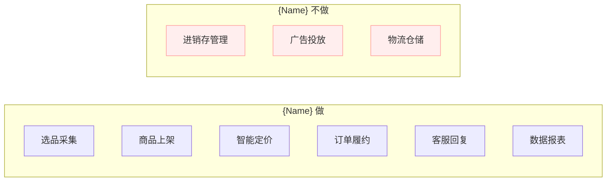
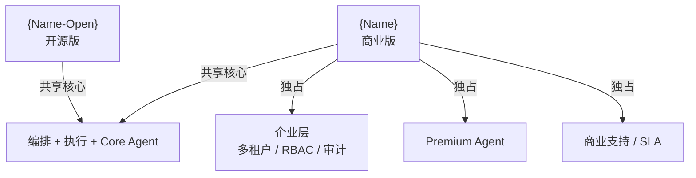
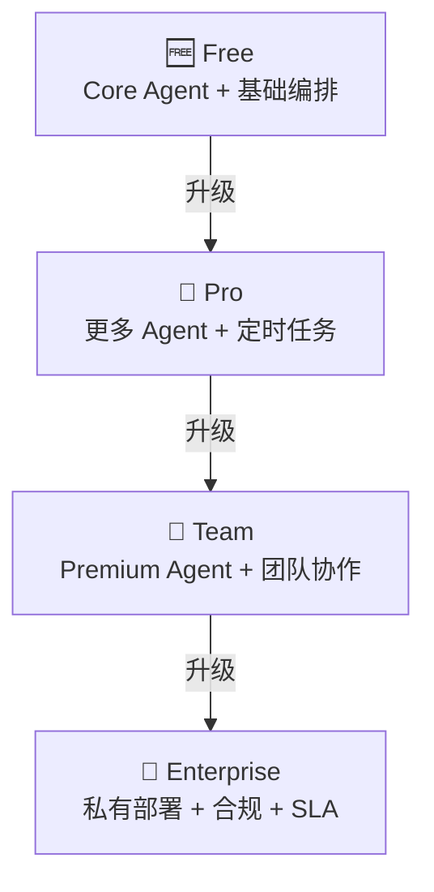
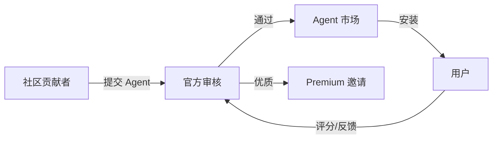

# {Name} 产品与版本规划

> **文档说明**：定义产品定位、版本体系、功能演进路线与商业化节奏，作为研发与商业协同基线。
>
> **版本**：V1.0.0
> **最后更新**：{YYYY-MM-DD}

---

## 1. 文档信息

### 1.1 版本记录

| 版本 | 日期 | 作者 | 变更说明 |
| :--- | :--- | :--- | :--- |
| V1.0.0 | {YYYY-MM-DD} | {姓名} | 初始版本 |

### 1.2 关联文档

| 文档 | 关联说明 |
| :--- | :--- |
| [3、市场与商业分析](3、{Name}-市场与商业分析.md) | 商业模式与定价 |
| [5、技术方案与路线](5、{Name}-技术方案与路线.md) | 技术路线与里程碑 |
| [10、功能菜单与版本规划](10、{Name}-功能菜单与版本规划.md) | 功能清单与版本分布 |

---

## 2. 产品定位

### 2.1 一句话定位

{例如：面向中小电商卖家的 AI 自动化运营平台，让 Agent 替你开店。}

### 2.2 核心价值主张

| 价值 | 说明 |
| :--- | :--- |
| {例如：效率} | {例如：AI Agent 替代重复操作，降低 80% 人工成本} |
| {例如：覆盖} | {例如：多平台统一管理，告别工具碎片化} |
| {例如：智能} | {例如：AI 驱动选品、定价、客服，数据驱动决策} |
| {例如：开放} | {例如：开源核心引擎，社区驱动创新} |

### 2.3 产品边界

---

## 3. 版本体系

### 3.1 开源与商业关系（如适用）

| 维度 | {Name-Open} 开源版 | {Name} 商业版 |
| :--- | :--- | :--- |
| 编排引擎 | ✅ 完整 | ✅ 完整 |
| 执行层 | ✅ 完整 | ✅ 完整 |
| Core Agent | ✅ 全部 | ✅ 全部 |
| Premium Agent | ❌ | ✅ |
| 多租户 | ❌ | ✅ |
| RBAC | ❌ | ✅ |
| 审计日志 | ❌ | ✅ |
| 技术支持 | 社区 | 专属/SLA |

### 3.2 版本功能矩阵

| 功能 | 🆓 Free | 👤 Pro | 👥 Team | 🏢 Enterprise |
| :--- | :---: | :---: | :---: | :---: |
| {例如：Agent 数量} | {例如：3} | {例如：10} | {例如：无限} | {例如：无限} |
| {例如：店铺数量} | {例如：1} | {例如：5} | {例如：20} | {例如：无限} |
| {例如：平台数量} | {例如：2} | {例如：5} | {例如：全部} | {例如：全部} |
| {例如：定时任务} | ❌ | ✅ | ✅ | ✅ |
| {例如：Premium Agent} | ❌ | ❌ | ✅ | ✅ |
| {例如：多租户} | ❌ | ❌ | ❌ | ✅ |
| {例如：RBAC} | ❌ | ❌ | ❌ | ✅ |
| {例如：私有部署} | ❌ | ❌ | ❌ | ✅ |
| {例如：SLA} | ❌ | ❌ | ❌ | ✅ |
| {功能} | — | — | — | — |

---

## 4. 版本路线图

### 4.1 V1.0 — MVP（{例如：2026 Q2}）

**目标**：{例如：核心流程跑通，验证 PMF}

| 功能 | 优先级 | 状态 |
| :--- | :---: | :---: |
| {例如：编排引擎集成} | P0 | ⏳ |
| {例如：淘宝/拼多多 Adapter} | P0 | ⏳ |
| {例如：选品 Agent} | P0 | ⏳ |
| {例如：上架 Agent} | P0 | ⏳ |
| {例如：Web Console 基础} | P1 | ⏳ |
| {功能} | — | — |

### 4.2 V2.0 — 商业版基础（{例如：2026 Q3}）

**目标**：{例如：商业化启动，付费用户增长}

| 功能 | 优先级 | 状态 |
| :--- | :---: | :---: |
| {例如：多租户 + 用户管理} | P0 | ⏳ |
| {例如：RBAC 权限体系} | P0 | ⏳ |
| {例如：Premium Agent ×3} | P1 | ⏳ |
| {例如：计费与套餐管理} | P1 | ⏳ |
| {功能} | — | — |

### 4.3 V3.0 — 企业版完整（{例如：2026 Q4}）

**目标**：{例如：满足企业客户安全与合规需求}

| 功能 | 优先级 | 状态 |
| :--- | :---: | :---: |
| {例如：Schema 级租户隔离} | P0 | ⏳ |
| {例如：审计日志} | P0 | ⏳ |
| {例如：私有部署支持} | P1 | ⏳ |
| {例如：白标定制} | P2 | ⏳ |
| {功能} | — | — |

### 4.4 V4.0 — 生态版（{例如：2027 Q1}，可选）

**目标**：{例如：构建开放生态}

| 功能 | 优先级 | 状态 |
| :--- | :---: | :---: |
| {例如：Agent 市场} | P1 | ⏳ |
| {例如：插件系统} | P1 | ⏳ |
| {例如：开放 API} | P1 | ⏳ |
| {功能} | — | — |

---

## 5. 版本定价对照

| 档位 | 月价 | 年价（折扣） | 适用版本 |
| :--- | :--- | :--- | :--- |
| 🆓 Free | ¥0 | ¥0 | V1.0+ |
| 👤 Pro | {例如：¥99} | {例如：¥999 (¥83/月)} | V1.0+ |
| 👥 Team | {例如：¥299} | {例如：¥2,999 (¥250/月)} | V2.0+ |
| 🏢 Enterprise | {例如：议价} | {例如：议价} | V3.0+ |

---

## 6. 开源与商业协同策略（如适用）

### 6.1 开源版角色

- {例如：社区推广引擎，降低获客成本}
- {例如：开发者生态入口，培养 Agent 贡献者}
- {例如：核心引擎稳定性验证}

### 6.2 商业版护城河

- {例如：企业级治理（多租户、RBAC、审计）}
- {例如：Premium Agent（更高质量、SLA 保证）}
- {例如：商业支持与 SLA}

### 6.3 功能墙策略

---

## 7. 发布策略

| 策略 | 说明 |
| :--- | :--- |
| 版本号规范 | SemVer：`MAJOR.MINOR.PATCH`（如 `1.2.3`） |
| 发布节奏 | {例如：Major 每季度、Minor 每月、Patch 按需} |
| 灰度策略 | {例如：内部 → 5% 灰度 → 50% → 全量} |
| 回滚策略 | {例如：蓝绿部署，30 分钟内可回滚} |
| 变更日志 | {例如：每版本 CHANGELOG.md + 用户通知} |

---

## 8. 生态协作路径（如适用）

---

## 9. 成功指标

| 指标 | V1.0 目标 | V2.0 目标 | V3.0 目标 |
| :--- | :--- | :--- | :--- |
| {例如：GitHub Stars} | {例如：>500} | {例如：>2,000} | {例如：>5,000} |
| {例如：注册用户} | {例如：>200} | {例如：>1,000} | {例如：>3,000} |
| {例如：付费用户} | {例如：>20} | {例如：>100} | {例如：>300} |
| {例如：MRR} | {例如：>¥5K} | {例如：>¥50K} | {例如：>¥200K} |
| {例如：NPS} | {例如：>30} | {例如：>40} | {例如：>50} |

---

**文档版本**：V1.0.0
**创建日期**：{YYYY-MM-DD}
**最后更新**：{YYYY-MM-DD}
**文档状态**：✅ 待评审
