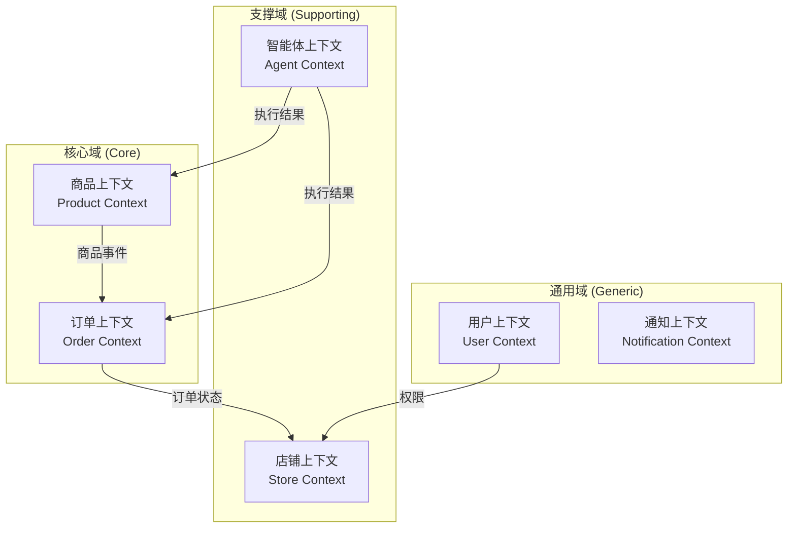
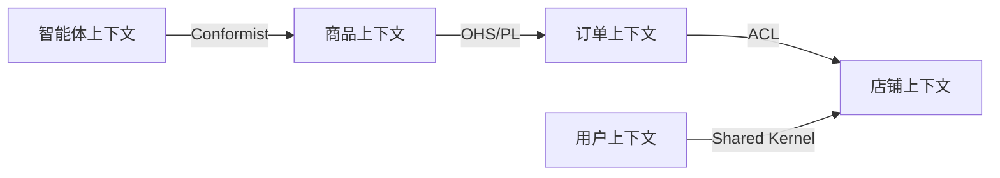
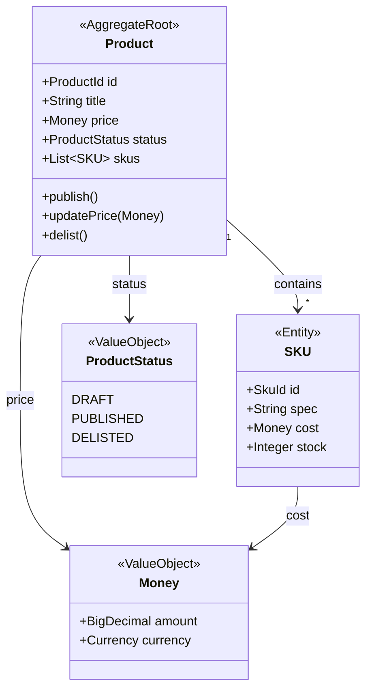
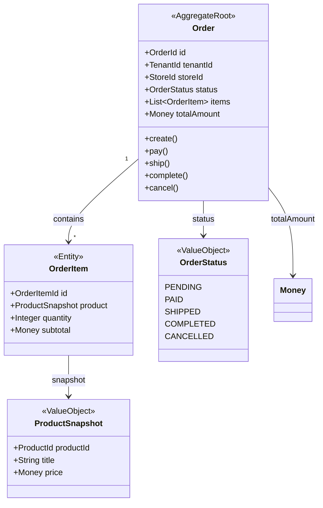
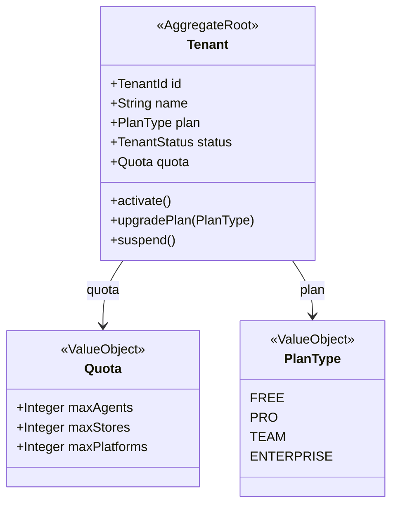
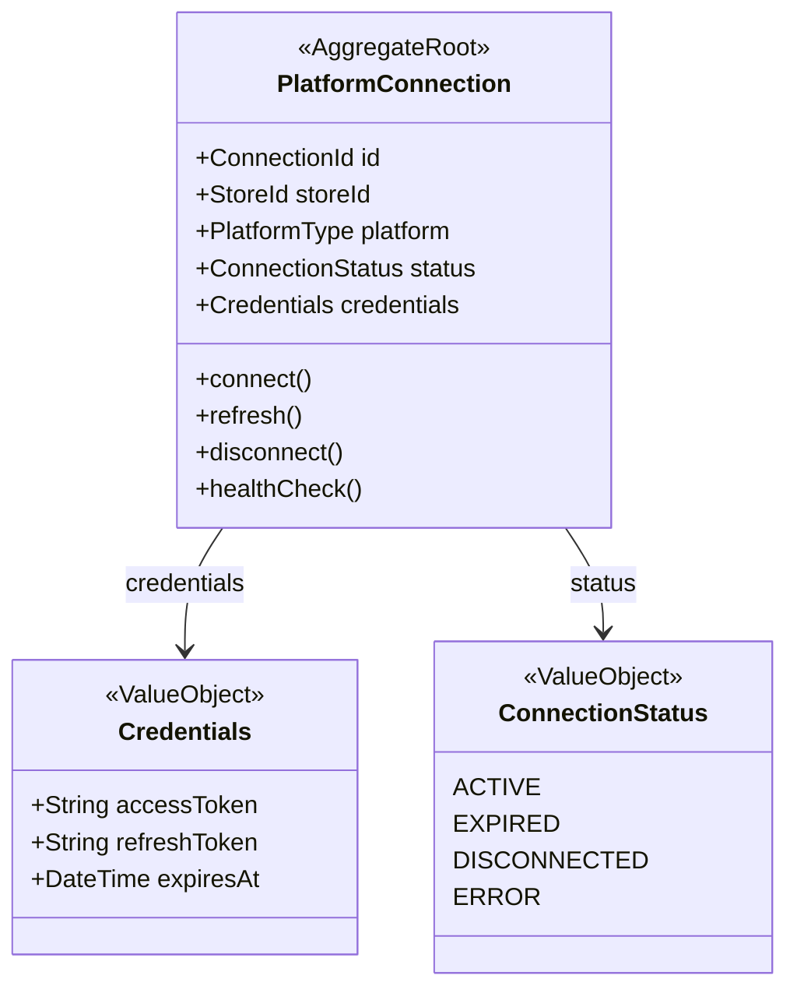
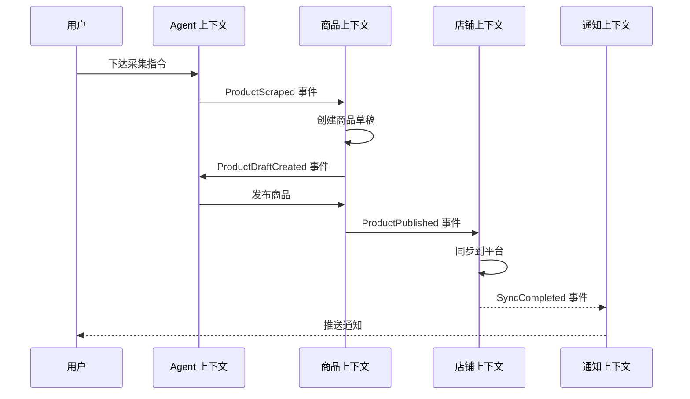
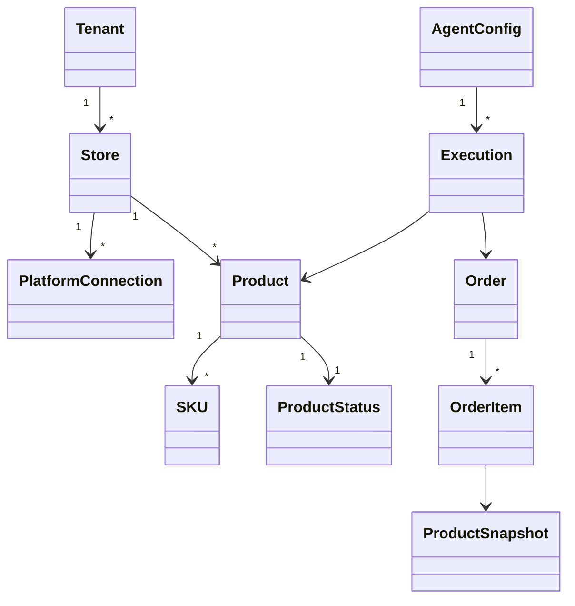

# {Name} 领域模型设计

> **文档说明**：基于 DDD（战略 + 战术）定义限界上下文、聚合、实体和值对象，并说明上下文协作方式、领域事件与仓储接口。
>
> **版本**：V1.0.0
> **最后更新**：{YYYY-MM-DD}

---

## 1. 文档信息

### 1.1 版本记录

| 版本 | 日期 | 作者 | 变更说明 |
| :--- | :--- | :--- | :--- |
| V1.0.0 | {YYYY-MM-DD} | {姓名} | 初始版本 |

### 1.2 关联文档

| 文档 | 关联说明 |
| :--- | :--- |
| [2、术语表与词汇表](2、{Name}-术语表与词汇表.md) | 统一语言定义 |
| [6、产品与版本规划](6、{Name}-产品与版本规划.md) | 功能边界与版本范围 |
| [8、系统架构设计](8、{Name}-系统架构设计.md) | 架构分层承接 |

### 1.3 文档责任人

| 角色 | 姓名 | 职责 |
| :--- | :--- | :--- |
| 领域专家 | {姓名} | 业务规则与模型验证 |
| 架构师 | {姓名} | 聚合划分与上下文映射 |

---

## 2. 战略设计 (Strategic Design)

### 2.1 核心公式映射

```
{Name} = {例如：商品域 + 订单域 + 店铺域 + 智能体域 + 运营域}
```

### 2.2 限界上下文



| 上下文 | 类型 | 核心职责 | 关键聚合 |
| :--- | :--- | :--- | :--- |
| {例如：商品上下文} | 核心域 | {例如：商品全生命周期管理} | {例如：Product, Category} |
| {例如：订单上下文} | 核心域 | {例如：订单创建、履约、退款} | {例如：Order, Payment} |
| {例如：店铺上下文} | 支撑域 | {例如：店铺连接与平台对接} | {例如：Store, PlatformConnection} |
| {例如：智能体上下文} | 支撑域 | {例如：Agent 配置、执行、调度} | {例如：AgentConfig, Execution} |
| {例如：用户上下文} | 通用域 | {例如：用户认证、角色、权限} | {例如：User, Role, Tenant} |
| {上下文} | {类型} | {职责} | {聚合} |

### 2.3 上下文映射 (Context Map)



| 上游 | 下游 | 关系类型 | 说明 |
| :--- | :--- | :--- | :--- |
| {例如：商品} | {例如：订单} | OHS/PL | {例如：商品发布事件触发订单域商品快照} |
| {例如：订单} | {例如：店铺} | ACL | {例如：订单通过防腐层调用店铺 API} |
| {例如：智能体} | {例如：商品} | Conformist | {例如：Agent 遵循商品域协议} |
| {上游} | {下游} | {类型} | {说明} |

> **关系类型说明**：OHS = Open Host Service, PL = Published Language, ACL = Anti-Corruption Layer, SK = Shared Kernel

---

## 3. 统一语言 (Ubiquitous Language)

| 领域概念 | 英文 | 定义 | 所属上下文 |
| :--- | :--- | :--- | :--- |
| {例如：商品} | Product | {例如：可上架到平台的商品实体} | 商品上下文 |
| {例如：SKU} | SKU | {例如：库存管理最小单位} | 商品上下文 |
| {例如：订单} | Order | {例如：用户购买行为的交易记录} | 订单上下文 |
| {例如：履约} | Fulfillment | {例如：订单从创建到完成的全流程} | 订单上下文 |
| {例如：平台连接} | Platform Connection | {例如：与外部电商平台的授权连接} | 店铺上下文 |
| {概念} | {English} | {定义} | {上下文} |

> **注意**：本表中的术语定义须与 [术语表](2、{Name}-术语表与词汇表.md) 保持完全一致。

---

## 4. 核心聚合设计

### 4.1 {例如：商品聚合 (Product Aggregate)}



**不变量 (Invariants)**:
- {例如：商品至少包含一个 SKU}
- {例如：已发布商品不可删除，只能下架}
- {例如：售价不得低于成本价}

### 4.2 {例如：订单聚合 (Order Aggregate)}



**不变量 (Invariants)**:
- {例如：已支付订单不可修改商品}
- {例如：取消订单需退款}
- {例如：订单总额 = Σ(订单项小计)}

### 4.3 {例如：租户聚合 (Tenant Aggregate)（商业版）}



**不变量 (Invariants)**:
- {例如：免费版配额不可超出}
- {例如：降级版本需检查当前资源使用}

### 4.4 {例如：平台连接聚合 (PlatformConnection Aggregate)}



---

## 5. 领域事件

### 5.1 事件清单

| 事件名 | 触发条件 | 发布上下文 | 消费上下文 | 说明 |
| :--- | :--- | :--- | :--- | :--- |
| {例如：ProductPublished} | {例如：商品发布成功} | 商品 | 订单、店铺 | {例如：触发商品同步} |
| {例如：OrderCreated} | {例如：新订单创建} | 订单 | 店铺、通知 | {例如：触发发货流程} |
| {例如：OrderShipped} | {例如：订单发货} | 订单 | 通知 | {例如：通知买家} |
| {例如：AgentExecutionCompleted} | {例如：Agent 执行完成} | 智能体 | 商品、订单 | {例如：更新执行结果} |
| {例如：TenantPlanUpgraded} | {例如：租户升级套餐} | 用户 | 全局 | {例如：更新配额} |
| {例如：ConnectionExpired} | {例如：平台授权过期} | 店铺 | 通知 | {例如：提醒重新授权} |
| {事件} | {条件} | {发布} | {消费} | {说明} |

### 5.2 事件流示意



---

## 6. 领域服务

| 服务名 | 所属上下文 | 职责 | 跨聚合 |
| :--- | :--- | :--- | :---: |
| {例如：PricingService} | 商品 | {例如：根据策略计算售价} | 否 |
| {例如：OrderFulfillmentService} | 订单 | {例如：协调发货流程} | 是 |
| {例如：AgentSchedulingService} | 智能体 | {例如：调度 Agent 执行任务} | 是 |
| {例如：QuotaEnforcementService} | 用户 | {例如：检查租户配额} | 是 |
| {服务} | {上下文} | {职责} | — |

---

## 7. 仓储接口 (Repository)

```typescript
// 商品仓储
interface ProductRepository {
  findById(id: ProductId): Promise<Product | null>;
  findByStore(storeId: StoreId, page: PageRequest): Promise<Page<Product>>;
  save(product: Product): Promise<void>;
  delete(id: ProductId): Promise<void>;
}

// 订单仓储
interface OrderRepository {
  findById(id: OrderId): Promise<Order | null>;
  findByTenant(tenantId: TenantId, filter: OrderFilter): Promise<Page<Order>>;
  save(order: Order): Promise<void>;
}

// 租户仓储（商业版）
interface TenantRepository {
  findById(id: TenantId): Promise<Tenant | null>;
  findByApiKey(key: string): Promise<Tenant | null>;
  save(tenant: Tenant): Promise<void>;
}

// 平台连接仓储
interface PlatformConnectionRepository {
  findByStore(storeId: StoreId): Promise<PlatformConnection[]>;
  findActive(platform: PlatformType): Promise<PlatformConnection[]>;
  save(connection: PlatformConnection): Promise<void>;
}
```

---

## 8. 上下文关系类型速查

| 关系类型 | 缩写 | 含义 | 适用场景 |
| :--- | :--- | :--- | :--- |
| Shared Kernel | SK | 共享代码/模型 | 紧密协作的上下文 |
| Customer-Supplier | C/S | 上游供应，下游消费 | 有明确上下游关系 |
| Conformist | CF | 下游完全遵循上游 | 下游无需变换 |
| Anti-Corruption Layer | ACL | 下游添加防腐层 | 隔离外部系统变化 |
| Open Host Service | OHS | 上游提供标准 API | 上游为多消费者服务 |
| Published Language | PL | 标准化数据格式 | 跨上下文数据交换 |

---

## 9. 领域对象关系图



---

## 10. 演进与治理

| 维度 | 规则 |
| :--- | :--- |
| 新增上下文 | {例如：需领域专家 + 架构师共同评审} |
| 聚合拆分 | {例如：当聚合事务边界过大时考虑拆分} |
| 事件版本 | {例如：使用 CloudEvents 规范，语义化版本} |
| 模型同步 | {例如：每次 Sprint 结束同步更新领域模型文档} |
| 代码一致 | {例如：代码中的 Entity/VO/Service 命名须与本文一致} |

---

**文档版本**：V1.0.0
**创建日期**：{YYYY-MM-DD}
**最后更新**：{YYYY-MM-DD}
**文档状态**：✅ 待评审
