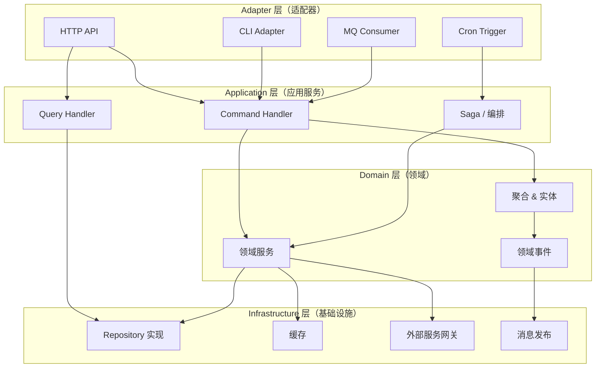
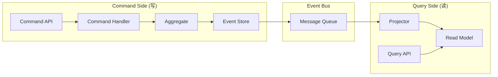
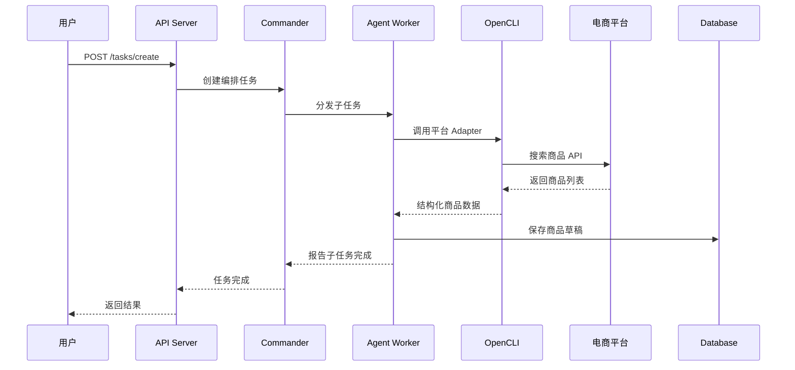
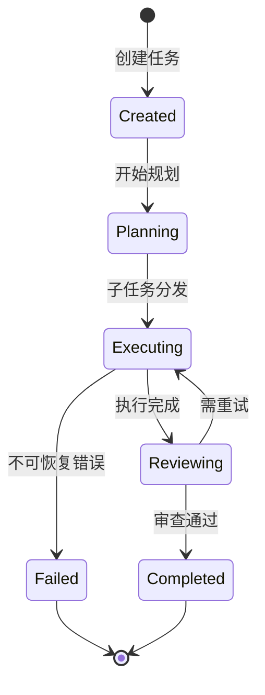
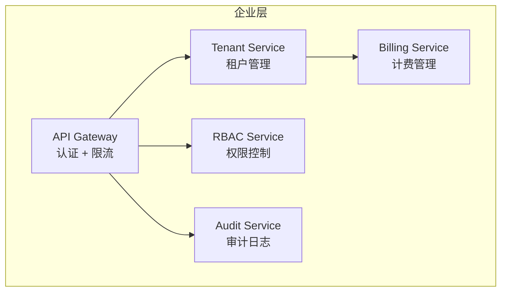
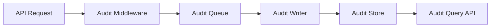
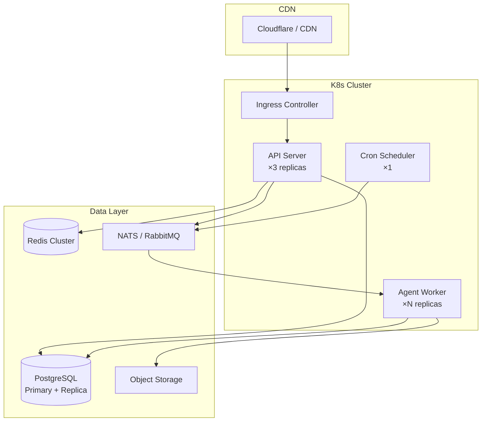

# {Name} 系统架构设计

> **文档说明**：描述系统总体架构、分层职责、核心数据流、安全设计、部署方案与扩展机制。基于 DDD + COLA 架构分层。
>
> **版本**：V1.0.0
> **最后更新**：{YYYY-MM-DD}

---

## 1. 文档信息

| 项目 | 内容 |
| :--- | :--- |
| 文档类型 | 系统架构设计 |
| 产品 | {Name} |
| 版本 | V1.0.0 |
| 状态 | ✅ 待评审 |

### 1.1 关联文档

| 文档 | 关联说明 |
| :--- | :--- |
| [5、技术方案与路线](5、{Name}-技术方案与路线.md) | 技术选型与路线 |
| [7、领域模型设计](7、{Name}-领域模型设计.md) | 领域模型与上下文 |
| [9、视觉与交互DNA规范](9、{Name}-视觉与交互DNA规范.md) | 前端架构约束 |

---

## 2. 架构定位

### 2.1 核心公式

```
{Name} = {例如：OpenClaw (编排) + agency-agents (专家) + OpenCLI (执行) + Enterprise (企业)}
```

### 2.2 架构目标

| 目标 | 说明 | 度量 |
| :--- | :--- | :--- |
| {例如：高可用} | {例如：核心服务 99.9% 可用} | {例如：SLA ≥ 99.9%} |
| {例如：可扩展} | {例如：支持水平扩展} | {例如：100→10K 用户无架构变更} |
| {例如：安全} | {例如：数据隔离、传输加密} | {例如：通过安全审计} |
| {例如：可观测} | {例如：全链路追踪} | {例如：Metrics + Logging + Tracing} |

---

## 3. 总体分层架构



| 层级 | 职责 | 典型组件 |
| :--- | :--- | :--- |
| Adapter | 处理外部 I/O | HTTP Controller, CLI, MQ Consumer, Cron |
| Application | 编排用例，协调领域 | Command/Query Handler, Saga |
| Domain | 核心业务逻辑 | Aggregate, Entity, VO, Domain Service, Event |
| Infrastructure | 技术实现 | Repository Impl, Cache, Gateway, Publisher |

---

## 4. DDD + COLA 分层映射

| COLA 层 | DDD 概念 | {Name} 实现 |
| :--- | :--- | :--- |
| Adapter | Interface / Gateway | {例如：REST Controller, gRPC Endpoint} |
| Application | Application Service | {例如：CommandHandler, QueryHandler} |
| Domain | Aggregate / Service / Event | {例如：Product, Order, PricingService} |
| Infrastructure | Repository / Gateway Impl | {例如：PostgresProductRepo, RedisCache} |

### 4.1 CQRS 与事件驱动（按需）



---

## 5. 核心数据流

### 5.1 主流程示例：{例如：Agent 执行商品采集}



### 5.2 数据流摘要

| 流程 | 入口 | 经过组件 | 存储 |
| :--- | :--- | :--- | :--- |
| {例如：商品采集} | {例如：REST API} | {例如：Commander → Agent → CLI → Adapter} | {例如：PostgreSQL} |
| {例如：订单同步} | {例如：Cron 调度} | {例如：Cron → Commander → Agent → CLI} | {例如：PostgreSQL + Redis} |
| {例如：用户操作审计} | {例如：All API} | {例如：Middleware → Audit Writer} | {例如：审计日志表} |
| {流程} | {入口} | {组件} | {存储} |

---

## 6. 编排层架构

### 6.1 Commander 状态机



---

## 7. 企业层架构（{Name} 独有，按需）

### 7.1 总体架构



### 7.2 多租户架构

| 隔离策略 | 数据库层面 | 应用层面 | 适用版本 |
| :--- | :--- | :--- | :--- |
| {例如：Row-Level} | {例如：RLS Policy} | {例如：tenant_id 上下文} | {例如：👥 Team} |
| {例如：Schema-Level} | {例如：独立 Schema} | {例如：连接池路由} | {例如：🏢 Enterprise} |

### 7.3 RBAC 设计

| 角色 | 权限范围 | 典型用户 |
| :--- | :--- | :--- |
| {例如：Owner} | {例如：全部权限} | {例如：账户创建者} |
| {例如：Admin} | {例如：除转让外全部} | {例如：管理员} |
| {例如：Operator} | {例如：操作类权限} | {例如：运营人员} |
| {例如：Viewer} | {例如：只读} | {例如：查看者} |

### 7.4 审计日志架构



---

## 8. 数据架构

### 8.1 数据库设计概要

| 数据库 | 用途 | 存储内容 |
| :--- | :--- | :--- |
| {例如：PostgreSQL} | 主库 | {例如：商品、订单、用户、租户元数据} |
| {例如：Redis} | 缓存 + 队列 | {例如：会话、热数据、任务队列} |
| {例如：MinIO/S3} | 对象存储 | {例如：图片、导出文件、快照} |

### 8.2 缓存策略

| 场景 | 策略 | TTL | 更新方式 |
| :--- | :--- | :--- | :--- |
| {例如：商品列表} | {例如：Cache-Aside} | {例如：5min} | {例如：写入时失效} |
| {例如：用户会话} | {例如：Write-Through} | {例如：24h} | {例如：登录时写入} |
| {场景} | {策略} | {TTL} | {更新} |

### 8.3 消息队列设计

| Topic | 生产者 | 消费者 | 说明 |
| :--- | :--- | :--- | :--- |
| {例如：task.created} | {例如：API Server} | {例如：Commander} | {例如：新任务创建} |
| {例如：agent.result} | {例如：Agent Worker} | {例如：Commander} | {例如：Agent 执行结果} |
| {例如：audit.event} | {例如：All Services} | {例如：Audit Writer} | {例如：审计事件} |
| {topic} | {生产者} | {消费者} | {说明} |

---

## 9. 安全架构

### 9.1 安全分层

| 层级 | 措施 | 说明 |
| :--- | :--- | :--- |
| 传输层 | {例如：TLS 1.3} | {例如：全链路 HTTPS} |
| 认证层 | {例如：JWT + API Key} | {例如：双模认证} |
| 授权层 | {例如：RBAC} | {例如：基于角色的细粒度权限} |
| 数据层 | {例如：AES-256 加密} | {例如：敏感字段加密存储} |
| 审计层 | {例如：全操作日志} | {例如：不可篡改审计记录} |

### 9.2 凭证安全

| 凭证类型 | 存储方式 | 访问方式 |
| :--- | :--- | :--- |
| {例如：平台 Token} | {例如：加密数据库} | {例如：解密后注入 Adapter} |
| {例如：API Key} | {例如：哈希存储} | {例如：请求头验证} |
| {例如：LLM Key} | {例如：Vault/KMS} | {例如：运行时获取} |

---

## 10. 部署架构

### 10.1 SaaS 部署（推荐）



### 10.2 私有化部署（企业版）

| 组件 | 最小配置 | 推荐配置 |
| :--- | :--- | :--- |
| {例如：API Server} | {例如：2C4G ×1} | {例如：4C8G ×2} |
| {例如：Agent Worker} | {例如：2C4G ×1} | {例如：4C8G ×N} |
| {例如：PostgreSQL} | {例如：2C4G ×1} | {例如：4C16G ×2 (主从)} |
| {例如：Redis} | {例如：1C2G ×1} | {例如：2C4G ×3 (Cluster)} |

---

## 11. 扩展机制

### 11.1 Agent 插件

```typescript
// Agent 插件接口示例
interface AgentPlugin {
  readonly id: string;
  readonly name: string;
  readonly version: string;
  install(context: PluginContext): Promise<void>;
  uninstall(): Promise<void>;
}
```

### 11.2 Platform Adapter 扩展

```typescript
// 自定义 Adapter 注册示例
interface AdapterRegistry {
  register(adapter: PlatformAdapter): void;
  get(platformId: string): PlatformAdapter | null;
  list(): PlatformAdapter[];
}
```

### 11.3 Webhook 事件订阅

| 事件 | Payload 示例 | 说明 |
| :--- | :--- | :--- |
| {例如：`task.completed`} | `{"taskId": "...", "status": "done"}` | {例如：任务完成回调} |
| {例如：`order.created`} | `{"orderId": "...", "total": 99.00}` | {例如：新订单通知} |
| {事件} | {Payload} | {说明} |

---

## 12. 技术债与演进计划

| # | 技术债 | 影响 | 计划修复版本 |
| :---: | :--- | :--- | :--- |
| 1 | {例如：缺少请求幂等性保证} | {例如：重复请求可能导致数据不一致} | {例如：V1.1} |
| 2 | {例如：日志格式不统一} | {例如：排查问题效率低} | {例如：V1.0 Patch} |
| 3 | {例如：缺少限流中间件} | {例如：突发流量可能打垮服务} | {例如：V2.0} |
| N | {技术债} | {影响} | {版本} |

---

**文档版本**：V1.0.0
**创建日期**：{YYYY-MM-DD}
**最后更新**：{YYYY-MM-DD}
**文档状态**：✅ 待评审
